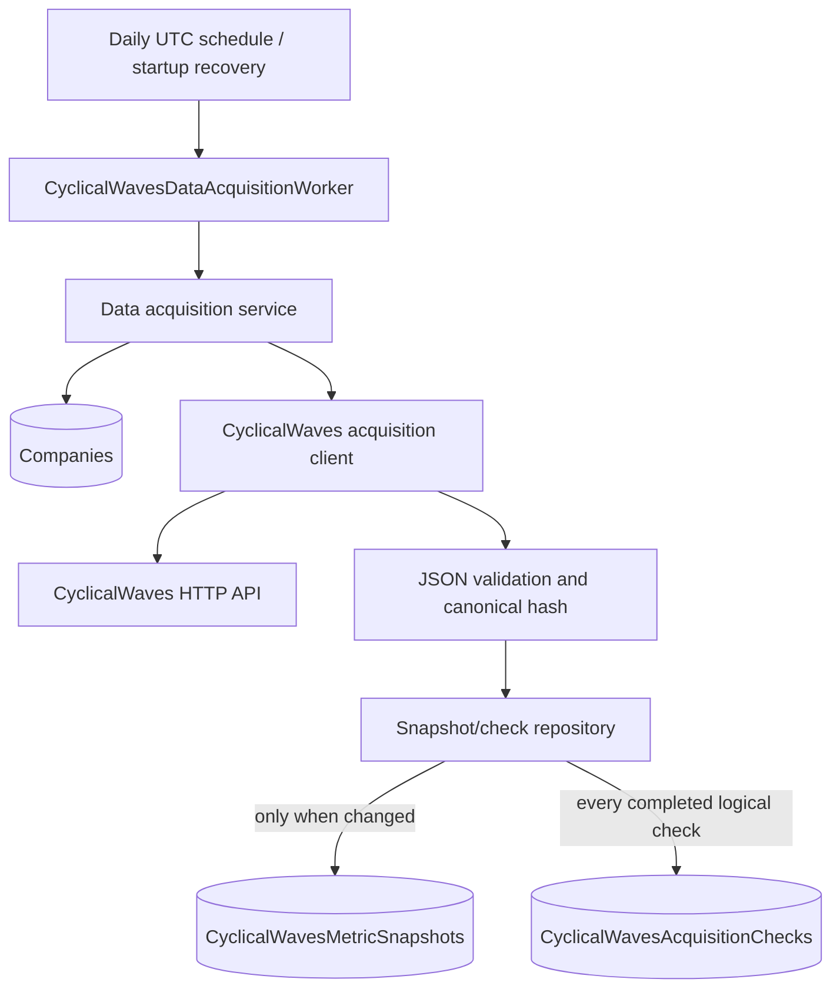
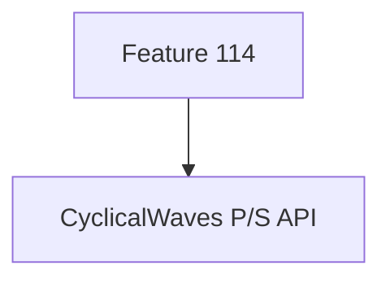
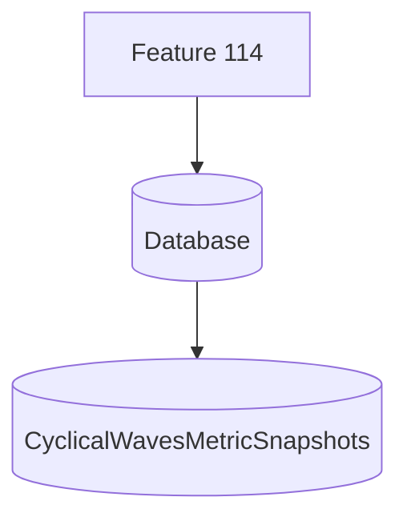

# CyclicalWaves Daily Data Acquisition - Design Specification

Status: Design only. No implementation is authorized by this specification.

## 1. Problem statement

Financial Copilot needs a small, reliable worker that acquires three CyclicalWaves responses for
every company each day:

1. P/S gauge: `GET /api/ps/circle-chart-data/{ISIN}`
2. P/E gauge: `GET /api/pe/circle-chart-data/{ISIN}`
3. Equilibrium gauge: `GET /api/equilibrium/gauge/{ISIN}`

The provider does not reliably supply the business acquisition timestamp. The platform must
therefore record UTC timestamps captured by the platform at the moment each HTTP request is sent.
Provider date fields such as `date` and `lastcaldate` remain part of the raw response and are not
used as substitutes for `AcquisitionDateUtc` or `RequestedAtUtc`.

The worker is expected to run as one instance and to process companies and metrics sequentially.
If the process stops, the next execution must resume safely from persisted acquisition checks.
Repeated or restarted work must not create duplicate snapshots, and a failure for one metric or
company must not stop the remaining work.

The design separates two facts:

- A data snapshot means the provider response changed from the immediately preceding accepted
  response for that company and metric.
- An acquisition check means the provider was contacted, regardless of whether the response
  changed or the operation failed.

## 2. Scope and constraints

### In scope

- Daily scheduled acquisition for P/S, P/E, and equilibrium responses.
- Full successful response preservation as raw JSON text.
- Deterministic response hashing and change detection.
- Snapshot and acquisition-check persistence.
- Sequential execution, request pacing, bounded retries, timeouts, and failure isolation.
- Restart-safe continuation using persisted acquisition checks.
- Database migration and automated test design.

### Explicitly out of scope

- Feature 114 integration or P/S visualization persistence.
- Feature 125 integration, calculation, ranking, publication, or watch behavior.
- Reuse of Feature 126 orchestration or persistence architecture.
- Leases, fencing tokens, distributed locks, ownership handoff, heartbeats, or takeovers.
- RabbitMQ, outbox messages, multi-stage orchestration, or a manual trigger API.
- Parallel provider calls or multiple-worker coordination.
- Derived metrics, normalized valuation facts, AI query changes, or frontend changes.
- Company catalog creation or mutation. The existing `Companies` catalog remains authoritative.
- Historical missed-day reconstruction. The worker acquires the provider's current response.

## 3. Design principles

1. **Persist evidence, not only selected values.** Store the entire accepted JSON response, not
   only `close`, `avg`, or `balance`.
2. **Keep snapshot history separate from operational history.** Unchanged checks do not create
   snapshots, but they always create acquisition-check rows.
3. **Commit one metric at a time.** A successful response is compared, persisted if changed, and
   audited in one database transaction before the next provider call begins.
4. **Prefer replay over coordination.** A restart safely re-evaluates unfinished work. Hash
   comparison and database constraints make replay harmless.
5. **Use one resilience layer.** Only the HTTP client pipeline retries provider requests.
6. **Apply backpressure by construction.** There is no parallelism, and a configured delay is
   observed between logical provider calls.

## 4. Architecture



### Component responsibilities

| Component | Responsibility |
| --- | --- |
| `CyclicalWavesDataAcquisitionWorker` | Wait for the configured UTC schedule, invoke one run at a time, and perform startup recovery. |
| Data acquisition service | Load companies, enforce fixed metric order, skip already completed daily work, isolate failures, and apply inter-request delay. |
| Acquisition client | Send the three GET requests and return the exact response text plus transport metadata and request timestamps. |
| JSON canonicalizer | Validate JSON, canonicalize the complete document, and calculate SHA-256. It never changes the stored raw text. |
| Snapshot/check repository | Atomically compare the latest snapshot, insert a changed snapshot when necessary, and insert the acquisition check. |
| Existing `Companies` table | Supply `CompanyId` and the symbol ISIN. This feature never creates or updates company data. |

The feature may use the existing CyclicalWaves base address and authentication transport settings,
but it owns a dedicated raw-response acquisition operation. It must not call Feature 114, Feature
125, Feature 126, or their application services.

## 5. Future Feature114 Data Consumption Boundary

This acquisition feature is the single data acquisition source for all three CyclicalWaves metric
services in its scope:

- P/S
- P/E
- Equilibrium

The worker must call and persist all three services for every company in each daily cycle. P/S is
not optional and must not be skipped because Feature 114 currently fetches or consumes P/S data for
gauge visualization. Until Feature 114 is migrated, the existing Feature 114 provider call and this
worker's P/S acquisition may temporarily coexist. That temporary overlap does not change this
feature's responsibility to independently acquire, hash, persist, and audit P/S responses.

### Current Feature 114 flow



Current Feature 114 behavior is an external compatibility concern and must not shape this worker's
endpoint selection, scheduling, persistence, change detection, or recovery behavior.

### Required future Feature 114 flow



A separate future change must migrate Feature 114 to database-backed consumption. After that
migration, Feature 114 must read the appropriate persisted P/S snapshot and must not call any
CyclicalWaves provider endpoint directly. This design does not implement or schedule that migration.

### Ownership boundary

This acquisition feature owns:

- Provider communication for P/S, P/E, and equilibrium.
- Complete raw response preservation.
- Immutable snapshot history.
- Acquisition-check history.
- Canonical hashing, change detection, and duplicate prevention.

This acquisition feature does not own:

- Gauge rendering.
- Visualization behavior.
- Frontend behavior.
- Valuation calculations or derived metrics.

### Future consumption invariant

`RawResponseJson` is the canonical source of truth for every accepted provider snapshot. Any
future consumer that requires typed or structured fields must build a separate read model or
projection from `CyclicalWavesMetricSnapshots`. Consumers must not add extracted fields to the
acquisition tables, replace the raw payload with a structured-only representation, or otherwise
change the acquisition storage model to serve their query or presentation needs.

Read models and projections are disposable, rebuildable derivatives. They may evolve independently,
but they must retain traceability to the source snapshot, normally through `SnapshotId` and
`ResponseHash`. The acquisition snapshot remains immutable and provider-faithful.

## 6. Provider contract

### Endpoints and accepted response shape

| MetricType | Relative endpoint | Minimum contract validation |
| --- | --- | --- |
| `PS` | `ps/circle-chart-data/{ISIN}` | A JSON object containing numeric `a` through `f`, `close`, `start`, `end`, `min`, `max`, and `avg`. |
| `PE` | `pe/circle-chart-data/{ISIN}` | A JSON object containing numeric `a` through `f`, `close`, `start`, `end`, `min`, `max`, and `avg`. |
| `Equilibrium` | `equilibrium/gauge/{ISIN}` | A JSON object containing the documented gauge fields. `enticker`, when present, must match the requested normalized ISIN. |

Unknown additive JSON properties are accepted and retained because the raw response is the source
of truth. Arrays retain provider order. Numeric values must be valid JSON numbers; non-finite
values, malformed/truncated JSON, a non-object root, or a response that lacks the minimum contract
are failed checks and do not replace the latest accepted snapshot.

`204` and `404` are recorded as `Failed` with `NotFoundOrNoData`. Other non-success status codes
are also failed checks after the retry policy, if applicable. A failed response never deletes,
invalidates, or overwrites a previous valid snapshot.

### Acquisition timestamps

- `RequestedAtUtc` is captured immediately before the first physical HTTP attempt for a logical
  metric check.
- `AcquisitionDateUtc` on a snapshot is captured immediately before the physical HTTP attempt that
  returned the accepted response. With a retry, this can be later than `RequestedAtUtc`.
- `CompletedAtUtc` is captured after the response has been read and classified.
- `CreatedAtUtc` is the database record creation time.
- All values use `DateTimeOffset`/PostgreSQL `timestamptz` in UTC and come from the injected system
  `TimeProvider`, not from the provider payload.

## 7. Database schema proposal

Both tables belong in the existing Financial Ingestion PostgreSQL database and reference the
existing `Companies` table. Names are feature-specific so they do not change the semantics of the
generic provider payload tables or existing valuation features.

### 7.1 `CyclicalWavesMetricSnapshots`

One row represents one accepted response version for one company and metric.

| Column | Type | Null | Purpose |
| --- | --- | --- | --- |
| `Id` | `uuid` | No | Primary key. |
| `CompanyId` | `uuid` | No | FK to `Companies.Id`, delete restricted. |
| `SymbolIsin` | `varchar(32)` | No | Trimmed, uppercase ISIN used in the request; retained as acquisition-time identity evidence. |
| `ProviderName` | `varchar(64)` | No | Always `CyclicalWaves`. |
| `MetricType` | `varchar(16)` | No | `PS`, `PE`, or `Equilibrium`. |
| `RawResponseJson` | `text` | No | Exact successful response text as received. `text`, rather than `jsonb`, preserves formatting and property order. |
| `ResponseHash` | `char(64)` | No | Lowercase hexadecimal SHA-256 of the canonical complete JSON document. |
| `AcquisitionDateUtc` | `timestamptz` | No | Time immediately before the successful physical HTTP attempt. |
| `SourceEndpoint` | `varchar(512)` | No | Actual relative endpoint, including the escaped ISIN. |
| `PreviousSnapshotId` | `uuid` | Yes | Self-reference to the previously latest snapshot in this company/metric stream. Null for the first version. |
| `CreatedAtUtc` | `timestamptz` | No | Time the row was created locally. |

`RawResponseJson` is the canonical persisted evidence. This table must not gain consumer-specific
parsed columns in future migrations. Structured consumers must use separate projections or read
models linked back to the immutable snapshot.

Required constraints and indexes:

- Primary key on `Id`.
- FK `CompanyId -> Companies.Id` with `Restrict`/`NoAction` delete behavior.
- Self FK `PreviousSnapshotId -> CyclicalWavesMetricSnapshots.Id` with restricted delete behavior.
- Check constraint for the three `MetricType` values.
- Check constraint for `ProviderName = 'CyclicalWaves'`.
- Check constraint that `ResponseHash` is 64 lowercase hexadecimal characters.
- Latest-read index on
  `(CompanyId, ProviderName, MetricType, AcquisitionDateUtc DESC, CreatedAtUtc DESC)`.
- Hash lookup index on `(CompanyId, ProviderName, MetricType, ResponseHash)`.
- Defensive PostgreSQL unique constraint using `NULLS NOT DISTINCT` on
  `(CompanyId, ProviderName, MetricType, PreviousSnapshotId)`. This prevents two snapshots from
  claiming the same predecessor, including two competing first snapshots, without introducing a
  lease or distributed lock.

The predecessor model preserves legitimate reversions. If responses change `A -> B -> A`, the
third response is a new snapshot because it differs from the latest (`B`), even though its hash
appeared earlier. A global uniqueness constraint on response hash would incorrectly lose that
transition and must not be used.

### 7.2 `CyclicalWavesAcquisitionChecks`

One row represents one completed logical metric check. Retries are attributes of that check, not
additional check rows.

| Column | Type | Null | Purpose |
| --- | --- | --- | --- |
| `Id` | `uuid` | No | Primary key. |
| `CycleDateUtc` | `date` | No | UTC daily cycle captured when the worker run starts; used only for restart continuation. |
| `CompanyId` | `uuid` | No | FK to `Companies.Id`, delete restricted. |
| `SymbolIsin` | `varchar(32)` | Yes | ISIN used for the request; null only when identity validation failed before an HTTP call. |
| `ProviderName` | `varchar(64)` | No | Always `CyclicalWaves`. |
| `MetricType` | `varchar(16)` | No | `PS`, `PE`, or `Equilibrium`. |
| `CheckedAtUtc` | `timestamptz` | No | Time the logical metric evaluation began. |
| `RequestedAtUtc` | `timestamptz` | Yes | Time immediately before its first physical HTTP attempt. |
| `CompletedAtUtc` | `timestamptz` | No | Time the logical check reached a terminal result. |
| `ResponseHash` | `char(64)` | Yes | Canonical response hash for `Changed` or `NoChange`; null when no valid response was accepted. |
| `Result` | `varchar(16)` | No | `Changed`, `NoChange`, or `Failed`. |
| `SnapshotId` | `uuid` | Yes | The inserted snapshot for `Changed`, or the still-current snapshot for `NoChange`; null for `Failed`. |
| `SourceEndpoint` | `varchar(512)` | No | Intended/actual relative endpoint. |
| `HttpStatusCode` | `smallint` | Yes | Final HTTP status when a response was received. |
| `AttemptCount` | `smallint` | No | Physical HTTP attempts consumed by the one retry policy; zero for a pre-request failure. |
| `FailureCode` | `varchar(64)` | Yes | Stable bounded code such as `Timeout`, `RateLimited`, `NotFoundOrNoData`, `InvalidJson`, `ContractMismatch`, `IdentityMismatch`, `MissingSymbolIsin`, or `PersistenceFailure`. |
| `FailureMessage` | `varchar(1000)` | Yes | Sanitized, bounded diagnostic. It must not contain credentials, tokens, or raw response bodies. |
| `CreatedAtUtc` | `timestamptz` | No | Time the audit row was inserted locally. |

Required constraints and indexes:

- Primary key on `Id`.
- FKs to `Companies` and `CyclicalWavesMetricSnapshots`, with restricted delete behavior.
- Check constraints for `MetricType`, `ProviderName`, and `Result`.
- A consistency constraint: `Changed`/`NoChange` require `ResponseHash` and `SnapshotId`; `Failed`
  requires both to be null.
- Restart lookup index on `(CycleDateUtc, CompanyId, MetricType, Result)`.
- Diagnostic index on `(CompanyId, MetricType, CheckedAtUtc DESC)`.
- No uniqueness constraint on checks. Multiple rows are correct when the provider was actually
  checked multiple times, for example a failed check followed by a successful restart attempt.

### 7.3 Snapshot versus acquisition check

| Question | Snapshot | Acquisition check |
| --- | --- | --- |
| What does it prove? | A new provider response version was accepted. | The platform evaluated/contacted the provider at a specific time. |
| Written when data changes? | Yes. | Yes, with `Changed`. |
| Written when data is unchanged? | No. | Yes, with `NoChange`. |
| Written when acquisition fails? | No. | Yes, with `Failed`, when persistence is available. |
| Contains full successful JSON? | Yes. | No; it links to the accepted snapshot. |
| Used to resume after restart? | Indirectly for hash comparison. | Yes, by successful result and `CycleDateUtc`. |

## 8. Idempotency strategy

### Canonical hash

The system stores the exact response string but hashes a canonical form of the complete JSON
document. Canonicalization follows JSON Canonicalization Scheme behavior:

1. Parse the complete JSON response.
2. Sort object property names ordinally at every depth.
3. Preserve array order.
4. Emit compact canonical JSON with deterministic string, literal, and number representations.
5. Hash the canonical UTF-8 bytes with SHA-256 and encode as lowercase hexadecimal.

No provider fields are omitted from hashing. Whitespace, property ordering, and equivalent numeric
lexical forms do not create false changes; any semantic field change does.

### Atomic persistence algorithm

For one successful metric response:

1. Begin one database transaction.
2. Read the latest snapshot for `(CompanyId, ProviderName, MetricType)`.
3. If the latest `ResponseHash` equals the new hash, insert only a `NoChange` acquisition check
   linked to that snapshot.
4. Otherwise insert a snapshot whose `PreviousSnapshotId` is the latest snapshot id, then insert a
   `Changed` acquisition check linked to the new snapshot.
5. Commit both writes together.

If the process stops before commit, neither row is visible and the next execution repeats the
check. If it stops after commit, the successful acquisition check acts as the daily checkpoint and
the next execution skips that company/metric for the same UTC cycle. A database-generated unique
predecessor conflict is handled by reloading the latest snapshot and repeating the comparison in a
fresh transaction; it is not handled by a lease.

A failed provider operation inserts only a `Failed` acquisition check. Existing snapshots are
immutable and remain valid.

## 9. Duplicate prevention and recovery

Duplicate snapshot prevention uses four simple layers:

1. One expected worker instance.
2. Sequential, awaited calls with no overlapping run inside that worker.
3. Latest-hash comparison within the per-metric persistence transaction.
4. The unique predecessor constraint as defense against an accidental overlapping invocation.

Acquisition checks are deliberately not deduplicated because each row is evidence of a real
logical check.

### Restart continuation

At startup and at each scheduled boundary, the worker captures one `CycleDateUtc` and loads the
company catalog in deterministic order. Before calling a metric endpoint, it asks whether a
`Changed` or `NoChange` check already exists for that cycle, company, and metric:

- If yes, that metric is complete for the cycle and is skipped without adding a new check.
- If only failed checks exist, the metric is attempted again.
- If no check exists, the metric is attempted.

This makes an interrupted sequence such as `Company 37 / PE` resume without re-calling successful
earlier work. Even if the checkpoint lookup is bypassed or a committed check is not observed due to
a transient read failure, replay remains safe because the latest hash suppresses duplicate
snapshots.

No run table, lease, fencing token, or distributed coordination mechanism is required.

## 10. Worker execution flow

The worker uses this fixed order and never executes metrics in parallel:

```text
On startup or daily schedule
  capture CycleDateUtc
  load all Companies in deterministic order

  for each company:
    resolve one SymbolIsin
    if no valid ISIN:
      record Failed checks for PS, PE, and Equilibrium
      continue to next company

    for metric in [PS, PE, Equilibrium]:
      if successful check already exists for this cycle/company/metric:
        continue

      fetch metric with the single HTTP resilience policy

      if response accepted:
        canonicalize and hash the complete JSON
        atomically persist Changed snapshot + check, or NoChange check
      else:
        persist Failed check

      wait RequestDelayMilliseconds before the next logical provider call
```

### Company and ISIN selection

- Load every existing company row; do not create, update, delete, rank, or filter companies by a
  downstream feature's eligibility rules.
- Prefer `Companies.SymbolIsin`. `Companies.EnTicker` may be used only as an explicit fallback when
  it is a valid normalized symbol ISIN.
- If both values are present but normalize to different values, record three failed checks with
  `IdentityConfigurationMismatch` and make no provider request for that company.
- If no valid ISIN exists, record three `MissingSymbolIsin` failures. Missing identity is visible
  and must never silently reduce coverage.
- Company order is stable: normalized ISIN, then `CompanyId`. Metric order is always P/S, P/E,
  equilibrium.

### Scheduling behavior

- `Schedule` is a five-field cron expression interpreted in UTC. Example: `0 2 * * *`.
- When enabled, startup immediately evaluates the current UTC cycle so a restarted worker can
  continue unfinished work without waiting until the next day.
- If the current cycle is already complete, startup performs no provider calls.
- The background loop awaits the whole run. A later schedule occurrence cannot overlap a still
  running execution; it is skipped rather than queued as a second run.
- Graceful shutdown cancels the current HTTP request or delay. Uncommitted work is retried by the
  startup recovery path.

## 11. Error handling strategy

One metric failure never escapes the per-metric boundary except host shutdown cancellation. The
worker records the failure when possible, logs a sanitized structured event, and continues with
the next metric.

| Failure | Retry? | Persistence result | Continuation |
| --- | --- | --- | --- |
| Network error, timeout, HTTP `408`, `429`, or `5xx` | Yes, within `RetryCount` | `Failed` after exhaustion | Next metric |
| HTTP `204` or `404` | No | `Failed / NotFoundOrNoData` | Next metric |
| Other HTTP `4xx` | No, except the transport's bounded authentication refresh | `Failed` with stable HTTP code | Next metric |
| Invalid/malformed JSON or contract mismatch | No | `Failed`; previous snapshot retained | Next metric |
| Equilibrium response identity mismatch | No | `Failed / IdentityMismatch` | Next metric |
| Missing/conflicting company ISIN | No HTTP call | Three failed checks for the company | Next company |
| Snapshot/check transaction failure | No provider retry in the same metric operation | Transaction rolls back; error is logged | Next execution re-acquires unfinished work |
| Host cancellation | No | Commit already completed work only | Startup recovery resumes |

Retries use bounded exponential backoff with jitter and honor a valid bounded `Retry-After` for
`429`. `RetryCount = 2` means at most three physical HTTP attempts: the initial attempt plus two
retries. `TimeoutSeconds` applies per physical attempt. Authentication refresh, when required by
the provider, is part of this same transport policy and must not create a second retry loop.

Logs include company id, ISIN, metric, endpoint, check id, result, HTTP status, attempt count,
duration, hash prefix, and failure code. Raw responses, credentials, authorization headers, and
tokens are never logged.

## 12. Provider throttling strategy

- Maximum logical provider concurrency is one.
- Maximum physical HTTP concurrency, including retries, is one.
- After each logical provider call completes, wait `RequestDelayMilliseconds` before beginning the
  next metric or company request. The delay is cancellation-aware.
- The retry policy's backoff applies between retry attempts. The configured request delay applies
  once between logical operations and is not recursively applied by multiple layers.
- A valid `Retry-After` takes precedence over the normal retry backoff for the affected attempt,
  subject to a safe upper bound.
- No batching, speculative prefetch, parallel loops, or per-company fan-out is introduced.

With the default 1,000 ms delay, provider pressure is intentionally low and run duration remains
easy to estimate: approximately three seconds of configured pacing per company, plus provider and
database latency and any retries.

## 13. Configuration

```json
{
  "CyclicalWavesDataAcquisition": {
    "Enabled": false,
    "Schedule": "0 2 * * *",
    "RequestDelayMilliseconds": 1000,
    "TimeoutSeconds": 30,
    "RetryCount": 2
  }
}
```

Validation rules:

- `Enabled` defaults to `false`.
- `Schedule` must be a valid five-field UTC cron expression.
- `RequestDelayMilliseconds` must be non-negative and should have a conservative upper bound.
- `TimeoutSeconds` must be positive.
- `RetryCount` must be non-negative and bounded; a maximum of five is sufficient.
- Invalid enabled configuration must fail startup validation before any provider request.

The provider base address and credentials remain in the existing secret-backed CyclicalWaves
transport configuration. They are not duplicated into this section.

## 14. Migration impact

One additive EF Core migration is required in `FinancialIngestionDbContext`:

1. Create `CyclicalWavesMetricSnapshots` with its company/self foreign keys, checks, and indexes.
2. Create `CyclicalWavesAcquisitionChecks` with its company/snapshot foreign keys, checks, and
   indexes.
3. Add the corresponding `DbSet` and entity configurations.

The migration has no data backfill and does not alter existing company, P/S visualization,
relative valuation, derived metric, or provider raw-payload rows. Existing data remains readable.
Deployment order is:

1. Apply the migration.
2. Deploy the worker and repository code with the feature disabled.
3. Validate connectivity and configuration.
4. Enable the feature in a later configuration change.

Rollback disables the worker first. The additive tables should normally be retained for audit and
recovery; dropping them is a separate explicit destructive operation, not part of routine rollback.

## 15. Testing strategy

### Unit tests

- Canonicalization produces the same hash for property-order, whitespace, and equivalent-number
  variations.
- A change to any nested field changes the hash; array order remains significant.
- Raw response text is retained byte-for-byte as decoded UTF-8 text while hashing uses the
  canonical representation.
- Endpoint construction correctly escapes and normalizes ISINs.
- Request timestamps come from `TimeProvider` and distinguish first request, successful retry, and
  completion times.
- Worker order is company-sequential and exactly `PS -> PE -> Equilibrium`.
- A failed P/S operation still executes P/E and equilibrium.
- Request delay is applied once between logical calls and is cancellation-aware.
- Missing and conflicting ISINs produce the required failed checks without HTTP calls.
- A successful same-cycle check is skipped during restart; a failed check is retried.

### Provider contract tests

For each endpoint, cover:

- Representative successful payloads, including all documented fields.
- Unknown additive properties, property reordering, and Unicode ticker values.
- `204`, `400`, `401`, `404`, `408`, `429` with `Retry-After`, and `5xx`.
- Timeout, connection failure, truncated JSON, malformed JSON, non-object JSON, missing required
  fields, numeric overflow/non-finite input, and an equilibrium identity mismatch.
- Retry attempt count never exceeds `1 + RetryCount`.
- One logical acquisition produces one acquisition-check row even when it uses multiple physical
  HTTP attempts.

### PostgreSQL integration tests

- First valid response inserts one snapshot and one `Changed` check.
- Repeating an unchanged response inserts no snapshot and one `NoChange` check linked to the
  current snapshot.
- A changed response inserts a successor snapshot and one `Changed` check.
- `A -> B -> A` creates three snapshots and preserves the full transition history.
- A failed response inserts only a failed check and preserves the latest snapshot.
- Snapshot and successful check commit atomically; injected failure before commit leaves neither.
- A restart after commit skips completed same-cycle work.
- A restart after rollback re-acquires the unfinished metric and creates no duplicate snapshot.
- The unique predecessor constraint rejects an accidental competing successor without corrupting
  history.
- Foreign keys and delete restrictions preserve audit evidence.

### Worker/host integration tests

- Disabled configuration causes no schedule, company read, provider call, or write.
- Startup recovery runs incomplete current-cycle work and performs no calls for a completed cycle.
- A run spanning many companies never has more than one provider request in flight.
- A provider or persistence failure for one company does not terminate the hosted service.
- Graceful cancellation stops promptly and the next start resumes from checks.
- A schedule occurrence during an active run does not start an overlapping run.

### Operational verification

After a controlled test run, operators should be able to answer with simple queries:

- Which company/metric checks failed in the latest UTC cycle?
- Which checks were `Changed` versus `NoChange`?
- What is the latest snapshot hash and acquisition timestamp for each company/metric?
- Does every company have three successful checks for the cycle, or explicit identity/provider
  failures explaining the gap?

## 16. Acceptance criteria

1. When disabled, the feature makes no provider calls and writes no feature rows.
2. Each enabled daily cycle evaluates every company and all three metrics in the fixed sequential
   order, with no parallel calls.
3. Every accepted changed response is stored completely in a new immutable snapshot.
4. An unchanged accepted response creates no snapshot and creates one `NoChange` check.
5. Every exhausted provider failure creates a `Failed` check when the database is available and
   does not remove prior data.
6. Acquisition timestamps are local UTC request times, never inferred from provider date fields.
7. A metric/company failure does not stop later metrics or companies.
8. Restarting after an interruption resumes incomplete current-cycle work and does not duplicate
   committed snapshots.
9. Snapshot and successful-check writes are atomic.
10. Complete-response canonical hashing is deterministic and preserves legitimate response
    reversions as new versions.
11. One and only one HTTP resilience policy owns timeout and retry behavior.
12. The implementation introduces no lease, fencing, distributed lock, handoff, ranking,
    Feature 114 integration, Feature 125 integration, Feature 126 architecture reuse, or complex
    orchestration.
13. The system acquires PS data even before Feature114 migration is completed. Feature114
    migration to database-backed consumption is a separate future change.
14. `RawResponseJson` remains the canonical source of truth. Any future structured consumer uses a
    separate read model or projection and does not change the acquisition storage model.
