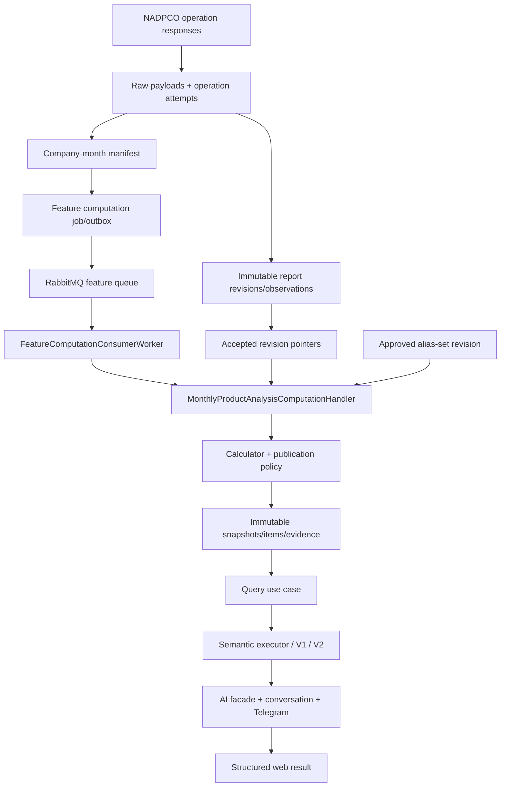

# Feature 129 — Monthly Product Production and Sales Intelligence

## 1. Document status and change summary

**Status:** `READY_FOR_DESIGN_REVIEW`  
**Repository discovery date:** 2026-08-24  
**Document role:** Standalone replacement technical design. This document does not approve implementation and does not authorize a migration, provider call, or production-data change.

This revision resolves all 16 findings in `Design-review.md` (B-01–B-04, M-01–M-10, N-01, and T-01). The principal changes are:

- every provider source line is retained as an immutable observation; product-code collisions no longer collapse rows;
- logical reports, immutable revisions, append-only receipt/status history, and a locked accepted-current pointer replace mutable report authority;
- a per-company/Jalali-month operation manifest separates successful empty responses from failures and makes ProductSales `OutputType=0` a calculation barrier;
- Feature 129 uses the existing derived-feature scheduler, computation jobs, RabbitMQ bus, consumer worker, and processor, extended with a durable dispatcher and a specialized computation handler;
- canonical products, aliases, effective periods, merge/split lineage, and alias-set revisions are immutable and reproducible;
- a collectively exhaustive attribution state machine reconciles every comparable product contribution;
- company driver classification is signed, materiality-aware, and guarded against cancellation;
- publication uses one PostgreSQL serializable/advisory-lock protocol;
- evidence and stored conversation results are immutable and self-sufficient;
- semantic routing activates the repository's governed hybrid interpreter instead of relying on fixed Persian keywords;
- the first supported backfill month is 1404/01; 1403 is not promised without a separately verified archive source.

## 2. Executive summary

Feature 129 explains why a company's reported monthly product revenue changed. It compares an accepted current report revision with an accepted base-period revision, preserves reported sales value as authoritative, and attributes the signed company change to quantity, price, activation, discontinuation, source residual, matched-but-undecomposable, and unmatched effects. The LLM can select wording and section order, but it never calculates a financial value.

The source of truth is an immutable chain:

```text
raw payload -> operation attempt -> report revision -> source observation
            -> accepted-current pointer -> alias-set revision
            -> calculation run -> immutable published snapshot/evidence
            -> structured API and embedded conversation payload
```

Corrections create revisions; they do not overwrite history. A published snapshot names exact report and alias-set revision IDs. Old conversations embed the bounded calculated result and therefore replay the same values even after newer reports, aliases, policies, or snapshots exist.

## 3. Scope and non-goals

### 3.1 First-release scope

- ProductSales `OutputType=0` monthly product facts for supported months from 1404/01 onward, including a unit-safe selected-product production-versus-sales visualization.
- Current month versus previous month, with explicit-period comparison when both accepted revisions exist.
- Immutable source observations, deterministic revision acceptance, completeness manifests, canonical products, versioned aliases, approved unit conversions, two-period calculation, immutable evidence, atomic publication, semantic/API integration, conversation replay, Telegram text fallback, and an accessible web contribution table.
- Company and product totals, growth guards, concentration, lifecycle/sign/identity/quality dimensions, contributors, quantity/price attribution, coverage, freshness, and limitations.

### 3.2 Later-release scope

- YoY, fiscal YTD, prior-year equivalent YTD, contiguous 3/12-month averages, extended product history, robust anomalies, inferred inventory signals, advanced waterfall graphics, image export, and an optional direct read endpoint.
- These are not prerequisites for a financially correct two-period result, but any enabled item must satisfy its later-release acceptance criteria.

### 3.3 Non-goals

- Forecasts, inventory-balance claims, target prices, or investment recommendations.
- Cross-company aggregation of physical quantities.
- Automatic conversion between economically different packages/products.
- Provider access from HTTP query paths.
- LLM arithmetic or LLM-created source facts.
- A 1403 monthly backfill without a separately approved, verified archive source.

## 4. Repository discovery and verified current state

Verified implementation facts are distinct from proposals in later sections.

| Area | Verified current state | Consequence for Feature 129 |
| --- | --- | --- |
| Provider | `NadpcoApiDataProviderClient.cs` requests ProductSales output types 0–4 independently and ServiceSales separately. Failures become null/empty slots. | Add durable per-operation outcomes; null/empty is not sufficient. |
| Boundary | The provider defines `MonthlyActivityMinimumShamsiYear = 1404`; `MonthlyActivityBackfillCoordinator` and trend options also begin at 1404. | Supported backfill begins at 1404/01. |
| Raw payload | `ProviderRawPayloadPersistence.cs` stores exact text, endpoint, external reference, checksum, and receipt time; provider/checksum is unique. | Reuse it and reference its immutable ID/checksum from revisions. |
| Normalizer | `NadpcoApiMonthlyActivityNormalizer.cs` groups by `LineItemCode`, takes `Last()`, includes array index in fallback identity, mutates a logical report, deletes children, and inserts new GUIDs. | Replace authority with revisions/observations; retain current tables only as a compatibility projection. |
| Schema | `MonthlyReports` has logical-period uniqueness; `MonthlyReportLineItems` is unique on `(MonthlyReportId, ProductCode)`. | Change projection uniqueness to source-row discriminator and permit repeated product codes. |
| Derived features | Feature definitions, snapshots, computation jobs, `FeatureRecalculationScheduler`, RabbitMQ publisher/consumer, `FeatureComputationConsumerWorker`, and `FeatureComputationProcessor` are registered. The generic snapshot is scalar and `NoOpFeatureInputReader` is currently registered. | Reuse orchestration; add a keyed complex-feature handler and durable dispatch extension. |
| Publication precedent | `IndustryRelativeValuationCalculationSnapshotWriter.cs` uses transaction-scoped PostgreSQL advisory locking, idempotent fingerprints, version allocation, and current-pointer replacement only for successful publication. | Reuse and strengthen this pattern with serializable isolation and immutable children/evidence. |
| Metric outbox | `MetricRecalculationProcessor` is for metric-registry recalculation. | Do not branch Feature 129 financial logic through it. |
| Interpretation | `ICapabilityInterpreter` is registered as `DeterministicCapabilityInterpreter`; the dialogue gate calls it directly. `HybridCapabilityInterpreter` exists, but the proposal provider is `NoOpQueryInterpretationProposalProvider`. | Activate the governed async hybrid path and validate its result deterministically. |
| Slots/state | `QuerySlotType` has company, metric, period, comparison, presentation, limit, and topic, but no product or analysis-focus slot. `ConversationDialogueGate` persists typed task state. | Add general product/focus/measure slots and carry them through task state. |
| Conversation | `AssistantMessagePayload.Version` is 1 in V1 persistence and 2 in V2 persistence; structured fields are embedded. | Introduce schema version 3 for both paths and backward decoding for 1/2. |
| Frontend/Telegram | `chat.functions.ts`, `message-list.tsx`, the monthly trend view-model/chart, and `TelegramAssistantResponseRenderer.cs` are the current structured render paths. There is no Feature 129 waterfall. | Add a discriminated result contract, accessible contribution table, and concise Telegram fallback. |

## 5. Review findings resolution matrix

| Finding ID | Severity | Resolution | Revised section | Acceptance criteria | Tests | Slice |
| --- | --- | --- | --- | --- | --- | --- |
| B-01 | BLOCKER | Resolved: immutable source observations use a row fingerprint plus duplicate occurrence, preserve repeated codes, and reconcile accepted raw facts to normalized facts. | 8, 9, 18 | AC-01–AC-04 | T-ING-01–04 | 1 |
| B-02 | BLOCKER | Resolved: exhaustive mutually exclusive attribution paths include unattributed comparable and unmatched effects; activation depends on base revenue, not rate. | 12, 13 | AC-20–AC-25 | T-CALC-01–07 | 3 |
| B-03 | BLOCKER | Resolved: evidence references immutable revisions/observations and copies the observed fact needed for replay. | 20, 23 | AC-34–AC-36 | T-EVID-01–03, T-CONV-01 | 1, 4 |
| B-04 | BLOCKER | Resolved: deterministic acceptance precedence, ambiguity blocking/manual decision, and locked accepted pointers prevent late overwrite. | 9, 19 | AC-08–AC-13 | T-REV-01–06 | 1 |
| M-01 | MAJOR | Resolved: company-month manifest records every ProductSales 0–4 and ServiceSales outcome; type 0 is mandatory. | 8, 15, 17 | AC-05–AC-07 | T-MAN-01–03 | 1 |
| M-02 | MAJOR | Resolved: selected orchestration is the existing derived-feature framework with a specialized keyed handler and durable job dispatch; metric recalculation is excluded. | 16, 17, 31 | AC-37–AC-39 | T-ORCH-01–04 | 1, 3, 6 |
| M-03 | MAJOR | Resolved: vendor identity is compatibility-gated, collisions block auto-match, array index is excluded, and alias overlap is exclusion-constrained. | 10, 18 | AC-14–AC-18 | T-ID-01–02, T-ALIAS-02 | 2 |
| M-04 | MAJOR | Resolved: append-only alias-set headers/memberships and canonical lineage are snapshot inputs. | 10, 20 | AC-16–AC-19, AC-35 | T-ALIAS-01–04 | 2, 3 |
| M-05 | MAJOR | Resolved: one serializable advisory-lock protocol, filtered indexes, `xmin`, retry, and rollback behavior are specified. | 18, 19 | AC-29–AC-33 | T-PUB-01–04 | 3 |
| M-06 | MAJOR | Resolved: lifecycle, identity, sign, quality, and attribution availability are separate; company classification is cancellation-aware. | 13, 14 | AC-24–AC-29 | T-CALC-05–07, T-CLASS-01 | 3 |
| M-07 | MAJOR | Resolved: hybrid model proposal is activated, governed, slot-validated, precedence-tested, and integrated with task state in V1/V2. | 22, 31 | AC-40–AC-43 | T-SEM-01–04 | 4 |
| M-08 | MAJOR | Resolved: result ownership/schema v1, assistant payload v3, backward decoder, embedded replay, Telegram fallback, and contribution view model are specified. | 21, 23, 24 | AC-44–AC-48 | T-API-01–03, T-CONV-01–02, T-UI-01–02 | 4, 5 |
| M-09 | MAJOR | Resolved: source/revision and identity foundations precede the first publishable calculator; boundary is 1404. | 3, 17, 29 | AC-49–AC-50 | T-BF-01–04 | 1–6 |
| M-10 | MAJOR | Resolved: all material behavior is normative and mapped to tests/slices. | 27–29 | AC-01–AC-54 | T-TRACE-01 | 1–6 |
| N-01 | MINOR | Resolved: database scales, ToEven rounding, canonical serialization, tolerance, and denominator reason codes are fixed. | 12, 18 | AC-26–AC-28 | T-DEC-01–02 | 3 |
| T-01 | NOTE | Resolved: correctness release and later enhancements are separated without weakening publication gates. | 3, 27, 29 | AC-01–AC-50; AC-51–AC-54 later | T-TRACE-01 | 1–6 |

## 6. Functional requirements

1. Resolve company identity through the existing canonical company resolver; use provider `ExternalCompanyId` for ingestion identity and canonical company ID where available.
2. Default to the latest **published** snapshot, not the greatest raw period.
3. Default comparison to the immediately previous Jalali month; never skip a missing month.
4. Query only accepted report revision IDs captured by the snapshot fingerprint.
5. For each period, sum every authoritative `OutputType=0` source observation, including repeated product codes and negative values.
6. Return current/base product facts, amount changes, guarded percentages, revenue share, signed contribution, all effect buckets, independent state dimensions, warnings, and bounded evidence.
7. Return a union of canonical products in both periods. Unresolved rows remain explicit unmatched items.
8. Expose current/base company revenue, signed change, guarded growth, largest positive/negative contributors, concentration, effect coverage, driver, cancellation ratio, freshness, and quality.
9. Never emit infinity. A zero, missing, negative, or immaterial denominator produces `null` plus a fixed reason code.
10. Read requests never call NADPCO and never calculate from raw line items synchronously.

## 7. Non-functional requirements

- **Determinism:** identical accepted revision IDs, alias-set revision, unit policy, and calculation policy yield identical values, ordering, statuses, and fingerprint.
- **Reproducibility:** a snapshot and persisted conversation remain interpretable without a mutable report, line item, current alias, or latest-policy lookup.
- **Atomicity:** header, children, effect totals, evidence, and current selection publish together.
- **Availability:** a failed, blocked, stale-input, or cancelled run cannot displace the last valid publication.
- **Performance:** published repository read p95 ≤300 ms and structured facade retrieval p95 ≤700 ms excluding model latency; default ≤100 product items and ≤24 periods.
- **Security:** credentials/raw payload text remain server-side; admin actions are authorized and audited.
- **Localization/accessibility:** Persian RTL presentation, explicit units, non-color signs, keyboard evidence actions, and a table equivalent.
- **Observability:** fixed low-cardinality labels only; no company/product/query/payload values as metric labels.

## 8. Source facts and ingestion completeness model

### 8.1 Source-row preservation

For each accepted operation payload, parse every array element into an immutable `MonthlyReportSourceObservation`. Do not group by product code. Compute:

- `CanonicalRowJson`: culture-invariant JSON containing all provider fields in fixed property order; numeric lexemes are retained separately.
- `EconomicSignature`: SHA-256 of normalized vendor identity, title, domestic/export status, category, package size/count, grade/quality, unit, and any provider line discriminator. It excludes array position and numeric measures.
- `SourceFactFingerprint`: SHA-256 of `CanonicalRowJson`, including numeric measures.
- `DuplicateOccurrence`: 1..N inside the group of identical `SourceFactFingerprint` values. Because group members are identical facts, their order is not business identity.
- `SourceRowDiscriminator`: SHA-256 of provider, logical-report identity, `SourceFactFingerprint`, and `DuplicateOccurrence`.
- `RawArrayOrdinal`: retained only as evidence for locating the source row; it never participates in report, product, alias, or snapshot identity.

Two rows with the same vendor product code but different economic signatures remain separate authoritative facts. Byte- or fact-identical rows inside one payload are also retained, receive separate occurrences, and raise `DuplicateFactObserved`; they remain in the accepted raw total unless validation rejects the entire revision. A payload replay is detected at payload/semantic-multiset level, not by dropping a row.

`RawRevenueTotal` is the decimal sum of all accepted authoritative raw observations. `NormalizedRevenueTotal` is the sum of their persisted parsed values. Acceptance requires exact equality at the stored scale and equal row counts; otherwise the revision is `Blocked(RawNormalizationMismatch)`.

### 8.2 Company-month manifest

`CompanyMonthIngestionManifest` is unique by provider, company, Jalali year/month, and manifest generation. It has one current generation pointer and append-only operation attempts.

Expected operation keys are `ProductSales:0`, `ProductSales:1`, `ProductSales:2`, `ProductSales:3`, `ProductSales:4`, and `ServiceSales:none`. Each current operation state is one of:

`SucceededWithRows`, `SucceededEmpty`, `Failed`, `TimedOut`, `NotRequested`, `Retrying`, or `PermanentlyUnavailable`.

Each attempt records request ID, attempt number, start/end, fixed outcome/error code, HTTP status when safe, row count, raw payload ID/checksum, candidate/accepted revision ID, and retry eligibility. A successful empty response must be an HTTP-success payload that validates as an empty collection; catch-and-replace empty arrays are failures, not legitimate empties.

| Operation | Requirement | Publication effect |
| --- | --- | --- |
| ProductSales 0 | Mandatory | Must be `SucceededWithRows` or a validated `SucceededEmpty` with an accepted revision. Failure/timeout/retrying blocks calculation. |
| ProductSales 1 | Optional for core; mandatory for YTD section | Core may publish `Partial`; YTD is unavailable. |
| ProductSales 2–4 | Optional evidence/validation | Failure is visible but does not block the two-period core. |
| ServiceSales | `NotRequested` for Feature 129 ProductSales totals; still recorded when provider workflow requests it | Never mixed into product totals. A future service policy requires a separate feature version. |

The manifest becomes `CoreReady` only after type 0 observations, revision decision, raw reconciliation, and accepted pointer commit. That same database transaction creates/reuses a requested feature-computation job. Retries append attempts and update the manifest projection. A later optional success or any accepted-revision change creates a new manifest generation/fingerprint and schedules recalculation. Calculators read by exact manifest/revision IDs, so they cannot observe a half-committed envelope.

## 9. Immutable report revision and accepted-current model

### 9.1 Identity and lineage

`MonthlyReportLogicalIdentity` represents provider + external company + report kind + output type + Jalali month. It owns nullable `AcceptedRevisionId` and an Npgsql `xmin` concurrency token.

`MonthlyReportRevision` is immutable after insertion: logical identity, provider report/revision ID, raw payload ID/checksum, semantic multiset checksum, publication raw/parsed value, provider period, receipt/synchronization timestamps, predecessor revision, parser schema, row count/totals, and validation result. Append-only receipt and status-event tables record replay receipts and transitions (`Received`, `Validated`, `Accepted`, `Rejected`, `Superseded`, `Blocked`). The revision row's content is never updated; current status is a projection of its latest event.

### 9.2 Deterministic acceptance

Under the report-identity lock, all validated candidates are evaluated:

1. Same semantic multiset checksum as an existing revision: record a replay receipt; do not create another economic revision or recalculate.
2. A documented, comparable provider revision ID wins over a lower provider revision ID. Blank, zero, malformed, or undocumented identifiers provide no ordering.
3. If provider revisions do not decide, a valid provider publication timestamp wins over an older timestamp.
4. A valid newer candidate never loses to a later receipt of an older publication/revision.
5. Receipt time orders ingestion attempts only. If there is no accepted revision, the first fully validated metadata-less candidate may be accepted. A later conflicting metadata-less candidate cannot replace it automatically.
6. Conflicting payloads with equal provider revision/publication precedence are `Blocked(AmbiguousRevisionOrder)` and retain the existing accepted pointer. If no accepted revision exists, the pointer remains null.
7. Missing/invalid publication timestamps are retained as evidence and never outrank a valid timestamp merely because receipt is later.
8. A `DataAdmin` may accept/reject an ambiguous candidate with actor, reason, timestamp, and prior decision linkage. The action creates status/decision events; it does not mutate revision facts.

Acceptance transaction: `Serializable`; acquire `pg_advisory_xact_lock(hashtextextended('f129-report|' || LogicalIdentityId,0))`, then `SELECT ... FOR UPDATE` the logical identity, recompute precedence, append events, update the pointer with `xmin`, and commit. Logical IDs are locked in ascending GUID order when a transaction touches more than one. Serialization/deadlock conflicts retry at most three times.

Corrections create a new accepted revision and supersede the prior acceptance event. Existing snapshots/evidence continue pointing to the prior revision. Recalculation fingerprints contain exact revision GUIDs, never “latest report.”

### 9.3 Compatibility/backfill

- Existing `MonthlyReports`/`MonthlyReportLineItems` become an accepted-current compatibility projection for Features 075–079 during migration.
- Remove unique `(MonthlyReportId, ProductCode)` and replace it with unique `(MonthlyReportId, SourceRowDiscriminator)`; add a non-unique product-code index. Projection rows may still be replaced, but are never historical evidence.
- Backfill revisions from retained raw payloads when parsing/reconciliation succeeds. If only legacy normalized rows exist, create `LegacyNormalizedOnly` observations with copied values and `EvidenceQuality=Legacy`; do not claim raw reconciliation.
- Feature 129 publication requires reconciled raw observations. Legacy-only months are re-fetched from 1404 onward or remain unavailable.

## 10. Canonical product and versioned alias model

### 10.1 Identity hierarchy

Canonical products are company-scoped. Zero/blank vendor IDs are missing. A positive vendor ID is only a candidate and must have a compatible economic signature. Automatic matching order is:

1. approved alias membership effective for the period;
2. collision-free positive vendor ID plus compatible unit dimension, domestic/export, category, package, grade, and quality;
3. exact normalized economic signature with all material attributes compatible;
4. previously approved historical signature;
5. conservative similarity candidate for manual review.

Text similarity never auto-merges an economically material uncertain row. Initial thresholds: exact/approved = 1.00; deterministic full-signature match ≥0.995; any 0.90–0.994 candidate requires review; <0.90 remains unmatched. A policy-versioned materiality floor also forces review regardless of score. Vendor-ID reuse or one ID mapped to incompatible signatures is `VendorIdCollision`, leaves affected revenue unmatched, and blocks automatic alias ownership.

### 10.2 Immutable alias revisions

- `CompanyProductAliasSetRevision`: company, revision number, parent revision, status (`Draft`, `Approved`, `Rejected`, `Superseded`), effective range, algorithm version, evidence checksum, approver/actor/time, and reason.
- `CompanyProductAliasMembership`: immutable mapping from provider alias key/economic signature to canonical product, effective Jalali month range, method, confidence, evidence, and manual override reason.
- `CanonicalProductLineage`: append-only `Merge`, `Split`, `MergeReversal`, `SplitReversal`, `Retirement`, and `Reactivation` edges with effective period and superseding decision.

The provider alias key is vendor ID when present and collision-free; otherwise it is the full normalized economic signature. Approved ownership uses integer Jalali month ordinals and this PostgreSQL constraint:

```sql
EXCLUDE USING gist
("ExternalCompanyId" WITH =, "ProviderName" WITH =,
 "ProviderAliasKey" WITH =, "EffectiveMonthRange" WITH &&)
WHERE ("ApprovalState" = 'Approved')
```

`btree_gist` is required. Approval transactions take `pg_advisory_xact_lock(hashtextextended('f129-alias|' || companyId,0))`; the exclusion constraint remains the final concurrent guard.

Snapshots reference the exact approved alias-set revision. A merge/split/range change creates a new alias-set revision and schedules every supported company-month whose source observation range intersects the change, including comparison snapshots that use those months. Reversal creates compensating lineage; old alias sets and snapshots are never rewritten.

## 11. Unit normalization and conversion policy

Preserve raw unit text and map it to governed `UnitCode`, `Dimension`, and `ConversionPolicyVersion`. Normalize Persian/Arabic characters/digits, whitespace, ZWNJ, punctuation, package count/size, grade, quality, domestic/export, and category without deleting economic distinctions.

Only reviewed exact conversions inside one physical dimension are allowed. Version 1 permits no conversion by default; kilogram/tonne may be enabled only through reviewed policy data. Count, thousand-count, carton, package, litre, kilogram, and tonne are not assumed convertible without product-specific evidence. A unit change without an approved conversion retains signed revenue contribution and routes to `UnattributedComparableEffect`; it suppresses quantity/price and production/sales comparison.

Company quantities are maps by canonical unit bucket. A scalar total is emitted only when every included quantity shares one convertible dimension under the snapshot's policy.

## 12. Calculation definitions

For product `i`, base `0`, current `1`: sales quantity `Q`, valid reported rate `P`, reported sales value `R`, production `G`, and company revenue `S_t = ΣR_i,t`. Only accepted ProductSales `OutputType=0` observations are monthly facts. Multiple source observations may aggregate to one canonical product only after identity/unit checks; incompatible unit buckets remain separate items.

```text
Contribution_i = R_i,1 - R_i,0
CompanyChange D = S_1 - S_0 = Σ Contribution_i
PercentChange(x) = 100 × (x1-x0)/x0 only when x0 > 0
RevenueShare_i,t = 100 × R_i,t/S_t only when S_t > 0
```

`ContributionShare` is nullable when `D=0` (`ZeroCompanyChange`) or `abs(D)<MaterialityFloor` (`ImmaterialCompanyChange`). Otherwise it is `100×Contribution_i/D` and may exceed 100% or be negative.

For a decomposable continuing product:

```text
QuantityEffect = (Q1-Q0) × (P0+P1)/2
PriceEffect    = (P1-P0) × (Q0+Q1)/2
RawResidual_t = R_t - Q_t×P_t
ResidualEffect = Contribution - persisted QuantityEffect - persisted PriceEffect
```

The last definition intentionally absorbs only scale quantization into residual and guarantees stored equality. The unrounded `RawResidual_1-RawResidual_0` is retained in internal audit evidence.

### 12.1 Precision and rounding

| Value | PostgreSQL type |
| --- | --- |
| Parsed quantity, rate, revenue, effect, totals | `numeric(28,8)` |
| Ratios/coverage/cancellation | `numeric(20,10)` |
| Percentages/shares | `numeric(18,6)` |
| Raw provider numeric lexeme | bounded text plus parsed numeric |

Use .NET `decimal`, checked operations, and `MidpointRounding.ToEven`. Source parsing/scale validation occurs before acceptance. Calculations retain decimal precision until persistence; effects are rounded to scale 8 once, then residual is the balancing difference. Aggregation and reconciliation precede presentation rounding. Exact stored-scale equality is required for source and company reconciliation. The policy tolerance (`max(1.00000000 million rial, 0.5%×max(|R0|,|R1|))`) controls warnings/classification only.

Fingerprints serialize fixed-scale decimals with `InvariantCulture`, explicit null markers, UTF-8, ordinal field/item order, and SHA-256.

### 12.2 Representative غذا‌ر fixture

Values are million rial.

| Product | Contribution | Quantity | Price | Residual | Check |
| --- | ---: | ---: | ---: | ---: | ---: |
| سبزیجات ۴۰۰ گرمی | 91,881.6 | 95,440.8 | -3,559.2 | 0 | 91,881.6 |
| کنسرو مخلوط | -30,000 | -30,000 | 0 | 0 | -30,000 |
| غذای آماده صادراتی | 58,268.4 | 51,000 | 7,000 | 268.4 | 58,268.4 |
| **Total** | **120,150** | **116,440.8** | **3,440.8** | **268.4** | **120,150** |

Base sales = 450,000; current sales = 570,150; change = 120,150; growth = 26.7%. The first product is the largest positive contributor.

## 13. Exhaustive attribution state machine

### 13.1 Independent state dimensions

- Lifecycle: `New`, `Resumed`, `ContinuouslyActive`, `Inactive`, `Discontinued`, `HistoryInsufficient`.
- Identity/match: `Matched`, `Unmatched`, `Ambiguous`, `ManualReview`.
- Economic sign: `PositiveSale`, `ZeroActivity`, `ReturnOrReversal`, `NegativeAdjustment`.
- Data quality: `Valid`, `Warning`, `Partial`, `Blocking`.
- Attribution availability: `Decomposed`, `UnattributedComparable`, `Unmatched`, `Unavailable`.

Lifecycle is derived from accepted revenue/activity history, not sign. `New` requires sufficient prior history and no earlier activity; `Resumed` requires earlier activity before an inactive interval; otherwise first observation is `HistoryInsufficient`. `Discontinued` means meaningful positive base revenue and absent/zero current revenue for this comparison only.

Validation rules: `Decomposed` requires `Matched`, compatible units, non-negative comparable quantities, finite positive rates, and non-negative sale semantics. Non-matched identity requires `Unmatched`. A matched row that cannot decompose uses `UnattributedComparable`. Blocking data cannot publish. Missing comparison makes attribution `Unavailable` and no change equation is asserted.

### 13.2 Decision table and numeric proof

Exactly one path is selected per product comparison. `C=R1-R0`; omitted buckets are zero.

| Priority/state | Exact condition | Bucket assignment | Numeric example and identity |
| ---: | --- | --- | --- |
| 1 Blocking source | Mandatory type 0 incomplete or raw mismatch | No comparison snapshot; availability `Unavailable` | No effects published; prior valid snapshot remains current. |
| 2 Unsafe identity | Unmatched, ambiguous, or manual review | `UnmatchedEffect=C` | Base unmatched -100 and current unmatched +120 are separate rows: `-100+120=20=C`. |
| 3 Inactive | `R0=0`, `R1=0`, no meaningful activity | all zero | `0=0`. |
| 4 Activation | identity safe; base revenue absent/zero; current **positive** meaningful revenue | `ActivationEffect=C` | `0→120`: `120=120`. Missing base rate is irrelevant. |
| 5 Discontinuation | identity safe; base positive meaningful revenue; current absent/zero | `DiscontinuationEffect=C=-R0` | `100→0`: `-100=-100`. |
| 6 Decomposed | continuing, identity safe, unit compatible, valid non-negative Q, positive P, non-negative sale semantics | symmetric quantity + price + balancing residual | `Q 10→12`, `P 10→11`, `R 100→132`: `21+11+0=32=C`. |
| 7 Rounded/source residual | same as 6, but reported value differs from `Q×P` | quantity + price + residual | Current `R=133`: `21+11+1=33=C`. |
| 8 Missing base/current rate | positive revenue in both periods but either rate missing | `UnattributedComparableEffect=C` | `R 100→120`, base P missing: `20=20`; not activation. |
| 9 Missing/negative quantity or invalid rate | matched monetary facts but decomposition invalid | `UnattributedComparableEffect=C` | `R 100→125`, Q missing: `25=25`. |
| 10 Unit change | matched identity, no approved conversion | `UnattributedComparableEffect=C` | kg `100` to carton `130`: `30=30`. |
| 11 Return/reversal | either period has negative revenue and v1 signed quantity/rate semantics are not explicitly validated | `UnattributedComparableEffect=C` | `50→-20`: `-70=-70`. |
| 12 Negative-only adjustment | `R0=0`, `R1<0` | `UnattributedComparableEffect=C` if matched, otherwise unmatched | `0→-20`: `-20=-20`; never activation. |
| 13 Optional partial data | Type 0 complete; optional type unavailable | use applicable path 2–12; quality `Partial`; optional section absent | `100→120` valid type 0 still reconciles `20`; YTD is unavailable. |

Therefore, for every published comparison product:

```text
Contribution = QuantityEffect + PriceEffect + ActivationEffect
             + DiscontinuationEffect + ResidualEffect
             + UnattributedComparableEffect + UnmatchedEffect
```

Summing over the complete product union proves:

```text
CompanyRevenueChange = QuantityEffect + PriceEffect + ActivationEffect
                     + DiscontinuationEffect + ResidualEffect
                     + UnattributedComparableEffect + UnmatchedEffect
```

No branch drops or double-counts `C`.

## 14. Company-level classification

Let `D` be net company change. For every effect atom `e`, aligned effects have `sign(e)=sign(D)`; opposing effects have the opposite sign.

```text
GrossEffectMass G = Σ|e|
AlignedMass A = Σ aligned |e|
OpposingMass O = Σ opposing |e|
CancellationRatio = 1 - |D|/G       (null when G=0)
```

The v1 materiality floor is `max(1 million rial, 0.5%×max(|S0|,|S1|))`. Classification is `NotReliablyClassifiable` with `ZeroCompanyChange` when `D=0`, or `ImmaterialCompanyChange` below the floor. It is also unreliable when cancellation ratio >35%, match coverage <90%, decomposable continuing coverage <80%, residual ratio >10%, or unmatched+unattributed mass >20% of G.

For reliable cases, driver shares use **aligned** named mass, not gross absolute mass:

- `QuantityDriven`: aligned quantity share ≥60%, at least 15 points above aligned price share, and opposing quantity mass ≤25% of quantity gross mass.
- `PriceDriven`: symmetric rule for price.
- `ActivationDriven`: aligned activation share ≥50% and aligned activation is at least 50% of `|D|`.
- `DiscontinuationDriven`: symmetric rule for discontinuation.
- `Mixed`: prerequisites pass and no driver threshold is met.

Example: quantity `+100` and `-99`, price `+1` gives `D=2`, `G=200`, cancellation 99%; it is `NotReliablyClassifiable`, not quantity-driven.

Revenue composition shift is separate and non-additive: `0.5×Σ|share_i,1-share_i,0|`, reported as `MixShift` only. It never enters the additive equation or primary driver enum.

## 15. Data-quality and publication policy

`Blocking` prevents a new publication; `Partial` publishes safe sections; `Warning` publishes with evidence; `ManualReview` keeps affected revenue unmatched. Required publication checks are:

- current and base type-0 manifest states are core-ready;
- exact accepted revision IDs still match the calculation fingerprint;
- raw/normalized row counts and revenue reconcile;
- alias-set and unit policy revisions are approved/current for the run;
- product and company effect equations are exact at scale 8;
- evidence exists for every published numeric fact;
- no blocking identity, period, output-type, overflow, or source-scale finding exists.

Freshness states: `Fresh`, `Stale`, `Partial`, `Processing`, `Unavailable`, and `Blocked`. A failed new run leaves the prior snapshot current and exposes its stale/blocked reason. Provider publication time is used when valid; otherwise receipt time is labeled as receipt, never presented as publication.

## 16. Proposed backend architecture



Application owns formulas, states, policies, DTOs, and interfaces. Infrastructure owns provider parsing, EF persistence, locks, RabbitMQ, cache, and render adapters. Feature 129 does not change provider credentials or expose provider calls.

## 17. Calculation orchestration and workflow

### 17.1 Selected framework

Reuse the derived-feature framework: `FeatureDefinition`, `FeatureComputationJob`, `FeatureRecalculationScheduler`, RabbitMQ `IFeatureRecalculationPublisher/Consumer`, `FeatureComputationConsumerWorker`, and `FeatureComputationProcessor`.

Extend it as follows:

- introduce keyed `IFeatureComputationHandler`; the existing scalar path is the default handler around `IFeatureInputReader`/`IDerivedFeatureCalculationService`;
- register `MonthlyProductAnalysisComputationHandler` for feature code `monthly_product_activity_analysis`, because the existing scalar `FeatureSnapshot` cannot represent header + product children + evidence;
- use `FeatureComputationJobs` as the durable request/outbox record by adding dispatch status/attempt timestamps. Manifest completion inserts the job in the same Financial ingestion transaction; a feature dispatch worker publishes undispatched requested jobs. Rabbit delivery remains at-least-once and processor idempotency remains mandatory;
- do not add Feature 129 branching to `MetricRecalculationProcessor`.

### 17.2 Workflow

1. Persist operation attempt/raw payload.
2. Parse immutable revision/observations and reconcile.
3. Run revision acceptance under report lock.
4. Commit manifest generation and requested feature job atomically when core-ready.
5. Dispatcher publishes; consumer calls `FeatureComputationProcessor`; processor selects the Feature 129 handler.
6. Handler loads exact accepted revisions, approved alias set, unit policy, and comparison month; computes outside the publication transaction.
7. Writer atomically validates/publishes or records blocked/stale/no-op outcome.
8. Completion event and cache invalidation occur only after commit.

Idempotency key: SHA-256 of feature code/version, company, current/comparison month, manifest generation IDs, exact accepted revision IDs, alias-set revision ID, unit policy, and calculation policy. A later optional-operation success creates a new key only if it changes a section/source input.

## 18. Persistence model and database constraints

All proposed tables belong to `FinancialIngestionDbContext` except raw payloads, which remain in the provider context and are referenced by immutable GUID/checksum.

| Table | Core fields/constraints |
| --- | --- |
| `MonthlyReportLogicalIdentities` | unique provider/company/report-kind/output-type/month; accepted revision FK; `xmin`. |
| `MonthlyReportRevisions` | immutable provenance, checksums, timestamps, lineage, totals; unique logical ID + semantic checksum. |
| `MonthlyReportRevisionReceipts/StatusEvents` | append-only attempt/status/decision history. |
| `MonthlyReportSourceObservations` | revision FK, discriminator, fingerprints, raw ordinal, economic fields, numeric lexemes/values; unique revision + discriminator. |
| `CompanyMonthIngestionManifests/Operations/Attempts` | generation, expected operations, states, exact revision/raw references; unique manifest + operation and manifest + operation + attempt. |
| `CompanyCanonicalProducts` | company scope, display/economic identity, immutable creation; status derived from lineage. |
| `CompanyProductAliasSetRevisions/Memberships` | append-only revision/member, effective `int4range`, approval/evidence; GiST exclusion constraint. |
| `CanonicalProductLineage` | append-only merge/split/reversal/retirement edges. |
| `MonthlyProductAnalysisCalculationRuns` | request/input fingerprint/status/times/retry/fixed error. |
| `CompanyMonthlyProductAnalysisSnapshots` | immutable totals/status/policy/revisions/fingerprint/version/current flag. |
| `CompanyMonthlyProductAnalysisItems` | base/current facts, independent states, seven effects, stable order. |
| `MonthlyProductAnalysisEvidenceFacts` | immutable internal evidence copied/referenced from source observations. |

Required indexes:

- unique snapshot fingerprint;
- filtered unique current publication by company/current month/comparison kind/comparison month where `Status='Published' AND IsCurrent`;
- unique `(SnapshotId, CanonicalProductId)` where canonical ID is not null;
- unique `(SnapshotId, UnmatchedSourceKey)` where canonical ID is null;
- accepted-pointer, manifest state, job dispatch, revision timestamp, observation signature, and alias lookup indexes;
- precision from section 12.1 on every numeric column.

Snapshots, revisions, observations, evidence, alias revisions/memberships, and lineage are append-only. Only pointer/projection/job/run rows are mutable and use `xmin` where concurrent updates are possible.

## 19. Atomic publication, concurrency, and idempotency

One strategy is selected: PostgreSQL serializable transaction + transaction-scoped advisory lock + filtered uniqueness + `xmin` on pointers.

Publication lock key is the invariant string:

`f129-snapshot|{ExternalCompanyId}|{CurrentMonthOrdinal}|{ComparisonKind}|{ComparisonMonthOrdinal}`.

Sequence:

1. Create/update calculation run to `Running` outside the publication transaction.
2. Calculate from immutable inputs.
3. Begin `Serializable` transaction; acquire the advisory lock before any current-version read.
4. Re-read manifest, accepted revision, alias-set, unit-policy, and calculation-policy pointers. If any differ, roll back and mark `StaleInput`; schedule the new fingerprint.
5. If the same successful fingerprint exists, return `NoOp`; if necessary, repair only the current pointer under the same validation rules.
6. Allocate version; insert `Validating` snapshot, items, signals, and evidence.
7. Re-run exact reconciliation/quality checks against inserted values.
8. If valid, clear prior current row, mark it `Superseded`, set new row `Published/IsCurrent`, and update the pointer with `xmin`.
9. Commit; then publish completion/cache invalidation.

Lock order for multi-identity administrative rebuilds is report logical identities ascending GUID, alias company lock, then snapshot keys ascending ordinal. Normal single-snapshot publication takes only its snapshot lock.

Retry SQLSTATE `40001`, `40P01`, or filtered-unique races at most three times with bounded jitter. Concurrent identical runs yield one insertion and one no-op. Concurrent non-identical runs revalidate inputs; only the run matching current approved inputs may publish. Any child/validation failure rolls back all snapshot rows. A failed run after a valid publication records failure separately and never changes the current pointer.

## 20. Evidence, audit, and historical reproducibility

Every internal evidence fact contains: snapshot/item/insight IDs, accepted report revision ID, raw payload ID/checksum, source-row discriminator, source observation ID, product line/economic signature, field name, observed numeric lexeme/value, raw/canonical units, company, Jalali period, output type, provider publication/receipt/sync timestamps, alias-set revision, unit policy, calculation policy, formula/rule code, and calculated value.

The evidence row copies the factual values used, even though it also references immutable source rows. It never resolves through `MonthlyReports`, current alias ownership, or latest policy.

Public `MonthlyProductEvidenceDto` is bounded: at most 5 evidence facts per insight, 4 per displayed product field, 12 report references, and 100 contribution members. It omits raw payload text, credentials, internal error text, and full checksums for ordinary actors. DataAdmin audit endpoints may expose full checksums/IDs, never credentials or payload bodies through this feature.

Old snapshots and conversations retain exact revision/alias/policy IDs. Correcting a report or reversing an alias decision creates new facts and cannot alter old evidence.

## 21. API and structured contracts

`MonthlyProductAnalysisResult` is owned by `FinancialCopilot.Application/FinancialData/Ingestion/MonthlyProductAnalysisContracts.cs` (proposed). Its schema version is `monthly-product-analysis/1`. API contracts map it without arithmetic. The result is a discriminated structure containing identity/period, money-unit descriptor, summary, product items, effect totals, quality, evidence, contribution view model, and immutable snapshot metadata.

Statuses are `Executed`, `Partial`, `NoData`, `ClarificationRequired`, and `TemporarilyUnavailable`. Limits are server-enforced: 100 products, top-N 20 by default, 24 history months, and evidence bounds from section 20.

If the later direct endpoint is enabled:

```http
GET /api/v1/companies/{symbol}/monthly-product-analysis?year=1405&month=5&compare=previous-month
```

it uses a dedicated `MonthlyProductAnalysisRead` authorization policy plus authenticated-actor rate limiting and entitlement checks. It returns the same DTO, never calls the provider, sets strong `ETag: "{snapshotId}:{resultSchemaVersion}:{fingerprint}"`, returns `304` on matching `If-None-Match`, and never returns another tenant's conversation context. Until that slice is enabled, the route does not exist.

## 22. AI orchestration and semantic routing

### 22.1 Active interpretation path

Create an async governed interpreter abstraction implemented by the existing `HybridCapabilityInterpreter`. Register `LlmQueryInterpretationProposalProvider` instead of the no-op provider in shadow mode first, and change `ConversationDialogueGate` to await the governed interpreter. The deterministic interpreter remains the high-confidence/failure fallback.

Model proposals may contain only registered capability codes and bounded slot proposals. Existing `QueryInterpretationValidator`, registry enablement, confidence bounds, slot validator, canonical resolvers, period parser, capability precedence, and rollout coordinator deterministically accept/reject the proposal. The model never chooses a database route or formula.

### 22.2 Slots/resolution

Add general `QuerySlotType` values and schema names:

- `Product` (`product`), `Products` (`products`);
- `AnalysisFocus` (`analysisFocus`);
- `Measure` (`measure`).

Reuse `CompanyOrSymbol`, `Period`, `ComparisonBaseline`, `ResultLimit`, and `Presentation`. `ICanonicalProductResolver` resolves within company and the selected alias-set/current supported period. Ambiguous material candidates create bounded clarification; no unsafe auto-selection occurs. Default current period is latest published; default comparison is previous Jalali month. Follow-ups carry company, period, comparison, product, focus, measure, limit, and presentation with existing confidence/expiry rules.

### 22.3 Precedence and parity

Precedence is deterministic:

1. scanner with threshold/condition;
2. direct metric lookup (`P/E`, EPS, explicit metric);
3. financial statement/disclosure/valuation capabilities;
4. existing monthly trend when the request is a time series without product causality;
5. existing product revenue mix for single-period composition only;
6. Feature 129 for explicit period comparison, contributor, price-versus-quantity, product production/sales comparison, or cause/driver focus;
7. comprehensive analysis fallback.

Both V1 orchestration and native/fallback V2 consume the same validated frame and executor, producing the same structured result, outcome, reason codes, and numbers. Rollout: shadow proposals with disagreement telemetry, then tenant allowlist at high confidence, then gradual activation. Low confidence, invalid structured output, timeout, or provider failure falls back deterministically or asks governed clarification. Observability records proposal use, validator rejection, disagreement, selected capability, and outcome without raw messages in metric labels.

## 23. Conversation persistence and backward compatibility

Set `AssistantMessagePayload.Version=3` for both V1 and V2 persistence when the schema rollout ships; add `ExecutionMode` if pipeline provenance is required. Version 3 adds a discriminated `StructuredResults` collection and Feature 129 result schema/version. A custom decoder handles:

- v1: existing V1 fields, no Feature 129;
- v2: existing V2 fields, no Feature 129;
- v3: known result kinds strongly typed; unknown future kinds retained as bounded opaque JSON and ignored safely by older clients.

Conversation persistence embeds the complete bounded `MonthlyProductAnalysisResult` plus snapshot ID/fingerprint. History mapping returns the embedded result and does not query the latest snapshot. Live-query and history API mappings use the same DTO mapper. Frontend Zod parsing is a discriminated union with an unknown-kind fallback.

Telegram renders a concise summary, top positive/negative contributors, driver/quality/freshness, explicit unit, source period, and “operational analysis, not investment advice.” It does not attempt a waterfall image in release 1. Message splitting continues through the existing renderer limits.

## 24. UX and frontend architecture

Release 1 includes summary, limitations, product table, accessible contribution table, evidence action, all freshness/result states, RTL, and mobile layout. The advanced plotted waterfall may be deferred.

The server supplies `ContributionViewModel`:

- `itemId`, canonical/unmatched identity, Persian label, amount;
- cumulative financial `start` and `end`;
- `Positive`, `Negative`, `Subtotal`, or `Total` type;
- stable order/rank and evidence key;
- `isOther` and inspectable member records (identity, label, amount, evidence key).

The sequence begins with base subtotal, applies top-N product contributions ordered by absolute amount then canonical/unmatched key, includes server-summed `Other` when truncated, and ends with current total. Server validation proves end total. Client code converts supplied starts/ends to pixel positions only; it does not recompute amount, cumulative totals, “Other,” or financial values.

The accessible table shows the same stable sequence and values. Mobile uses the table/list with expandable evidence. RTL labels, Persian digits, explicit million-rial/billion-toman factor, positive/negative text/icons, keyboard selection, and non-color warnings are mandatory. Selecting a contribution focuses its product detail/evidence; selecting “Other” opens its member list.

## 25. Security and authorization

- Reuse current NADPCO client/token cache; provider credentials remain environment/secret configuration.
- AI reads use the existing `AiFacade` policy, authenticated-actor rate limit, billing, tenant/actor boundaries, and conversation ownership checks.
- Alias decisions, revision overrides, rebuilds, and backfills require `DataAdmin` initially and write audit reason/actor. Future narrower permissions may be `FinancialData.ProductMappingReview`, `FinancialData.ReportRevisionReview`, and `FinancialData.Recalculate`.
- Validate company, product, Jalali period, comparison, limits, and ETags; use EF parameterization.
- Do not expose raw payload text, tokens, provider request bodies, or internal stack traces.
- Sanitize displayed titles/Markdown and cap every collection/string.

## 26. Observability and operational support

Metrics: operation outcomes by fixed operation/status; revision received/replay/accepted/blocked; manifest readiness; job dispatch/retry; calculation outcome/duration; publication contention/retry; matched/decomposed coverage; residual/cancellation buckets; stale/blocked reads; semantic shadow disagreement; payload decode version; Telegram fallback result.

Allowed labels are provider, operation key, fixed status/reason, policy/schema version, comparison kind, and rollout cohort. Company/symbol/product/query/checksum/payload/exception text are forbidden labels.

Structured logs carry correlation, manifest/revision/job/run/snapshot IDs and bounded counts. Runbooks cover failed operation retry, ambiguous revision review, alias collision review, stale-input recalculation, publication serialization retries, backfill resume, and retaining the last valid publication.

## 27. Acceptance criteria

Criteria AC-01–AC-50 are first-release requirements; AC-51–AC-54 are later-release requirements. Every criterion maps to a test and slice.

| AC | Objective criterion | Test | Slice |
| ---: | --- | --- | ---: |
| AC-01 | Two distinct source rows with one product code persist as two observations and both enter raw totals. | T-ING-01 | 1 |
| AC-02 | Payload reorder yields the same semantic checksum/discriminator multiset; array ordinal is evidence only. | T-ING-02 | 1 |
| AC-03 | Exact/semantic payload replay creates no economic revision and records a receipt. | T-ING-03 | 1 |
| AC-04 | Accepted raw row count/revenue exactly equal normalized authoritative observations; mismatch blocks acceptance. | T-ING-04 | 1 |
| AC-05 | Manifest records outcomes for ProductSales 0–4 and ServiceSales and distinguishes empty success, failure, timeout, retry, not-requested, and permanent unavailability. | T-MAN-01 | 1 |
| AC-06 | No calculation job is emitted before type 0 is accepted/core-ready; optional failures produce explicit partial sections. | T-MAN-02 | 1 |
| AC-07 | A later successful retry commits a new manifest generation and schedules idempotent recalculation. | T-MAN-03 | 1 |
| AC-08 | Corrected facts create an immutable revision and never delete prior revisions/observations. | T-REV-01 | 1 |
| AC-09 | Higher comparable provider revision wins; otherwise newer valid publication wins. | T-REV-02 | 1 |
| AC-10 | An older payload received later cannot replace a newer accepted revision. | T-REV-03 | 1 |
| AC-11 | Equal-precedence conflicting payloads retain/null the pointer and require manual decision. | T-REV-04 | 1 |
| AC-12 | Concurrent candidates yield one deterministic accepted pointer under lock. | T-REV-05 | 1 |
| AC-13 | Manual accept/reject is authorized, reasoned, append-only, and triggers recalculation. | T-REV-06 | 1 |
| AC-14 | Blank/zero vendor IDs are missing and array index never affects canonical identity. | T-ID-01 | 2 |
| AC-15 | Vendor ID cannot merge incompatible unit/package/grade/category/domestic-export signatures; collision revenue remains unmatched. | T-ID-02 | 2 |
| AC-16 | Approved alias-set header/memberships and snapshot FK reproduce the exact historical match set. | T-ALIAS-01 | 2 |
| AC-17 | Concurrent overlapping approved ownership is rejected by the GiST exclusion constraint. | T-ALIAS-02 | 2 |
| AC-18 | Merge, split, retirement, and reversal create lineage/new revisions without rewriting old snapshots. | T-ALIAS-03 | 2 |
| AC-19 | Alias changes schedule exactly the intersecting supported months/comparisons. | T-ALIAS-04 | 2 |
| AC-20 | Monthly total sums every accepted type-0 observation including negatives and excludes types 1–4/ServiceSales. | T-CALC-01 | 3 |
| AC-21 | The product union exposes distinctly labeled base/current production, sales quantity, rate, reported sales, guarded changes, stable ranks, and concentration. | T-CALC-02 | 3 |
| AC-22 | Valid continuing products use symmetric decomposition and balancing residual. | T-CALC-03 | 3 |
| AC-23 | Activation requires absent/zero base revenue; discontinuation requires positive base and absent/zero current. | T-CALC-04 | 3 |
| AC-24 | Every state in section 13 routes the entire contribution exactly once across seven buckets. | T-CALC-05 | 3 |
| AC-25 | Product and company stored-scale equations reconcile exactly; failure blocks publication. | T-CALC-06 | 3 |
| AC-26 | Unit incompatibility, missing quantity/rate, invalid rate, returns, and ambiguous identity retain signed revenue in the specified bucket. | T-CALC-07 | 3 |
| AC-27 | Precision/scale, ToEven rounding, canonical serialization, and tolerance boundaries match section 12. | T-DEC-01 | 3 |
| AC-28 | Zero/immaterial company change makes contribution share/classification null with exact reason codes. | T-DEC-02 | 3 |
| AC-29 | Cancellation guard prevents quantity/price classification for materially offsetting effects. | T-CLASS-01 | 3 |
| AC-30 | One advisory-lock key/serializable transaction permits one current published snapshot. | T-PUB-01 | 3 |
| AC-31 | Concurrent identical calculations yield one snapshot plus no-op; non-identical stale input cannot publish. | T-PUB-02 | 3 |
| AC-32 | Child/validation failure rolls back snapshot publication and preserves prior current result. | T-PUB-03 | 3 |
| AC-33 | Filtered canonical/unmatched item uniqueness and `xmin` pointer conflicts behave as specified. | T-PUB-04 | 3 |
| AC-34 | Every public numerical fact has bounded evidence and internal self-sufficient immutable evidence. | T-EVID-01 | 1, 3 |
| AC-35 | Evidence retains old revision/alias/policy values after report correction or alias reversal. | T-EVID-02 | 3 |
| AC-36 | Old conversation replay returns byte-equivalent numeric structured content after newer inputs publish. | T-CONV-01 | 4 |
| AC-37 | Manifest commit and feature job request are atomic and dispatcher retries an undispatched job. | T-ORCH-01 | 1 |
| AC-38 | Rabbit duplicate delivery is idempotent and uses the Feature 129 handler, not metric recalculation. | T-ORCH-02 | 3 |
| AC-39 | Failed computation records fixed outcome and does not emit successful publication completion. | T-ORCH-03 | 3 |
| AC-40 | Governed semantic proposals activate only registered capabilities and pass deterministic validation. | T-SEM-01 | 4 |
| AC-41 | Natural Persian paraphrases with varied word order resolve product/period/focus without fixed grammar. | T-SEM-02 | 4 |
| AC-42 | Ambiguous product asks bounded clarification; follow-up carries company/period/product/focus slots. | T-SEM-03 | 4 |
| AC-43 | V1/V2 parity and precedence prevent regression of trend, mix, metric, statement, scanner, valuation, and comprehensive analysis. | T-SEM-04 | 4 |
| AC-44 | Result schema v1 serializes through live API and persisted payload v3 without financial recomputation. | T-API-01 | 4 |
| AC-45 | Payload v1/v2 conversations decode; unknown future result kinds degrade safely. | T-CONV-02 | 4 |
| AC-46 | Telegram renders bounded summary/evidence/limitation with explicit unit and no fabricated chart. | T-API-02 | 4 |
| AC-47 | Contribution transport supplies amount/start/end/type/order/Other members and exact ending total. | T-UI-01 | 4, 5 |
| AC-48 | Web summary, accessible contribution table, unit-safe selected-product production/sales visualization, product details, mobile/RTL, selection, evidence, and all result states use server values. | T-UI-02 | 5 |
| AC-49 | Backfill rejects months before 1404/01, resumes from durable progress, throttles load, and is idempotent. | T-BF-01 | 6 |
| AC-50 | No source code/provider data changes occur before reviewed migrations/rollout; last valid publication survives recovery. | T-TRACE-01 | 1–6 |
| AC-51 | YoY/YTD use exact accepted revisions/output type 1 and suppress invalid fiscal comparison. | T-HIST-01 | 6 |
| AC-52 | Complete 3/12 averages require contiguous months; partial windows are labeled. | T-HIST-02 | 6 |
| AC-53 | Anomaly/inventory signals meet minimum-history/materiality rules and use inferred wording. | T-HIST-03 | 6 |
| AC-54 | If direct endpoint is enabled, authorization/rate/entitlement checks and strong ETag/304 behavior pass. | T-API-03 | 6 |

## 28. Testing strategy

- **Ingestion/revision:** fixtures with repeated codes, distinct domestic/export/package/category rows, identical duplicate occurrences, reordering, raw mismatch, invalid numeric scale, replay, late older payload, missing timestamps, equal conflicts, and concurrent acceptance.
- **Manifest/orchestration:** every operation outcome; empty-vs-failure; retry transition; atomic job creation; dispatch crash/retry; Rabbit duplicate; specialized handler selection.
- **Identity/alias/unit:** zero IDs, reused IDs, collisions, normalization, package/grade/quality distinctions, exact allowed conversions, overlap concurrency, merge/split/reversal, affected-range scheduling.
- **Calculator:** the غذا‌ر fixture and every state-table example; boundary/property tests randomly generate `R0/R1` and assert product/company equations; negative/zero/overflow/rounding/tolerance/cancellation boundaries.
- **PostgreSQL integration:** real Npgsql tests for GiST exclusion, filtered uniqueness, `xmin`, advisory locks, serializable retry, rollback, identical/non-identical concurrency, and failed-after-valid behavior.
- **Evidence/conversation/API:** correction and alias reversal replay, bounded evidence, v1/v2/v3 decoder fixtures, unknown-kind forward compatibility, serialization, auth, limits, cancellation, billing, and no provider calls.
- **Semantic:** governed model-proposal stubs plus deterministic validation, colloquial Persian paraphrases, product ambiguity, task-state carryover, route-conflict matrix, shadow/fallback telemetry, V1/V2 equality.
- **Frontend/Telegram:** discriminated Zod parsing, server-value preservation, contribution totals/Other inspection, accessible table, keyboard, RTL/mobile, all states, long titles/100 rows, persisted replay, Telegram splitting/escaping.
- **Backfill/operations:** restart after each failure point, progress counters, bounded concurrency/rate, newest-to-oldest publication, 1404 floor, SLO/load tests, dashboards/runbook exercise.

`T-TRACE-01` mechanically verifies every AC has a test and slice, every finding appears in section 5, required paths exist or are explicitly proposed, and only `Design-v2.md` changed for this design task.

## 29. Revised vertical-slice implementation plan

### Slice 1 — Immutable source, revision, and completeness foundation

- **Goal:** trustworthy accepted observations and durable readiness; no user-facing analysis.
- **Backend:** operation result envelope, row fingerprint/discriminator, revisions/status/receipts, acceptance service, manifest, raw reconciliation, evidence primitives, feature job durable dispatch.
- **Database:** source/revision/manifest/event tables; compatibility projection changes; job dispatch metadata.
- **AI/orchestration:** none user-facing; register feature definition disabled.
- **Frontend:** none.
- **Tests:** T-ING, T-MAN, T-REV, T-ORCH-01.
- **Dependencies:** raw payload store, Financial ingestion DbContext, existing backfill/outbox conventions.
- **Rollout:** dual-write/shadow reconciliation; old calculators continue using compatibility projection.
- **Done:** repeated source lines survive, accepted pointer is deterministic, core-ready job is durable, and no snapshot is published.

### Slice 2 — Canonical product and unit foundation

- **Goal:** reproducible, conservative product identity before publication.
- **Backend:** canonicalizer, product resolver, economic signature, unit policy, collision/manual review, alias revision and lineage services.
- **Database:** canonical/alias/membership/lineage tables, `btree_gist`, exclusion constraint.
- **AI/orchestration:** admin review contracts only.
- **Frontend:** optional existing admin-console review; no investor output.
- **Tests:** T-ID, T-ALIAS, unit conversion/overlap concurrency.
- **Dependencies:** Slice 1 observations.
- **Rollout:** shadow match coverage/collision reporting; approvals required for material uncertainty.
- **Done:** an approved alias-set revision deterministically maps or leaves every source observation unmatched.

### Slice 3 — Correct two-period calculator and atomic publication

- **Goal:** first publishable internal analysis.
- **Backend:** specialized feature handler, calculator/state machine/classifier, policy, writer/query repository, cache invalidation.
- **Database:** run/snapshot/item/evidence tables and all publication indexes/precision.
- **AI/orchestration:** feature remains unavailable to public registry; internal read only.
- **Frontend:** none.
- **Tests:** T-CALC, T-DEC, T-CLASS, T-PUB, T-EVID, T-ORCH-02/03.
- **Dependencies:** Slices 1–2.
- **Rollout:** shadow calculate, compare reconciliation/coverage, then mark internal publication enabled.
- **Done:** every published product/company equation is exact and concurrent workers cannot create two current snapshots.

### Slice 4 — Structured semantic/API end-to-end

- **Goal:** governed Persian queries through the AI facade with reproducible persistence.
- **Backend:** result schema v1, payload v3 decoder, capability/slots/product resolver, async hybrid gate, executor, V1/V2 mappings, billing/consistency, Telegram fallback.
- **Database:** no financial schema change; conversation JSON remains bounded.
- **AI/orchestration:** shadow model proposals, deterministic validation/precedence/task state, gradual rollout.
- **Frontend:** transport/Zod contract and safe fallback rendering.
- **Tests:** T-SEM, T-API, T-CONV.
- **Dependencies:** Slice 3 published internal result.
- **Rollout:** shadow → tenant allowlist → percentage; deterministic fallback always active.
- **Done:** V1/V2 return identical structured numbers, conversations replay, and Telegram is safe.

### Slice 5 — Investor-facing UI

- **Goal:** accessible web analysis without client financial calculations.
- **Backend:** contribution projection/top-N/Other only.
- **Database:** none.
- **AI/orchestration:** concise evidence-backed narrative templates.
- **Frontend:** summary, limitations, accessible contribution table, optional waterfall chart, unit-safe selected-product production/sales visualization, product table/detail, evidence, states, RTL/mobile.
- **Tests:** T-UI plus accessibility/visual regression.
- **Dependencies:** Slice 4 contract.
- **Rollout:** component flag and telemetry; table is mandatory even if chart deferred.
- **Done:** server values remain unchanged from payload to desktop/mobile rendering.

### Slice 6 — History and operational hardening

- **Goal:** supported history features and production readiness.
- **Backend:** YoY/YTD/contiguous averages, anomalies/inferred signals, restartable 1404 backfill, optional direct endpoint, SLO/caches/runbooks.
- **Database:** history indexes and backfill progress only as reviewed.
- **AI/orchestration:** additional focus handling within existing slots; no new arithmetic.
- **Frontend:** historical sections, advanced waterfall/image export only if accepted.
- **Tests:** T-BF, T-HIST, load/recovery, T-API-03.
- **Dependencies:** production-stable Slices 1–5.
- **Rollout:** throttled newest-to-oldest company-month batches, canary companies, dashboard gates.
- **Done:** 1404+ backfill resumes safely, later ACs enabled in scope pass, and operational alerts/runbooks are exercised.

## 30. Dependencies, decisions, and remaining open questions

### Decisions

- Reported sales is authoritative; symmetric quantity/price plus residual is used only for safe continuing products.
- Derived-feature orchestration is reused and extended; metric recalculation is not the Feature 129 engine.
- Product identity is company-scoped; alias sets and report facts are immutable.
- PostgreSQL serializable/advisory locking is the sole publication strategy.
- Backfill begins at 1404/01.
- Release 1 includes structured contribution transport and accessible table; advanced waterfall graphics may follow.

### Dependencies

NADPCO current API/raw store, Financial ingestion DbContext, canonical company resolver, derived-feature jobs/RabbitMQ/worker, AI capability registry/frame/task state, AI facade/conversation/billing/auth, frontend structured chat, and Telegram renderer.

### Genuinely unresolved business decisions

1. Confirm the contractual monetary unit for each NADPCO tenant with a provider fixture and one reconciled sample before public enablement. Current repository convention indicates million rial.
2. Approve the initial unit-conversion dictionary. The safe default is no conversions.
3. Choose the business freshness SLA and economic materiality floor if they should differ from the proposed v1 defaults.
4. Decide whether ServiceSales ever belongs in a separate future service-analysis feature; it is excluded here.

None changes the correctness architecture. Until decided, safe defaults block or suppress the affected claim.

## 31. File-by-file implementation impact map

### Existing files to modify in a future implementation

| Existing path | Planned impact |
| --- | --- |
| `src/backend/FinancialCopilot.Infrastructure/Financial/Providers/NadpcoApi/NadpcoApiDataProviderClient.cs` | Return/persist explicit operation outcomes while retaining the 1404 floor and server-side credentials. |
| `src/backend/FinancialCopilot.Infrastructure/Financial/Providers/Persistence/ProviderRawPayloadPersistence.cs` | Expose immutable raw payload ID/checksum linkage to revision ingestion; no raw text in public DTOs. |
| `src/backend/FinancialCopilot.Infrastructure/Financial/Ingestion/NadpcoApi/NadpcoApiMonthlyActivityNormalizer.cs` | Remove last-write-wins authority; populate revision/observation/compatibility projection and publication metadata. |
| `src/backend/FinancialCopilot.Infrastructure/Financial/Ingestion/NadpcoApi/MonthlyActivityBackfillCoordinator.cs` | Reuse durable progress/outbox; enforce/reveal 1404 boundary and manifest-aware completion. |
| `src/backend/FinancialCopilot.Application/FinancialData/Ingestion/FinancialIngestionContracts.cs` | Carry manifest generation, operation outcome, accepted revision IDs, and exact affected period in committed ingestion results. |
| `src/backend/FinancialCopilot.Infrastructure/Financial/Ingestion/FinancialDataSyncProcessor.cs` | Commit manifest/revision outcome and requested feature job through the ingestion transaction boundary; do not calculate Feature 129. |
| `src/backend/FinancialCopilot.Infrastructure/Financial/Ingestion/MetricRecalculationProcessor.cs` | No Feature 129 calculation branch; retain metric-registry responsibilities and document the separation. |
| `src/backend/FinancialCopilot.Infrastructure/Financial/Ingestion/Persistence/FinancialIngestionRows.cs` | Add revision, manifest, identity, alias, run, snapshot, item, evidence, and dispatch rows. |
| `src/backend/FinancialCopilot.Infrastructure/Financial/Ingestion/Persistence/FinancialIngestionConfigurations.cs` | Add precision, filtered indexes, `xmin`, GiST exclusion, and evolved line-item uniqueness. |
| `src/backend/FinancialCopilot.Infrastructure/Financial/Ingestion/Persistence/FinancialIngestionDbContext.cs` | Register DbSets/configurations. |
| `src/backend/FinancialCopilot.Domain/Financial/Features/FeatureModels.cs` | Add/extend complex-feature computation status/dispatch metadata without Feature 129 formulas. |
| `src/backend/FinancialCopilot.Application/FinancialData/Features/DerivedFeatureContracts.cs` | Add keyed computation-handler and durable-dispatch contracts. |
| `src/backend/FinancialCopilot.Infrastructure/Financial/Features/FeatureComputationProcessor.cs` | Dispatch by feature code to the specialized handler; preserve default scalar handler. |
| `src/backend/FinancialCopilot.Infrastructure/Financial/Features/PersistedFeatureServices.cs` | Persist/query dispatchable jobs, idempotency keys, and terminal computation status through the existing repositories. |
| `src/backend/FinancialCopilot.Infrastructure/Financial/Features/Messaging/RabbitMqFeatureMessaging.cs` | Preserve at-least-once feature messages and bounded retry/dead-letter behavior. |
| `src/backend/FinancialCopilot.Worker/FeatureComputationConsumerWorker.cs` | Continue consuming through the processor; add dispatcher worker registration as needed. |
| `src/backend/FinancialCopilot.Worker/Program.cs` | Register the durable feature-job dispatcher alongside the existing feature consumer. |
| `src/backend/FinancialCopilot.Infrastructure/ServiceCollectionExtensions.cs` | Register handlers, dispatcher, repositories, policies, hybrid proposal provider, resolver, executor, and renderer changes. |
| `src/backend/FinancialCopilot.Application/AI/Orchestration/CanonicalQueryEntityContracts.cs` | Add product/products/focus/measure slots and validation. |
| `src/backend/FinancialCopilot.Application/AI/Orchestration/CapabilityInterpretationGovernance.cs` | Add async governed interpreter abstraction and activate validated LLM proposals. |
| `src/backend/FinancialCopilot.Application/AI/Orchestration/DeterministicCapabilityInterpreter.cs` | Retain fallback evidence; avoid making new fixed Persian word order the primary route. |
| `src/backend/FinancialCopilot.Application/AI/Orchestration/ConversationTaskStateContracts.cs` | Await governed interpretation and carry product/focus/measure state. |
| `src/backend/FinancialCopilot.Application/AI/Orchestration/ConversationalCapabilityContracts.cs` | Register Feature 129 definition/requirements/precedence. |
| `src/backend/FinancialCopilot.Application/AI/Orchestration/SemanticCapabilityExecutionContracts.cs` | Carry typed Feature 129 result. |
| `src/backend/FinancialCopilot.Application/AI/Orchestration/SemanticCapabilityExecutors.cs` | Add deterministic executor. |
| `src/backend/FinancialCopilot.Application/AI/Orchestration/AiOrchestrationContracts.cs` and `AiQueryOrchestrationService.cs` | V1 structured mapping/template narrative/consistency. |
| `src/backend/FinancialCopilot.Infrastructure/AI/OrchestrationV2/Workflow/FinancialCopilotWorkflowMessages.cs` and `FinancialCopilotWorkflowDefinition.cs` | V2 typed propagation/parity/persistence. |
| `src/backend/FinancialCopilot.Infrastructure/AI/OrchestrationV2/FinancialCopilotAgentWorkflowRunner.cs` | V2 direct/fallback result mapping. |
| `src/backend/FinancialCopilot.Infrastructure/AI/OrchestrationV2/Functions/MessagePersistenceFunction.cs` | Persist payload v3 embedded result. |
| `src/backend/FinancialCopilot.Application/Conversations/ConversationContracts.cs` | Payload v3, discriminated results, backward decoder contract. |
| `src/backend/FinancialCopilot.API/Contracts/AiFacadeContracts.cs` and `Controllers/AiFacadeController.cs` | HTTP DTO/live-history mapping. |
| `src/backend/FinancialCopilot.Infrastructure/Authentication/TelegramAssistantResponseRenderer.cs` | Add bounded Feature 129 text fallback. |
| `src/frontend/src/lib/chat.functions.ts` | Add discriminated schema/Zod mapping. |
| `src/frontend/src/components/app/message-list.tsx` | Render result/states. |
| `src/frontend/src/components/app/monthly-activity-trend-chart-view-model.ts` and `monthly-activity-trend-chart.tsx` | Reuse presentation conventions only; no Feature 129 arithmetic. |

`MetricRecalculationProcessor.cs` is intentionally not modified for Feature 129 calculation routing.

### Proposed new files

- Application: `MonthlyProductAnalysisContracts.cs`, `MonthlyProductAnalysisPolicies.cs`, `MonthlyProductAnalysisCalculator.cs`, `CanonicalProductContracts.cs`, `ReportRevisionContracts.cs`, `IngestionManifestContracts.cs`.
- Infrastructure: `MonthlyReportRevisionIngestor.cs`, `ReportRevisionAcceptanceService.cs`, `CompanyProductCanonicalizer.cs`, `MonthlyProductAnalysisComputationHandler.cs`, `MonthlyProductAnalysisSnapshotWriter.cs`, `EfCoreMonthlyProductAnalysisRepository.cs`, `FeatureComputationDispatchWorker.cs`, and persistence row/configuration files.
- API (later only): `MonthlyProductAnalysisController.cs` and authorization policy/permission entries.
- Frontend: `monthly-product-analysis.tsx`, `monthly-product-analysis-view-model.ts`, `monthly-product-contribution.tsx`, `monthly-product-analysis-table.tsx`, and `monthly-product-analysis-evidence.tsx` with colocated tests.
- Tests under existing backend/frontend test projects for every `T-*` family in section 28.

## 32. Final readiness checklist

- [x] All B-01–B-04, M-01–M-10, N-01, and T-01 appear in the resolution matrix.
- [x] Every blocker/major has a concrete model, algorithm, constraint, criterion, test, and slice.
- [x] The representative غذا‌ر fixture recalculates to 120,150 and 26.7%.
- [x] Every attribution branch proves the seven-bucket identity.
- [x] Old evidence references/copies immutable facts after correction.
- [x] Old conversations embed the bounded result and do not read latest state.
- [x] Late older reports cannot replace newer accepted revisions.
- [x] Serializable advisory locking plus filtered uniqueness prevents two current snapshots.
- [x] No public slice precedes source revision, identity, alias, evidence, and reconciliation foundations.
- [x] Every acceptance criterion maps to a named test and slice.
- [x] Existing repository paths in the impact map were verified; proposed files are explicitly marked.
- [x] The supported backfill boundary is 1404/01.
- [x] No implementation code, migration, existing design/review file, or production data is changed by this document.

**Final status:** `READY_FOR_DESIGN_REVIEW`
