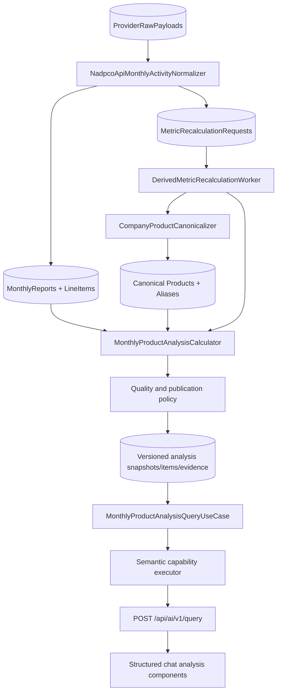

# Feature 129 — Monthly Product Production and Sales Intelligence

Status: Design only. No feature code, migration, provider call, or production-data change is authorized by this specification.

Repository discovery date: 2026-08-24.

## 1. Executive summary

Financial Copilot already ingests NADPCO monthly product sales, retains raw provider payloads,
normalizes company-month reports and product line items, calculates company-level trend snapshots,
persists a product revenue mix, routes monthly capabilities through the conversational capability
registry, and renders a monthly sales chart in the React chat experience. The missing capability is
a deterministic, versioned analysis that explains *why* monthly production and sales changed at
product level.

Feature 129 introduces a published monthly product-analysis read model. It compares a selected
company-month with the previous month, the same month of the previous year, or another explicit
month; attributes the reported revenue change to quantity, rate, activation/discontinuation, and
source residual; identifies contributors, product lifecycle changes, concentration, anomalies, and
production-versus-sales signals; and returns a Persian, evidence-backed response plus chart-ready
data. The LLM resolves intent and explains the result. It never performs the financial arithmetic.

The recommended architecture is hybrid:

1. Keep the existing raw and normalized ingestion layers as evidence and source facts.
2. Canonicalize products with company-scoped, auditable aliases.
3. Recalculate after committed monthly ingestion through the existing recalculation/outbox worker
   pattern.
4. Persist immutable, versioned analysis snapshots and atomically publish one current version.
5. Serve chat/API requests only from published snapshots, with a narrowly bounded cache.

The symmetric price/quantity decomposition is recommended because it is order-neutral and exactly
reconciles the change in `quantity × rate`. Reported sales value remains authoritative. The change
in the difference between reported value and `quantity × rate` is exposed as a residual, so the
published attribution reconciles to the reported revenue change rather than hiding rate rounding or
source inconsistency.

## 2. Scope and non-goals

### 2.1 In scope

- Company-level monthly sales, MoM, YoY, YTD, prior-year equivalent YTD, 3-month average, 12-month
  average, deviation from averages, active-product count, and top-1/top-3/top-5 concentration.
- Product-level production, sales quantity, rate, sales value, changes, contribution, revenue share,
  production-versus-sales differences, lifecycle state, and data-quality state.
- Symmetric price-versus-quantity decomposition with explicit activation/discontinuation effects and
  reported-value residual.
- Deterministic growth-driver, breadth, concentration, mix-change, anomaly, and inferred-inventory
  signals.
- Company-scoped canonical product identity, historical aliases, confidence, manual overrides, and
  audit history.
- Versioned calculation and publication, replay/backfill, freshness, evidence, observability, and
  authorization.
- Structured chat/API output and Financial Copilot frontend components for summary, trends,
  contribution, product comparison, and explainability.
- Semantic routing through the existing capability registry and validated query frame.

### 2.2 Explicitly out of scope

- Forecasting sales, production, price, or inventory.
- Claiming actual inventory balances without inventory statement data.
- Investment advice, target price, or buy/sell recommendations.
- Cross-company aggregation of physical quantities.
- Automatic conversion between economically different products or incompatible units.
- Replacing the NADPCO acquisition client, token cache, monthly backfill coordinator, existing
  monthly trend capability, or existing product revenue mix in the first slice.
- Editing provider payloads or production data.
- LLM-generated calculations or untraceable narrative.

## 3. Current-state repository discovery

This section distinguishes confirmed repository facts from proposed Feature 129 changes.

### 3.1 Provider acquisition and authentication

Confirmed flow:

```text
NadpcoApiScheduledSyncService / MonthlyActivityBackfillCoordinator
    -> NadpcoApiDataProviderClient.FetchMonthlyReportsAsync
    -> POST api/v2/MonthlyActivity/ProductSales for outputTypeId 0..4
    -> POST api/v3/MonthlyActivity/ServiceSales
    -> ProviderRawPayloadStore
    -> FinancialDataSyncProcessor
    -> NadpcoApiMonthlyActivityNormalizer
```

Concrete implementation:

- `src/backend/FinancialCopilot.Infrastructure/Financial/Providers/NadpcoApi/NadpcoApiDataProviderClient.cs`
  sends five isolated ProductSales requests for `outputTypeId` 0–4. The verified request contract
  places `fromDate` and `toDate` in `yyyyMM` Jalali query-string form and sends `companyIds` in the
  JSON body. A failure for one output type is logged and isolated. ServiceSales failure degrades to
  an empty service payload rather than discarding ProductSales.
- `src/backend/FinancialCopilot.Infrastructure/Financial/Providers/NadpcoApi/NadpcoApiTokenCache.cs`
  owns cached NADPCO access-token acquisition and expiry handling. Feature 129 must reuse this
  boundary and must never persist, log, return, or document a bearer token.
- `src/backend/FinancialCopilot.Infrastructure/Financial/Providers/NadpcoApi/NadpcoApiPayloadModels.cs`
  supports the verified nested `productSales` response as well as legacy flat records. It maps
  company identity, year/month, fiscal year end, publication fields, category, product id/code,
  product title/unit, production quantity, sales quantity, rate, and sales value. Vendor product id
  `0` is intentionally treated as missing.
- `src/backend/FinancialCopilot.Infrastructure/Financial/Providers/Persistence/ProviderRawPayloadPersistence.cs`
  stores exact payload text with provider, dataset, endpoint, external reference, SHA-256 checksum,
  and receipt time. `(ProviderName, Checksum)` is unique.

No Feature 129 request path calls NADPCO. Provider access remains an ingestion concern.

### 3.2 Normalized persistence and identity

The authoritative normalized source rows are in
`src/backend/FinancialCopilot.Infrastructure/Financial/Ingestion/Persistence/FinancialIngestionRows.cs`:

- `NormalizedCompanyRow` stores provider-scoped `ExternalCompanyId`, names, TSE symbols, instrument
  code, company/symbol ISIN, industry/group/market foreign keys, and CyclicalWaves mapping fields.
- `NormalizedMonthlyReportRow` stores provider, external company/report ids, Gregorian period start
  and end, source checksum, synchronization time, warning evidence, report type, `OutputType`,
  optional provider period/publication dates, and optional canonical company FK.
- `NormalizedMonthlyReportLineItemRow` stores `ProductCode`, production quantity, sales quantity,
  sales amount, raw title, raw unit, and sales rate.

Important constraints in
`src/backend/FinancialCopilot.Infrastructure/Financial/Ingestion/Persistence/FinancialIngestionConfigurations.cs`:

- `(ProviderName, ExternalReportId)` is unique.
- A logical report period has a unique index over provider, external company, period start,
  output type, and report type.
- `(MonthlyReportId, ProductCode)` is unique.

`NadpcoApiMonthlyActivityNormalizer` in
`src/backend/FinancialCopilot.Infrastructure/Financial/Ingestion/NadpcoApi/NadpcoApiMonthlyActivityNormalizer.cs`
groups by source kind/company/report/year/month, collapses duplicate line-item codes by taking the
last occurrence, authoritatively replaces line items for the report, and calculates product mix and
trend snapshots for ProductSales `OutputType=0`. If the vendor product id/code is absent, the
normalizer creates a deterministic natural code from title, category, unit, and array index. That
key is ingestion-stable for an identical payload, but it is not a canonical product identity across
months because index, title, category, or unit can change.

The normalizer retains publication metadata and vendor-line evidence in `WarningsJson`, but the
current NADPCO path does not populate `MonthlyReports.PublishedAt`. This is a confirmed freshness
gap for Feature 129.

### 3.3 Existing derived monthly capabilities

#### Product revenue mix — Feature 075

- `CompanyProductRevenueMixCalculator` groups line items by a minimal title normalization that only
  maps Arabic `ي/ك` to Persian `ی/ک` and trims whitespace.
- It excludes non-positive sales amounts, ranks products by sales amount, marks a product dominant
  at 30%, and persists rows in `CompanyProductRevenueMix`.
- `ProductRevenueMixQueryUseCase` resolves a company and reads the latest or explicit period from
  the persisted table.
- The current semantic executor always requests the latest period; it does not map a period slot.
- Product mix has no stable product id, raw unit, alias revision, evidence link, publication status,
  calculation version, or inter-period comparison.
- `BuildProductRevenueMixContent` labels its monetary values as rial, while the monthly source and
  snapshot conventions treat NADPCO product sale value as million rial. This is a confirmed unit
  presentation defect to correct when Feature 129 output is introduced; Feature 129 must not copy
  that label.

Concrete files:

- `src/backend/FinancialCopilot.Application/FinancialData/Ingestion/ProductRevenueMixContracts.cs`
- `src/backend/FinancialCopilot.Infrastructure/Financial/Ingestion/NadpcoApi/CompanyProductRevenueMixCalculator.cs`
- `src/backend/FinancialCopilot.Infrastructure/Financial/Ingestion/NadpcoApi/EfCoreProductRevenueMixRepository.cs`
- `src/backend/FinancialCopilot.Infrastructure/Financial/Ingestion/Persistence/CompanyProductRevenueMixRows.cs`
- `src/backend/FinancialCopilot.Infrastructure/Financial/Ingestion/Persistence/CompanyProductRevenueMixConfigurations.cs`

#### Company monthly trend — Features 076–078

`CompanyMonthlyActivityTrendSnapshotCalculator` already provides:

- net monthly sales from all `OutputType=0` product rows, including negatives;
- quantity totals only when units are not mixed;
- YTD from output type 1 and YTD-to-previous-month context from output type 4;
- prior-year and prior-month comparisons from persisted snapshots;
- a trailing average from the current month plus up to 11 prior available snapshots;
- MoM/YoY growth, completeness flags, industry/category enrichment, and source report id.

Confirmed limitations:

- “12-month average” uses the latest available rows rather than proving 12 contiguous calendar
  months; missing months can therefore be silently skipped.
- Fiscal year/index/name fields are currently persisted as `null` by the calculator.
- `SourceRawPayloadId` is currently `null`.
- Publication state, policy version, source fingerprint, revision lineage, and stale status are not
  represented.
- Company-level production and sales quantities are suppressed only by a report-wide mixed-unit
  flag. Per-unit buckets are not published.
- The query use case is primarily sales-value oriented even though its enum lists production and
  sales quantity.

Concrete files:

- `src/backend/FinancialCopilot.Application/FinancialData/Ingestion/CompanyMonthlyActivityTrendSnapshotContracts.cs`
- `src/backend/FinancialCopilot.Application/FinancialData/Ingestion/MonthlyActivityTrendQueryContracts.cs`
- `src/backend/FinancialCopilot.Infrastructure/Financial/Ingestion/NadpcoApi/CompanyMonthlyActivityTrendSnapshotCalculator.cs`
- `src/backend/FinancialCopilot.Infrastructure/Financial/Ingestion/NadpcoApi/EfCoreCompanyMonthlyActivityTrendSnapshotRepository.cs`
- `src/backend/FinancialCopilot.Infrastructure/Financial/Ingestion/Persistence/CompanyMonthlyActivityTrendSnapshotRow.cs`
- `src/backend/FinancialCopilot.Infrastructure/Financial/Ingestion/Persistence/CompanyMonthlyActivityTrendSnapshotConfigurations.cs`

The persisted monetary unit is the NADPCO source unit (million rial). The query use case converts
with `value × 0.0001` and returns `میلیارد تومان` to the frontend.

#### Ranking — Feature 080

The monthly sales quality ranking is deterministic and already models separate quality and
confidence scores. Feature 129 may expose its published label as related context, but must not
reuse that score as product-level attribution and must not turn it into investment advice.

### 3.4 Ingestion, recalculation, and worker patterns

The repository already has an idempotent recalculation outbox:

- `IDerivedMetricRecalculationPublisher` and `DerivedMetricRecalculationRequested` in
  `FinancialIngestionContracts.cs`.
- `StoredDerivedMetricRecalculationPublisher` in `FinancialDataSyncProcessor.cs`.
- `MetricRecalculationRequestRow` with a unique source-dataset/checksum key.
- `MetricRecalculationProcessor` and `DerivedMetricRecalculationWorker` for background execution.
- A durable monthly-activity backfill outbox and worker/coordinator conventions.

Feature 129 should extend this committed-source-event path. It should not add another provider
scheduler or calculate the full product analysis synchronously inside the HTTP query path.

### 3.5 AI orchestration and semantic routing

The current repository implements more than the high-level idea in Feature 128:

- `ConversationalCapabilityRegistry` declares versioned aliases, examples, required/optional slots,
  execution route, output type, data requirements, precedence group, and guidance policy.
- `QueryInterpretation`, `ValidatedQueryFrame`, canonical entity resolution, task state, confidence
  governance, suggested actions, and semantic rollout/shadow support exist under
  `FinancialCopilot.Application/AI/Orchestration`.
- `monthly_activity_trend` and `product_revenue_mix` are registered capabilities with dedicated
  `IConversationalCapabilityExecutor` implementations.
- Both V1 and Microsoft Agent Framework V2 map semantic frames to deterministic use cases.
- The active public facade remains `POST /api/ai/v1/query`.

Concrete files:

- `ConversationalCapabilityContracts.cs`
- `DeterministicCapabilityInterpreter.cs`
- `CapabilityInterpretationGovernance.cs`
- `SemanticCapabilityExecutionContracts.cs`
- `SemanticCapabilityExecutors.cs`
- `ConversationTaskStateContracts.cs`
- `AiQueryOrchestrationService.cs`
- `FinancialCopilotAgentWorkflowRunner.cs`
- `FinancialCopilotWorkflowDefinition.cs`
- `AiFacadeController.cs`
- `AiFacadeContracts.cs`

Feature 129 must add a governed capability and slots, not another free-standing Persian phrase
switch. Deterministic phrases may remain a safe fallback, but capability selection must support
natural paraphrases through interpretation plus deterministic validation.

### 3.6 Frontend conventions

The frontend is React 19 + TypeScript + TanStack Start/Router/Query, Tailwind, Radix UI, Recharts,
Zod, and Vitest. The chat server function in `src/frontend/src/lib/chat.functions.ts` calls the AI
facade through the authenticated server-side API client and maps structured assistant payloads.

`MessageList` renders assistant prose, scanner tables, citations, confidence, usage, suggested
actions, and specialized results. `MonthlyActivityTrendChart` is an RTL Recharts composed chart
with responsive sizing, current/previous-year bars, 12-month line, null handling, tooltip, light and
dark palettes, image download, and Persian number formatting. Its view-model and image-export
separation should be reused.

Current gaps for Feature 129:

- No structured product-analysis result exists in `AssistantChatBlock`.
- Product revenue mix is rendered as Markdown prose rather than a dedicated product table.
- There is no contribution waterfall, price/quantity detail, data-quality badge, or evidence drawer.
- The trend chart owns its loading only at the message level; partial/stale/unavailable states for a
  multi-section analysis need explicit contracts.

Concrete files:

- `src/frontend/src/lib/chat.functions.ts`
- `src/frontend/src/components/app/message-list.tsx`
- `src/frontend/src/components/app/monthly-activity-trend-chart.tsx`
- `src/frontend/src/components/app/monthly-activity-trend-chart-view-model.ts`
- `src/frontend/src/components/app/monthly-activity-trend-chart-image.ts`
- `src/frontend/src/components/ui/chart.tsx`
- `src/frontend/src/components/app/__tests__/monthly-activity-trend-chart-view-model.test.ts`
- `src/frontend/src/components/app/__tests__/message-list.test.tsx`

### 3.7 Existing tests to reuse

- `NadpcoApiProviderTests` and `NoavaranCurrentApiBoundaryTests`: provider request and token-safe
  boundary behavior.
- `NadpcoApiMonthlyActivityNormalizerTests`: nested payload flattening, output types, missing product
  ids, duplicate collapse, idempotency, source coexistence, recalculation publication, and retries.
- `CompanyProductRevenueMix075Tests`: share, rank, dominant threshold, minimal normalization,
  backfill, and intent routing.
- `CompanyMonthlyActivityTrendSnapshot076Tests`: net sales, negatives, output-type isolation,
  mixed units, YoY, averages, and YTD.
- `MonthlyActivityTrend077Tests`: Persian intent variations, company resolution, chart series,
  null future months, and unit conversion.
- `AiFacadeV2EndpointTests`: structured semantic execution, billing, and response persistence.
- Frontend Vitest suites for message rendering and monthly chart view models.

Several older spec status labels say “not implemented” although corresponding code and migrations
are present. Feature 129 treats executable repository state as authoritative and should update stale
spec status only in a separate documentation-maintenance change.

## 4. Confirmed capabilities, gaps, and risks

| Area | Confirmed capability | Gap or risk Feature 129 must address |
| --- | --- | --- |
| Acquisition | Five ProductSales output types, isolated failures, raw payload checksum | Partial output-type ingestion can produce a partial company-month without a publish gate |
| Report identity | Provider/report and logical-period uniqueness | Revised payload replaces normalized lines; current derived rows lack immutable revision lineage |
| Product identity | Vendor code/id when positive; natural fallback otherwise | Fallback includes array index; title/unit drift splits products; minimal title grouping can also merge unsafe rows |
| Monetary facts | Reported sales amount retained | Existing product-mix label is inconsistent with million-rial source semantics |
| Quantity facts | Production/sales/rate retained | No unit normalization or per-unit aggregate; changed unit can create false growth |
| Trend | MoM, YoY, YTD, 12-row average, mixed-unit flag | No contiguous-month proof, product attribution, versioned policy, or complete evidence |
| Revenue mix | Product share/rank/dominance persisted | Positive-sales-only logic hides returns; no history, unit, canonical id, or comparison |
| AI | Registry, validated frame, task state, deterministic executors | Existing product mix has no period slot; current capabilities cannot answer price-vs-quantity or contributor questions |
| Frontend | Structured trend chart and stateful chat | No product intelligence components or per-insight evidence inspection |
| Data quality | Raw checksum, warnings JSON, idempotent normalization | No severity model, publication blocking, manual product review, or source residual status |

The largest financial risk is false attribution: a textually similar but economically different
product, a changed unit, a cumulative row mistaken for a monthly row, or a rounded rate can produce
a plausible but wrong explanation. The design therefore makes identity, unit compatibility,
output type, source reconciliation, and coverage publication gates—not footnotes added after an
answer is generated.

## 5. Functional requirements

### 5.1 Query and period selection

1. Resolve a company through the existing companies-first canonical resolver and carry
   `ExternalCompanyId` as the analysis join key.
2. Default the current period to the latest **published** `OutputType=0` product analysis, not merely
   the numerically greatest raw report period.
3. Default comparison to the immediately preceding Jalali month.
4. Support `previous_month`, `same_month_previous_year`, and an explicit Jalali company-month.
5. Resolve fiscal YTD from provider output type 1. Compare it with output type 1 for the same
   company and report month in the prior Jalali/fiscal year when available; do not infer it from
   unrelated output types.
6. Return bounded clarification only when company or requested period is genuinely unresolved.

### 5.2 Company monthly summary

For current period `t`, calculate and publish:

- net reported sales value;
- MoM and YoY amount/percent when valid;
- YTD and prior-year equivalent YTD amount/percent when valid;
- contiguous 3- and 12-month averages and period counts;
- deviation from each available average;
- active, new, discontinued, resumed, inactive, and unmatched product counts;
- top-1, top-3, and top-5 revenue concentration;
- product match coverage, decomposition coverage, unit-safe quantity coverage, and evidence status;
- largest positive and negative contributors;
- primary driver and breadth/concentration classification;
- positive, negative, neutral, inferred, and data-quality signals.

Production and sales quantity totals are published only per canonical unit bucket. A cross-product
“total quantity” is `null` when more than one non-convertible unit dimension exists.

### 5.3 Product comparison

For the union of products present in either period, publish base/current values and changes for:

- production quantity;
- sales quantity;
- sales rate;
- reported sales value;
- revenue share;
- contribution to total company revenue change;
- production-to-sales ratio and production-minus-sales quantity when unit-compatible;
- quantity effect, rate effect, activation/discontinuation effect, and residual;
- lifecycle state and primary driver;
- raw/canonical unit, matching method/confidence, warning codes, and evidence references.

When the query names a product and a history window (for example six months), return a bounded
canonical-product monthly series (maximum 24 months) containing production, sales quantity, rate,
reported sales value, unit, lifecycle state, and missing-period markers. The series is read from
published analysis facts and never stitched by raw-title equality in the request path.

Percent change is `null` when the base is zero, negative, missing, or unit-incompatible. The response
contains an explicit reason code; it never emits infinity or substitutes zero.

### 5.4 Product lifecycle states

The closed set is:

- `ContinuouslyActive`: meaningful activity in both periods.
- `New`: no evidence in prior history and meaningful current activity.
- `Resumed`: current activity after at least one inactive comparison period and earlier activity.
- `Discontinued`: meaningful base activity and no current activity, with no evidence of a simple
  title/unit remap.
- `Inactive`: product appears but has no meaningful production, quantity, or sales value.
- `ReturnsOrReversal`: economically meaningful negative reported value requiring separate display.
- `Unmatched`: identity cannot be resolved safely enough for inter-period attribution.

“Discontinued” is an observed-period state, not a claim that the company permanently stopped the
product.

### 5.5 User-facing signals

Signals include:

- production growing faster than sales quantity;
- sales quantity exceeding production;
- production exceeding sales for 2 or 3+ consecutive comparable periods;
- potential inventory accumulation/drawdown;
- production interruption/restart;
- high production volatility;
- persistent production-sales imbalance;
- concentration increase/decrease;
- rate-driven, quantity-driven, new-product-driven, mixed, broad-based, or concentrated growth;
- unusual change against trailing history;
- unit/title change and reconciliation warnings.

Inventory wording must always use `inferred`/`potential` language. Without opening inventory facts,
the system cannot state that inventory definitely increased or decreased.

## 6. Non-functional requirements

- Deterministic: identical source facts, alias revision, and calculation policy produce identical
  numeric results, classifications, ordering, warnings, and source fingerprint.
- Reproducible: every result identifies policy version, source checksums/report ids, alias-set
  revision, calculated time, and publication time.
- Performant: published company-month read p95 ≤ 300 ms at the application repository boundary and
  warm AI facade structured retrieval p95 ≤ 700 ms, excluding model explanation latency.
- Bounded: default at most 24 trend months and 100 product rows; server-enforced maxima.
- Available: a failed recalculation never replaces the last published valid snapshot.
- Consistent: snapshot header, product items, signals, and evidence publish atomically.
- Localized: Persian response with correct RTL layout, Persian month labels/digits, and explicit
  units; API enum/code fields remain culture-neutral.
- Accessible: charts have text/table equivalents, keyboard-operable evidence controls, non-color
  sign labels, and readable contrast in both themes.
- Observable: low-cardinality metrics and structured logs; no payloads, product lists, credentials,
  or user messages in metric labels.
- Secure: provider credentials remain server-side; reads require existing AI/API authentication;
  administrative recalculation and product overrides require `DataAdmin` or a narrower future
  permission.

## 7. Calculation definitions

### 7.1 Notation and authoritative values

For canonical product `i` and period `t`:

- `Qᵢ,t`: sales quantity, when present and unit-compatible.
- `Pᵢ,t`: reported sales rate, when present and valid.
- `Rᵢ,t`: reported sales value. This is authoritative revenue.
- `Gᵢ,t`: production quantity.
- `Sₜ = Σ Rᵢ,t`: company net monthly reported sales, including negative rows.

Only ProductSales `OutputType=0` participates in monthly values. Adjustment/cumulative output types
remain evidence or explicitly scoped YTD inputs.

### 7.2 Changes and percentages

```text
AmountChange(x) = x1 - x0
PercentChange(x) = ((x1 - x0) / x0) × 100, only when x0 > 0
RevenueContributionᵢ = Rᵢ,1 - Rᵢ,0
ContributionShareᵢ = RevenueContributionᵢ / (S1 - S0) × 100
RevenueShareᵢ,t = Rᵢ,t / Sₜ × 100, only when Sₜ > 0
```

`ContributionShare` may exceed 100% or be negative when positive and negative product movements
offset. The UI must show the amount and sign; it must not clamp the percentage.

For concentration, define `PositiveRevenueₜ = Σ max(Rᵢ,t, 0)` and
`ConcentrationShareᵢ,t = max(Rᵢ,t, 0) / PositiveRevenueₜ`. Then calculate
`TopNShare = Σ top-N ConcentrationShare` for N=1, 3, and 5 and
`RevenueHHI = Σ (ConcentrationShareᵢ,t²)`. HHI is supporting evidence, while top-N shares remain the
primary user-facing measures because they are easier to explain. Returns/reversal rows remain in
net company sales and contribution, but are shown separately from the positive-revenue
concentration denominator. When positive revenue is zero, all concentration measures are `null`.

When a baseline is zero/missing/negative, return amount change plus a reason such as
`ZeroBaseline`, `MissingBaseline`, or `NegativeBaseline`; do not publish a growth percentage.

### 7.3 Averages and YTD

- `Average3`: arithmetic mean of exactly three contiguous published monthly totals ending at `t`.
- `Average12`: arithmetic mean of exactly twelve contiguous published monthly totals ending at `t`.
- If continuity is incomplete, publish the available-period mean separately with period count and
  `PartialWindow`; do not label it a complete 3/12-month average.
- YTD uses provider output type 1. An optional validation compares it with the sum of available
  output-type-0 months, but does not replace the reported YTD.
- Prior-year equivalent YTD uses prior-year output type 1 for the equivalent fiscal month.

### 7.4 Quantity aggregation and units

Normalize units to a governed code and dimension, while preserving raw text. Exact conversions are
allowed only inside an approved dimension (for example kilogram↔tonne) with a versioned conversion
factor. Packaging units such as “عدد”, “هزار عدد”, “کارتن”, and “تن” are not mutually convertible
without product-specific facts.

Company quantity output is a map of unit bucket to total. A scalar total is present only when all
included values share one compatible normalized dimension and conversion policy.

### 7.5 Production-versus-sales

For a matched product with a common unit:

```text
ProductionSalesGapᵢ,t = Gᵢ,t - Qᵢ,t
ProductionToSalesRatioᵢ,t = Gᵢ,t / Qᵢ,t, only when Qᵢ,t > 0
SalesToProductionRatioᵢ,t = Qᵢ,t / Gᵢ,t, only when Gᵢ,t > 0
```

Suggested deterministic signals:

- `PotentialAccumulation`: gap > max(10% of production, materiality floor) for at least two
  consecutive comparable months.
- `PersistentPotentialAccumulation`: same for at least three months.
- `PotentialDrawdown`: sales exceed production by the materiality threshold.
- `ProductionInterruption`: prior production is material and current production is zero/missing
  while the product remains otherwise identifiable.
- `ProductionRestart`: current production is material after at least one zero period and earlier
  material production.
- `HighProductionVolatility`: at least six valid periods and robust z-score/MAD threshold is met.

Thresholds are policy-versioned and use both percentage and absolute materiality floors so tiny
products do not create alerts.

## 8. Price-versus-quantity attribution

### 8.1 Considered methods

Base-period allocation:

```text
QuantityEffect = (Q1 - Q0) × P0
PriceEffect = Q1 × (P1 - P0)
```

This reconciles `Q1P1 - Q0P0`, but assigns the full interaction to price. The equivalent explicit
three-term form is `ΔQ×P0 + Q0×ΔP + ΔQ×ΔP`.

Symmetric allocation:

```text
QuantityEffect = (Q1 - Q0) × ((P0 + P1) / 2)
PriceEffect = (P1 - P0) × ((Q0 + Q1) / 2)
```

The symmetric effects also sum exactly to `Q1P1 - Q0P0`; the interaction is shared equally between
quantity and price. It is order-neutral and avoids implying that either the base or current period
is the privileged price basis.

### 8.2 Decision

Use symmetric decomposition for continuously active, unit-compatible products with finite positive
rates and non-negative comparable quantities. Store policy code
`MonthlyProductAttribution.Symmetric.v1`.

Reported revenue remains authoritative. Define the per-period reported-value difference:

```text
Residual_t = R_t - (Q_t × P_t)
ResidualEffect = Residual_1 - Residual_0
ReportedRevenueChange = QuantityEffect + PriceEffect + ResidualEffect
```

This equation must reconcile exactly at stored decimal precision. “Within tolerance” controls the
warning/classification, not whether an unbalanced result may be published.

Recommended warning tolerance:

```text
Tolerance = max(1 million rial, 0.5% × max(abs(R0), abs(R1)))
```

Make both values configuration-backed calculation-policy parameters. A residual above tolerance
sets `ReportedValueMismatch`, reduces decomposition coverage/confidence, and prevents an unqualified
price/quantity conclusion for that product.

### 8.3 Edge-case treatment

| Case | Treatment |
| --- | --- |
| Zero/missing base sales or rate | No fabricated price effect. Attribute current reported value to `ActivationEffect` and classify New/Resumed as history permits. |
| Discontinued product | Attribute `-R0` to `DiscontinuationEffect`; no current price effect. |
| Both periods zero/inactive | Effects zero, lifecycle Inactive; exclude from driver ranking. |
| Negative reported sales | Preserve in company total and contribution; classify as returns/reversal; decompose only when quantity/rate semantics are valid and separately flagged. |
| Zero/negative rate | Do not decompose; retain reported contribution with `InvalidRate`. |
| Unit change | Do not decompose unless an approved exact conversion makes quantities comparable; emit `UnitChanged`. |
| Rounded rates | Publish symmetric effects and explicit residual; warn only above tolerance. |
| Title change | Use canonical product alias evidence; do not rely on exact title equality. |
| Missing quantity | Report contribution, but set decomposition unavailable. |

### 8.4 Company reconciliation and coverage

```text
AttributedChange = Σ(quantity + price + activation + discontinuation + residual)
UnmatchedChange = Σ contributions for unresolved/unsafe products
CompanyChange = S1 - S0
```

The persisted result must satisfy `AttributedChange + UnmatchedChange = CompanyChange` at decimal
precision. Publish:

- match coverage = current/base absolute revenue linked to canonical products;
- decomposition coverage = absolute continuing-product revenue with valid quantity/rate inputs;
- residual ratio = `Σabs(residual effects) / max(Σabs(product contributions), floor)`;
- unmatched ratio.

## 9. Deterministic company-level classification

All thresholds belong to `MonthlyProductAnalysisPolicy.v1` and are adjustable only by publishing a
new policy version and recalculating snapshots.

Use absolute effect mass as the denominator so offsetting effects do not create unstable shares:

```text
EffectMass = Σ(abs(quantity) + abs(price) + abs(activation) + abs(discontinuation))
QuantityShare = Σabs(quantity) / EffectMass
PriceShare = Σabs(price) / EffectMass
ActivationShare = Σabs(activation) / EffectMass
```

Classification prerequisites: match coverage ≥ 90%, decomposition coverage ≥ 80% of continuing
revenue, residual ratio ≤ 10%, and no blocking quality issue.

- `QuantityDriven`: quantity share ≥ 60% and exceeds price share by at least 15 percentage points.
- `PriceDriven`: price share ≥ 60% and exceeds quantity share by at least 15 points.
- `NewProductDriven`: activation share ≥ 40% of effect mass or new/resumed products explain ≥ 50%
  of the signed company change.
- `Mixed`: prerequisites pass but no driver threshold is met.
- `NotReliablyClassifiable`: prerequisites fail or company change is immaterial.

Composition/mix is a separate, non-additive signal because physical units differ across products:

```text
RevenueShareTurnover = 0.5 × Σ abs(share_i,1 - share_i,0)
```

`MixShift` is material at ≥ 15 percentage points with ≥ 90% product match coverage. Label
`MixDriven` only when the shift is material, neither quantity nor price meets 60%, and the top
gaining/losing shares explain the change. The response must describe it as a revenue-composition
shift, not as a physical-quantity decomposition.

Breadth and concentration:

- `Concentrated`: top aligned contributor explains ≥ 50% of signed change, or top three explain
  ≥ 80%.
- `BroadBased`: at least four material aligned contributors, top one < 40%, and top three < 70%.
- otherwise `ModeratelyConcentrated`.

Material product contribution is `max(2% of abs(company change), policy absolute floor)`.

## 10. Product normalization strategy

### 10.1 Identity hierarchy

Product identity is company-scoped. Matching order:

1. Approved manual alias/override.
2. Stable positive vendor product id/code observed consistently for the same company.
3. Exact normalized composite: title tokens + package attributes + normalized unit dimension.
4. Historical alias previously approved by a high-confidence deterministic match.
5. Conservative similarity candidate for review; never auto-merge an economically material row
   solely because titles are textually similar.

### 10.2 Normalization pipeline

- Unicode normalization and Persian/Arabic character mapping (`ي→ی`, `ك→ک`).
- Normalize Persian, Arabic, and Latin digits to a comparison form while retaining display text.
- Normalize whitespace, zero-width non-joiner variants, punctuation, common separators, and casing.
- Extract package size/count and unit tokens (`۴۰ گرمی`, `1.5 لیتری`, `هزار عدد`).
- Normalize known unit aliases to governed unit codes and dimensions.
- Remove only governed non-economic noise tokens; do not remove grade, size, domestic/export,
  package, concentration, or quality terms by default.
- Apply company-scoped known aliases and validity periods.

Examples that must remain distinct unless manually approved include domestic versus export,
different package sizes, different chemical grades, and different units.

### 10.3 Confidence and audit

- 1.00: manual approved mapping or exact stable vendor id.
- ≥ 0.98: exact normalized composite with compatible unit/package.
- 0.90–0.979: candidate requiring review before materially affecting published inter-period
  attribution.
- < 0.90: unmatched.

Automatic matches store algorithm version, evidence features, source aliases, score, creator
(`System`/actor), timestamps, and override history. A manual change triggers recalculation for all
affected months and never rewrites raw titles.

## 11. Ranking and anomaly detection

### 11.1 Deterministic ranking

Sort largest contributors by:

1. signed contribution descending/ascending as requested;
2. absolute contribution descending;
3. current sales value descending;
4. canonical product id ascending for stable ties.

Production, sales quantity, and rate rankings include only products with comparable units/valid
inputs and use the same stable tie-breaking.

### 11.2 Historical anomalies

Minimum six comparable historical periods; prefer twelve. For each product/metric:

- calculate trailing median and median absolute deviation (MAD), excluding the current period;
- flag when robust z-score `0.6745 × (x - median) / MAD` has absolute value ≥ 3.5;
- when MAD is zero, require both a configured relative change and absolute materiality floor;
- winsorization is allowed for display-scale estimation, not for altering reported facts;
- suppress anomaly claims when unit/identity changed, history is sparse, or a revision is pending.

Also flag title/unit changes, duplicate candidates, rate/value inconsistency, implausible magnitude,
and current-vs-history gaps. Each anomaly has severity, rule version, inputs, threshold, and evidence.

## 12. Proposed backend architecture

### 12.1 Components



Application boundaries:

- `IMonthlyProductAnalysisRecalculationUseCase`
- `IMonthlyProductAnalysisCalculator`
- `ICompanyProductCanonicalizer`
- `IMonthlyProductAnalysisRepository`
- `IMonthlyProductAnalysisQueryUseCase`
- `IMonthlyProductAnalysisPublicationPolicy`

Infrastructure implements EF repositories, source readers, canonicalization persistence, and
worker routing. Domain/application code owns formulas, thresholds, states, and response contracts.

### 12.2 Calculation workflow

1. Normalize and commit all available report/line-item rows.
2. Commit/reuse the existing source-checksum recalculation request.
3. Worker loads the target company-month and required comparisons/history.
4. Resolve canonical products and unit compatibility using a fixed alias revision.
5. Build a canonical source fingerprint from sorted report ids, payload checksums, line facts,
   alias revision, and calculation policy.
6. If an identical successful fingerprint exists, complete as no-op.
7. Calculate header, product items, effects, signals, and quality findings in memory using decimal
   arithmetic.
8. Validate reconciliation and publication rules.
9. In one transaction insert the new immutable version and children, set it `Published`, and mark
   the prior current version `Superseded`. If blocked, persist a non-current `Blocked` version and
   leave the previous publication current.
10. Invalidate only the affected company-period cache keys.

### 12.3 On-demand versus precompute decision

| Option | Assessment |
| --- | --- |
| Calculate on every query | Rejected: expensive historical reads, inconsistent aliases/policies, weak auditability, and LLM-path latency. |
| Precompute only | Good for primary reads but needs a safe recovery path for late aliases/revisions. |
| Persisted published snapshot only | Strong reproducibility but needs explicit recalculation orchestration. |
| Hybrid | Recommended: precompute/publish after ingestion and overrides; permit authenticated admin rebuild and bounded lazy enqueue when a snapshot is absent, while returning `Unavailable/Processing` rather than calculating inline. |

## 13. Data model changes

Names below are proposed; implementation must use the Financial ingestion DbContext and naming
conventions verified above.

### 13.1 `CompanyCanonicalProducts`

| Field | Purpose |
| --- | --- |
| `Id` | Canonical GUID |
| `ExternalCompanyId` | Company scope |
| `DisplayTitleFa` | Approved display title |
| `NormalizedEconomicKey` | Normalized title/package/unit composite |
| `CanonicalUnitCode`, `UnitDimension` | Governed unit metadata |
| `Status` | Active/Merged/Retired |
| `CreatedAtUtc`, `UpdatedAtUtc`, `RowVersion` | Audit/concurrency |

Unique active index on company + normalized economic key; no global cross-company merge.

### 13.2 `CompanyProductAliases`

Fields: canonical product id, provider, external company id, vendor product code/id, raw title/unit,
normalized title/unit/package signature, valid-from/to period, method, confidence, algorithm version,
approval state, override actor/reason, created/updated timestamps. Index vendor identity and
normalized lookup fields. Only one approved alias may own the same company/provider/vendor key for
an overlapping validity range.

### 13.3 `CompanyMonthlyProductAnalysisSnapshots`

Header fields:

- identity: id, external company id, optional company FK/symbol/name, current/comparison periods and
  comparison kind;
- totals: current/base sales, amount/percent change, YTD comparisons, 3/12-month averages,
  concentration, lifecycle counts;
- attribution: aggregated effects, unmatched change, coverage ratios, residual ratio, primary
  driver, breadth, mix turnover;
- quality/publication: status, current flag, warning/error counts, freshness status, completeness,
  policy version, alias revision, source fingerprint;
- provenance: source provider, calculated/published timestamps, superseded snapshot id.

Unique idempotency index on `(ExternalCompanyId, CurrentPeriod, ComparisonPeriod,
CalculationPolicyVersion, AliasRevision, SourceFingerprint)`. A filtered unique index permits one
current published snapshot per company/current period/comparison kind.

### 13.4 `CompanyMonthlyProductAnalysisItems`

One row per canonical/unmatched product in the comparison union. Store base/current product facts,
raw and canonical units, changes, shares, contribution, lifecycle, effects, primary driver,
match/effect coverage, data-quality status, and stable rank fields. Unique snapshot + canonical
product; unmatched rows also carry a deterministic source key.

### 13.5 `MonthlyProductAnalysisEvidence`

Links snapshot/item/insight to monthly report id, line-item id, raw payload id/checksum when
available, report/output type, period, value field, and observed/synchronized/publication time. The
public API returns bounded evidence DTOs, never raw payload text.

### 13.6 `MonthlyProductAnalysisCalculationRuns`

Operational record: request/correlation id, source checksum, company/period, policy/alias versions,
status, start/end, counts, fixed failure code, and retry metadata. Do not store exception stacks or
payloads in public/status responses.

## 14. Data quality and publication rules

### 14.1 Severity model

- `Blocking`: no new publication; retain last valid published snapshot.
- `Warning`: publish with visible limitation and confidence penalty.
- `Partial`: publish safe sections, mark unavailable sections explicitly.
- `ManualReview`: publish only sections unaffected by the issue; product attribution remains
  pending or unmatched.

### 14.2 Rules

| Condition | Default outcome |
| --- | --- |
| Duplicate logical company/output-type/month reports with conflicting current facts | Blocking until deterministic revision winner is selected |
| Same checksum/replay | No-op |
| Revised/corrected report with newer accepted payload | Recalculate new immutable version; supersede atomically |
| Monthly analysis lacks output type 0 | Blocking |
| Cumulative row used as monthly row | Blocking |
| Invalid Jalali year/month or period mismatch | Blocking |
| Partial ingestion of output type 0 | Blocking when provider operation is known incomplete; otherwise Partial with coverage warning |
| Missing comparison month | Partial; publish current summary, no growth/attribution |
| Missing product id but safe alias match | Warning with match method |
| Ambiguous product match | ManualReview; keep unmatched, do not merge |
| Unit change without conversion | Partial; contribution valid, quantity/rate attribution unavailable |
| Missing/zero/negative rate | Partial; contribution valid, decomposition unavailable |
| Negative quantity/value | Warning or ManualReview by semantic rule; preserve value |
| `R` inconsistent with `Q×P` below tolerance | Publish residual without warning |
| Residual above tolerance | Warning; possibly `NotReliablyClassifiable` |
| Missing month inside 3/12-month window | PartialWindow; never label complete |
| Fiscal-year-end change | ManualReview for fiscal YTD comparability; calendar MoM remains possible |
| Product-title drift with high-confidence alias | Warning/audit only |
| Stale unpublished data | Return stale/unavailable state; never present as fresh |

Publication requires exact company reconciliation, valid source period/output type, deterministic
identity of the report winner, a non-empty evidence set, and no blocking finding.

### 14.3 Freshness semantics

- `Fresh`: current published snapshot corresponds to the latest accepted source report and is
  inside the configured reporting freshness window.
- `Stale`: published snapshot is internally valid but a newer source/report is expected or a newer
  recalculation is pending/failed.
- `Partial`: safe publication with unavailable sections.
- `Processing`: source is accepted and recalculation is queued/running; return prior snapshot as
  stale if present.
- `Unavailable`: no publishable snapshot.
- `Blocked`: latest source failed publication validation; prior valid snapshot may still be served
  with a prominent stale/blocked note.

Use provider publication date when normalized and validated; otherwise use source receipt/sync time
and state that publication time is unknown. Feature 129 should normalize NADPCO publication fields
into `MonthlyReports.PublishedAt` rather than leaving them only inside warning JSON.

## 15. API and contract design

### 15.1 Query request

The public chat entry remains:

```http
POST /api/ai/v1/query
Content-Type: application/json

{
  "conversationId": "optional-guid",
  "message": "رشد فروش مرداد غذار مقداری بوده یا قیمتی؟"
}
```

Semantic frame (internal):

```json
{
  "capabilityCode": "monthly_product_activity_analysis",
  "registryVersion": 2,
  "slots": {
    "companyOrSymbol": "canonical-company-guid",
    "currentPeriod": "1405-05",
    "comparisonPeriod": "previous_month",
    "analysisFocus": "price_quantity_attribution",
    "presentation": "summary"
  }
}
```

### 15.2 Structured result

Add `monthlyProductAnalysisResult` to `AiQueryResponse`, persisted assistant payload, workflow
messages, API mapper, and frontend assistant contract. Abbreviated example:

```json
{
  "company": { "externalCompanyId": "194", "symbol": "غذار", "name": "..." },
  "period": { "year": 1405, "month": 5, "labelFa": "مرداد ۱۴۰۵" },
  "comparison": { "kind": "PreviousMonth", "year": 1405, "month": 4 },
  "unit": { "source": "MillionRial", "display": "BillionToman", "factor": 0.0001 },
  "summary": {
    "currentSales": 570150,
    "baseSales": 450000,
    "salesChange": 120150,
    "salesGrowthPercent": 26.7,
    "primaryDriver": "QuantityDriven",
    "breadth": "ModeratelyConcentrated",
    "top1ConcentrationPercent": 36.5
  },
  "products": [
    {
      "canonicalProductId": "guid",
      "name": "سبزیجات ۴۰ گرمی",
      "unit": "عدد",
      "base": { "salesQuantity": 1000, "salesRate": 100, "salesValue": 100000 },
      "current": { "salesQuantity": 1966, "salesRate": 97.6, "salesValue": 191881.6 },
      "salesValueChange": 91881.6,
      "quantityEffect": 95440.8,
      "priceEffect": -3559.2,
      "residualEffect": 0,
      "lifecycle": "ContinuouslyActive",
      "primaryDriver": "Quantity",
      "quality": "Valid"
    }
  ],
  "signals": [],
  "quality": {
    "status": "Published",
    "freshness": "Fresh",
    "matchCoveragePercent": 99.4,
    "decompositionCoveragePercent": 93.2,
    "warnings": []
  },
  "evidence": {
    "snapshotId": "guid",
    "policyVersion": "MonthlyProductAnalysis.v1",
    "sourceProvider": "NoavaranCurrentApi",
    "sourceReports": [{ "reportId": "...", "outputType": 0, "period": "1405-05" }],
    "calculatedAtUtc": "2026-08-24T10:00:00Z"
  }
}
```

The example demonstrates shape, not production data.

### 15.3 Optional direct read endpoint

If a non-chat page is added, expose the same application read model without an LLM:

```http
GET /api/v1/companies/{symbol}/monthly-product-analysis?year=1405&month=5&compare=previous-month
```

This route is proposed, not currently present. It uses existing JWT/API-key authentication,
entitlement/rate-limit conventions, ETag from snapshot fingerprint/version, and no provider access.

## 16. AI orchestration and evidence-backed response

### 16.1 New capability

Register `monthly_product_activity_analysis` with execution route of the same name, output type
`analysis`, precedence group `monthly-product-analysis`, and data requirements
`canonical_company_identity`, `published_monthly_product_analysis`, and `product_analysis_evidence`.

Required slot: company/symbol. Optional slots: current period, comparison period/kind, product,
analysis focus, measure, result limit, and presentation. Extend `QuerySlotSchema` only with general
slot types that cannot be represented by existing period/metric/presentation slots.

Routing precedence examples:

- “روند فروش ماهانه غذار” → existing `monthly_activity_trend`.
- “ترکیب فروش محصولات غذار” → existing `product_revenue_mix` until migrated, or Feature 129 summary
  when a comparison is explicit.
- “فروش مرداد غذار نسبت به تیر چطور بود؟” → Feature 129.
- “رشد فروش غذار مقداری بود یا قیمتی؟” → Feature 129 attribution.
- “بیشترین اثر منفی را کدام محصول داشت؟” with active task state → Feature 129, carried company and
  period slots.
- “P/E غذار” → `symbol_metric_lookup`; Feature 129 must not intercept it.

The interpreter should use registry metadata/model interpretation for paraphrases. Deterministic
validation checks supported comparison kinds, resolved canonical company/product, period bounds,
publication state, and result limits. Do not add a growing list of sentence-order patterns.

### 16.2 Tool/executor contract

`MonthlyProductActivityAnalysisCapabilityExecutor` converts only validated slots into
`MonthlyProductAnalysisQuery` and calls the deterministic query use case. It returns one structured
payload with statuses `Executed`, `Partial`, `NoData`, `ClarificationRequired`, or
`TemporarilyUnavailable`. It does not pass raw line items to the model.

The LLM receives bounded, calculated facts and may:

- choose concise section ordering;
- produce natural Persian connective prose;
- repeat deterministic conclusions and limitations.

It may not recalculate, invent missing percentages, infer inventory as fact, alter units, or add
technical-analysis/investment conclusions. The response consistency layer verifies every numeric
claim against the structured result. Prefer template-backed narrative for the primary summary and
allow the LLM only to improve readability.

### 16.3 Required Persian answer content

```text
فروش مرداد ۱۴۰۵ غذار نسبت به تیر ۲۶٫۷٪ افزایش داشته است.
بزرگ‌ترین اثر مثبت مربوط به «سبزیجات ۴۰ گرمی» بوده است.
مقدار فروش این محصول ۹۶٫۶٪ افزایش و نرخ آن ۲٫۴٪ کاهش داشته؛ بنابراین اثر این محصول مقداری بوده است.

این جمع‌بندی بر پایه گزارش‌های ماهانه منتشرشده و محاسبه نسخه ... است.
هشدار: ...
```

All displayed figures come from the structured snapshot. Each insight exposes an evidence action
that reveals current/base values, formula/rule, source periods, freshness, and warnings.

## 17. UX and proposed frontend architecture

Feature 129 first appears as a structured assistant block below concise prose, consistent with
`MessageList` and the existing trend chart.

Frontend data flow:

```text
chat.functions.ts (authenticated server function and DTO mapping)
    -> AssistantChatBlock.monthlyProductAnalysisResult
    -> MessageList / AssistantBlock
    -> MonthlyProductAnalysis (state and section composition)
       -> summary cards
       -> existing MonthlyActivityTrendChart adapter
       -> MonthlyProductContributionChart
       -> ProductProductionSalesChart
       -> MonthlyProductAnalysisTable
       -> MonthlyProductAnalysisEvidence
```

Each component consumes a pure view model derived from the server DTO. View models format locale,
units, labels, and responsive presentation only; they do not recompute financial facts. This keeps
image export, screen rendering, persisted-message replay, and future Telegram presentation aligned
with one canonical backend result.

### 17.1 Sections

1. **Summary cards:** current sales, MoM/YoY, primary driver, largest positive/negative contributor,
   freshness.
2. **Persian narrative:** at most 3–5 evidence-backed bullets; limitations immediately adjacent.
3. **Sales trend:** reuse/extend `MonthlyActivityTrendChart`; current and prior year plus optional
   moving average and publication markers.
4. **Contribution waterfall:** signed product revenue changes, positive emerald/negative rose,
   “other” only when its members remain inspectable. Selecting a bar opens quantity/rate/residual.
5. **Production versus sales chart:** selected product only, explicit unit, no incompatible-unit
   overlay.
6. **Product analysis table:** product, lifecycle, production, sales quantity, rate, sales value,
   share, change, contribution, driver, and quality. Sortable and horizontally scrollable.
7. **Explainability drawer/accordion:** formula, inputs, source reports, calculation policy, freshness,
   alias match, and warnings.

Use Recharts, existing palettes, `toPersianDigits`, chart view-model separation, Radix components,
and Tailwind tokens. Do not calculate effects or financial totals in React.

### 17.2 Responsive behavior

- ≥1024 px: summary grid, two-column chart layout, full product table.
- 640–1023 px: stacked charts and horizontally scrollable table.
- <640 px: two summary cards per row, contribution list/top-N in place of dense waterfall labels,
  single selected-product chart, and product rows as expandable cards; evidence opens a bottom
  sheet/dialog.
- Charts retain text equivalents and never rely only on color.

### 17.3 States

| State | UI behavior |
| --- | --- |
| Loading | Existing assistant spinner, then section skeletons if streaming structured data is introduced |
| Fresh/complete | Full sections and normal source footer |
| Partial | Render safe sections; amber banner lists unavailable comparisons/decomposition |
| Stale | Render last published snapshot with timestamp and stale badge; never silently call provider |
| Processing | Show prior stale result if available and a non-polling-safe refresh/retry action |
| Unavailable | Explain which company/period has no published product data; show governed follow-up action |
| Blocked | Show last valid result, latest blocked-source warning, and no new numeric conclusions |
| Empty product set | Summary unavailable; distinguish zero reported activity from missing data |
| Error | Preserve user message, localized retry action, no partial fabricated values |

## 18. Caching, idempotency, and publication

- Cache only published query DTOs, keyed by company id, current/comparison periods, presentation
  limit, snapshot id/version, policy version, and locale.
- A short distributed cache (recommended 5 minutes) is safe because snapshot id/version is part of
  the key. Invalidate affected prefixes after publication.
- Do not cache `Processing`/`Blocked` longer than 30 seconds.
- Source fingerprint canonicalization sorts reports and items and serializes decimal values and
  nulls culture-invariantly before SHA-256.
- Replaying the same source/policy/aliases is a no-op.
- A correction creates a new version. It never mutates the prior published facts.
- Publication and supersession occur in one PostgreSQL transaction with optimistic concurrency or
  a company-period advisory/row lock. Two workers may calculate, but only one identical fingerprint
  becomes current.
- A failed or cancelled run leaves no partially published children.

## 19. Observability and audit

### 19.1 Metrics

- recalculation requested/succeeded/no-op/partial/blocked/failed counts;
- calculation duration and publication latency;
- product rows, matched/unmatched counts, match/decomposition coverage histograms;
- residual ratio and quality finding counts by fixed code;
- stale/blocked query counts and cache hit ratio;
- semantic capability execution outcomes and response consistency failures.

Allowed labels: provider, calculation policy version, status, fixed finding code, comparison kind.
Forbidden labels: symbol, company/product title, raw query, payload/checksum, token, exception text.

### 19.2 Structured logs and traces

Carry existing correlation id through source request, recalculation run, snapshot id, semantic
executor, and facade. Log bounded ids/counts/status codes. Product names may appear only in
access-controlled audit records when required for a manual alias decision, not routine operational
logs.

### 19.3 Audit events

- product alias proposed/approved/rejected/merged/split;
- calculation started/completed/no-op/blocked;
- snapshot published/superseded;
- admin rebuild requested;
- evidence inspected, if existing audit policy requires it.

## 20. Security and authorization

- Reuse NADPCO `HttpClient`, token cache, settings, timeout/retry, and secret/environment-variable
  handling. Feature 129 adds no credential field.
- Never expose raw provider payloads through AI or the direct read endpoint. Return bounded source
  references and checksums only where authorized; normal users usually need report id/period/source,
  not checksum.
- Existing authenticated AI facade rules, tenant/actor rate limits, usage reservation/charging,
  conversation persistence, and reply-language guard remain active.
- Analysis data is market data, but actor/tenant identity is still required for usage, entitlements,
  audit, and abuse prevention.
- Manual rebuild/backfill and product alias mutation require `DataAdmin` initially. If delegated,
  introduce explicit `FinancialData.ProductMappingReview` and `FinancialData.Recalculate` permissions.
- Validate period, page/limit, product id, and symbol inputs; use EF parameterization; cap response
  and evidence sizes.
- Sanitize all Markdown/display titles and continue using the frontend Markdown sanitizer.
- Do not log request/response bodies from the provider authentication flow.

## 21. Acceptance criteria

1. For a publishable company-month, total monthly sales equals the sum of all reported
   `OutputType=0` ProductSales values, including negative values.
2. No output type 1–4 value is used as a monthly product value.
3. Product comparisons use the union of canonical products in base and current periods.
4. Each product result contains base/current production, sales quantity, rate, reported sales value,
   amount changes, and nullable percent changes with reason codes.
5. No zero/missing/negative baseline produces infinity or a misleading percent.
6. The largest positive and negative contributor rankings are deterministic with stable tie-breaks.
7. Product contribution amounts reconcile exactly to the company reported revenue change, including
   unmatched and residual effects.
8. For valid continuing products, symmetric quantity and price effects reconcile to the change in
   `quantity × rate`.
9. Reported sales value remains authoritative when it differs from `quantity × rate`, and the
   difference is published as residual.
10. A residual above the versioned tolerance produces a visible warning and cannot support an
    unqualified price/quantity conclusion.
11. A new/resumed product with no meaningful base rate receives activation effect and no fabricated
    price effect.
12. A discontinued product receives discontinuation effect and no fabricated current rate.
13. A unit change without an approved conversion leaves monetary contribution available while
    suppressing quantity/rate attribution.
14. Quantities in incompatible units are never summed into a scalar company total.
15. Product-title normalization handles Arabic/Persian characters, whitespace, ZWNJ, punctuation,
    digits, and package tokens while preserving economically material distinctions.
16. Ambiguous product matches remain unmatched or enter manual review; they are not auto-merged.
17. Every automatic/manual product match is auditable with method, confidence, version, and source
    aliases.
18. MoM, YoY, YTD, prior-year equivalent YTD, concentration, 3/12-month average, and deviation
    calculations follow the definitions in this design.
19. Missing months make average windows partial; the system does not call non-contiguous available
    rows a complete 12-month average.
20. Production growth, sales-quantity growth, rate growth, and sales-value growth are labeled
    distinctly.
21. Inventory accumulation/drawdown is presented only as an inferred potential signal.
22. Driver, breadth, mix-shift, concentration, and anomaly classifications are deterministic and
    carry policy version and inputs.
23. Revised source data creates a new immutable snapshot version and atomically supersedes the prior
    current version.
24. A blocked or failed recalculation never removes the last valid published result.
25. Replaying identical source facts, aliases, and policy is a no-op and creates no duplicate current
    snapshot.
26. Natural Persian paraphrases for period comparison, contributor, price-versus-quantity,
    production/sales, mix, and potential inventory route through the semantic capability without
    rigid word order.
27. Direct metric, scanner, existing trend, financial statement, and valuation requests do not
    regress or route to Feature 129.
28. The LLM receives only calculated, bounded result facts and cannot be the source of numeric
    calculations.
29. Every numeric insight exposes current/base values, formula/rule, source period/report,
    freshness, policy version, and relevant warnings.
30. The API and persisted conversation payload preserve the structured Feature 129 result.
31. The frontend renders summary, contribution, selected-product production/sales, product table,
    and explainability using server-calculated values.
32. Loading, stale, partial, processing, unavailable, blocked, and error states are independently
    testable and localized.
33. Mobile layout remains usable without comparing incompatible units or hiding warnings.
34. No response or log exposes NADPCO credentials, bearer tokens, or raw payload text.
35. Query and calculation performance meet the non-functional targets with the configured bounded
    product/history limits.
36. The feature states that its output is operational analysis, not a buy/sell recommendation.

## 22. Testing strategy

### 22.1 Representative fixture

Use a realistic Persian fixture for `غذار`, 1405/05 versus 1405/04 (values in million rial):

| Product | Base Q | Base P | Base R | Current Q | Current P | Current R | Expected role |
| --- | ---: | ---: | ---: | ---: | ---: | ---: | --- |
| سبزیجات ۴۰ گرمی | 1,000 | 100 | 100,000 | 1,966 | 97.6 | 191,881.6 | quantity-driven; Q +96.6%, P -2.4%, R about +92% |
| کنسرو مخلوط | 2,000 | 100 | 200,000 | 1,700 | 100 | 170,000 | negative quantity contributor |
| غذای آماده صادراتی | 1,500 | 100 | 150,000 | 2,000 | 104 | 208,268.4 | positive mixed/residual example |

Company totals are 450,000 and 570,150; expected growth is 26.7%. The first product is the largest
positive contributor. Add fixture variants with Arabic `ي/ك`, ZWNJ, changed package size, missing
product id, tonne/kilogram conversion, incompatible `عدد`/`تن`, negative return, zero rate, rounded
rate residual, missing month, corrected report, and fiscal-year-end change.

### 22.2 Unit tests

- Every formula and baseline guard.
- Symmetric identity, residual reconciliation, tolerance boundary, and decimal rounding.
- New, resumed, discontinued, inactive, returns/reversal, and unmatched states.
- Driver/breadth/concentration/mix thresholds at just below/equal/above boundaries.
- Unit normalization/conversion and incompatible-unit suppression.
- Persian normalization, package extraction, safe non-merge cases, alias confidence, manual override.
- Contiguous average windows, Jalali decrement/year boundary, YTD prior-year equivalent.
- Robust MAD anomaly minimum history, zero MAD, materiality, and stable tie-breaking.
- Publication policy matrix and fixed warning/failure codes.

### 22.3 Persistence/integration tests

- PostgreSQL indexes and one-current-publication constraint.
- Atomic insert/publish/supersede and rollback on child failure.
- Identical replay no-op; corrected payload creates a new version.
- Concurrent workers result in one current snapshot.
- Alias change triggers affected-period rebuild without changing raw rows.
- Evidence links resolve report/line item/raw payload metadata.
- Blocked revision leaves prior publication current.
- Backfill from 1403 is restartable and bounded.
- Existing monthly normalizer/outbox behavior remains idempotent.

### 22.4 Semantic and API tests

- Persian paraphrase matrix for all representative questions in the task brief, with changed word
  order and colloquial forms.
- Follow-up questions carry company/period/product through `ConversationTaskState`.
- Ambiguous company/product and missing period produce governed suggestions.
- Route-conflict negatives for P/E, direct monthly sales, generic trend chart, product mix, scanner,
  financial statements, and comprehensive analysis.
- V1 and V2 return equivalent structured result/outcome/reason codes.
- Billing reservation commits exactly once; replay does not double charge.
- Numeric answer-consistency tests reject prose values absent from the structured payload.
- API serialization, persisted conversation replay, evidence bounds, auth, limits, cancellation, and
  no provider calls.

### 22.5 Frontend tests

- View-model tests for signs, Persian formatting, unit labels, nulls, warnings, and evidence text.
- Component tests for all seven states, RTL, keyboard interaction, mobile layout, table overflow,
  bar selection, product selection, and non-color status labels.
- Contribution chart never combines “other” without accessible member detail.
- Production/sales chart refuses incompatible units.
- Snapshot result rehydrates identically from conversation history.
- Visual regression for light/dark desktop/mobile and large Persian titles.

### 22.6 End-to-end scenarios

1. Ingest two valid months → recalculate → publish → ask price/quantity question → render evidence.
2. Ingest a corrected month → publish a new version → old conversation remains reproducible while a
   new query receives the correction.
3. Ingest ambiguous product title/unit → partial publication → no false attribution.
4. Latest calculation fails → prior result is served stale with warning.
5. Ask potential inventory question → receive inferred signal and explicit limitation.

## 23. Phased vertical-slice implementation plan

### Slice 1 — Reconciled two-period analysis foundation

- Goal: one company, latest month versus previous month, deterministic totals/contributions.
- Backend: contracts, source reader, calculator, repository, query use case, policy v1.
- Database: versioned snapshot header/items/evidence/run tables; no product alias tables yet beyond
  exact vendor id plus unmatched state.
- AI: no new route in this slice; exercise through application/integration tests.
- Frontend: none.
- Tests: reconciliation, baselines, negatives, units, idempotency, publication.
- Dependencies: current normalized rows and existing recalculation worker.
- Done: a published snapshot can be rebuilt and read without raw aggregation at query time.

### Slice 2 — Canonical products and safe matching

- Goal: stable product history across title/unit drift.
- Backend/database: canonical products, aliases, normalizer, confidence/manual review, audit.
- AI/frontend: none except admin-facing status if existing data console is extended.
- Tests: Persian normalization, package/unit distinctions, alias concurrency, rebuild impact.
- Dependencies: Slice 1.
- Done: reviewed matches are reproducible and ambiguous products remain unmatched.

### Slice 3 — Price/quantity attribution and quality gates

- Goal: exact symmetric attribution, lifecycle, residual, coverage, driver and breadth.
- Backend: decomposition service, publication policy, revision behavior, company classifications.
- Database: add/finalize effect and quality columns if not delivered in Slice 1.
- Tests: full edge matrix and fixture reconciliation.
- Dependencies: Slice 2 for trustworthy matching.
- Done: all published product/company changes reconcile and classification prerequisites are
  enforced.

### Slice 4 — Semantic/API end-to-end

- Goal: answer Persian product-analysis questions through `POST /api/ai/v1/query`.
- Backend: capability registry/slots/interpreter examples, executor, V1/V2 mappings, response
  consistency, assistant persistence, usage/billing.
- Database: registry/policy seed only if required by existing migration conventions.
- Frontend: transport/types only; temporarily render bounded Markdown plus evidence summary.
- Tests: semantic matrix, conflicts, API/persistence/billing, no provider calls.
- Dependencies: Slice 3.
- Done: representative questions return verified Persian text and structured JSON.

### Slice 5 — Investor-facing visual experience

- Goal: summary, contribution, product table, production/sales, and evidence UI.
- Backend: optional bounded projection parameters; no new arithmetic.
- Frontend: dedicated result components/view models and all states.
- Tests: component, accessibility, responsive, persisted replay, visual regression.
- Dependencies: Slice 4 and existing monthly trend chart conventions.
- Done: web chat presents a usable analysis on desktop/mobile with visible sources/limitations.

### Slice 6 — History, anomalies, YTD, and operational hardening

- Goal: YoY/explicit periods, contiguous averages, YTD comparison, anomalies, inferred inventory,
  production rollout.
- Backend/database: history reader, robust anomaly service, backfill, operational metrics/status,
  cache invalidation.
- AI/frontend: additional focus slots, trend/product selection, stale/processing experiences.
- Tests: long-history/fiscal/Jalali cases, load, concurrency, recovery, alerts against false positives.
- Dependencies: stable publication in prior slices.
- Done: backfill is complete, SLOs pass, dashboards/runbook exist, and rollout can be enabled safely.

## 24. Dependencies and open questions

### 24.1 Dependencies

- Features 038/039/042/053/057/059 for NADPCO current API and monthly semantics.
- Feature 075 product revenue mix.
- Features 076–079 monthly snapshots, query, frontend, and direct lookup.
- Features 118–123 and 128 semantic registry/frame/task-state direction.
- Existing recalculation outbox/worker, AI facade, conversation persistence, billing, auth, and
  frontend chart system.

### 24.2 Decisions made by this design

- Use symmetric attribution with explicit reported-value residual.
- Use a hybrid precomputed, versioned, published snapshot architecture.
- Scope canonical products to a company.
- Preserve negative reported values.
- Never aggregate incompatible units.
- Treat inventory observations as inference.
- Keep AI out of arithmetic and provider access.

### 24.3 Non-blocking open questions

1. Confirm the contractual monetary unit for every NADPCO ProductSales tenant/environment. Current
   code/spec behavior indicates million rial; rollout requires a provider-contract fixture and
   one reconciled production sample before enabling user output.
2. Should ServiceSales participate in company total Feature 129 analysis? This design defaults to
   ProductSales only because product attribution requires product rows; a service-company extension
   should be a separate policy with service identities.
3. Which exact unit conversions are approved initially? Recommended v1: no conversions except a
   small reviewed mass dictionary (kilogram/tonne) after data profiling.
4. Should product alias review live in the existing data-management console in Slice 2 or remain an
   API/admin operation until review volume is known?
5. What is the production freshness SLA after expected monthly disclosure publication? The schema
   supports it, but product/business operations must choose the threshold.

None of these questions changes the core snapshot, reconciliation, safety, or semantic design.

## 25. File-by-file implementation impact map

Existing files to modify in future implementation:

| File | Planned impact |
| --- | --- |
| `src/backend/FinancialCopilot.Application/FinancialData/Ingestion/FinancialIngestionContracts.cs` | Route committed monthly recalculation to Feature 129 without adding provider coupling. |
| `src/backend/FinancialCopilot.Infrastructure/Financial/Ingestion/MetricRecalculationProcessor.cs` | Invoke the Feature 129 recalculation use case for monthly source requests. |
| `src/backend/FinancialCopilot.Infrastructure/Financial/Ingestion/NadpcoApi/NadpcoApiMonthlyActivityNormalizer.cs` | Normalize `PublishedAt` and stop making Feature 129 depend on warning JSON; preserve current calculators during migration. |
| `src/backend/FinancialCopilot.Infrastructure/Financial/Ingestion/Persistence/FinancialIngestionDbContext.cs` | Register new DbSets/configurations. |
| `src/backend/FinancialCopilot.Infrastructure/ServiceCollectionExtensions.cs` | Register application/infrastructure services, policy options, cache, and semantic executor. |
| `src/backend/FinancialCopilot.Application/AI/Orchestration/ConversationalCapabilityContracts.cs` | Add capability definition, data requirements, examples, and governed slots. |
| `src/backend/FinancialCopilot.Application/AI/Orchestration/DeterministicCapabilityInterpreter.cs` | Add bounded fallback evidence only; primary semantics remain registry/model driven. |
| `src/backend/FinancialCopilot.Application/AI/Orchestration/CapabilityInterpretationGovernance.cs` | Add precedence/conflict and confidence rules. |
| `src/backend/FinancialCopilot.Application/AI/Orchestration/SemanticCapabilityExecutionContracts.cs` | Map new capability route and payload. |
| `src/backend/FinancialCopilot.Application/AI/Orchestration/SemanticCapabilityExecutors.cs` | Add deterministic Feature 129 executor. |
| `src/backend/FinancialCopilot.Application/AI/Orchestration/AiOrchestrationContracts.cs` | Carry structured result. |
| `src/backend/FinancialCopilot.Application/AI/Orchestration/AiQueryOrchestrationService.cs` | V1 mapping and grounded/template answer. |
| `src/backend/FinancialCopilot.Infrastructure/AI/OrchestrationV2/Workflow/FinancialCopilotWorkflowMessages.cs` | Carry the typed result through workflow steps. |
| `src/backend/FinancialCopilot.Infrastructure/AI/OrchestrationV2/Workflow/FinancialCopilotWorkflowDefinition.cs` | V2 semantic execution, result mapping, persistence, and answer consistency. |
| `src/backend/FinancialCopilot.Infrastructure/AI/OrchestrationV2/FinancialCopilotAgentWorkflowRunner.cs` | Map semantic result in the direct V2 runner path where applicable. |
| `src/backend/FinancialCopilot.Infrastructure/AI/OrchestrationV2/Functions/MessagePersistenceFunction.cs` | Persist/rebuild structured assistant content. |
| `src/backend/FinancialCopilot.Application/Conversations/ConversationContracts.cs` | Add persisted result contract/version. |
| `src/backend/FinancialCopilot.API/Contracts/AiFacadeContracts.cs` | Add HTTP DTOs. |
| `src/backend/FinancialCopilot.API/Controllers/AiFacadeController.cs` | Map result/evidence and optional direct read route only if approved. |
| `src/frontend/src/lib/chat.functions.ts` | Add TypeScript result types and assistant mapping. |
| `src/frontend/src/components/app/message-list.tsx` | Render Feature 129 block and states. |
| `src/frontend/src/components/app/monthly-activity-trend-chart.tsx` | Reuse via composition; avoid embedding Feature 129 arithmetic. |

Proposed new backend files:

- `FinancialCopilot.Application/FinancialData/Ingestion/MonthlyProductAnalysisContracts.cs`
- `FinancialCopilot.Application/FinancialData/Ingestion/MonthlyProductAnalysisPolicies.cs`
- `FinancialCopilot.Infrastructure/Financial/Ingestion/NadpcoApi/MonthlyProductAnalysisCalculator.cs`
- `FinancialCopilot.Infrastructure/Financial/Ingestion/NadpcoApi/CompanyProductCanonicalizer.cs`
- `FinancialCopilot.Infrastructure/Financial/Ingestion/NadpcoApi/EfCoreMonthlyProductAnalysisRepository.cs`
- `FinancialCopilot.Infrastructure/Financial/Ingestion/Persistence/MonthlyProductAnalysisRows.cs`
- `FinancialCopilot.Infrastructure/Financial/Ingestion/Persistence/MonthlyProductAnalysisConfigurations.cs`
- one EF migration created only during implementation, after schema review.

Proposed new frontend files:

- `monthly-product-analysis.tsx`
- `monthly-product-analysis-view-model.ts`
- `monthly-product-contribution-chart.tsx`
- `product-production-sales-chart.tsx`
- `monthly-product-analysis-table.tsx`
- `monthly-product-analysis-evidence.tsx`
- colocated Vitest suites for each view model/component.

Proposed/extended tests:

- `MonthlyProductAnalysisCalculatorTests.cs`
- `CompanyProductCanonicalizerTests.cs`
- `MonthlyProductAnalysisPublicationTests.cs`
- `MonthlyProductAnalysisSemanticRoutingTests.cs`
- AI facade V1/V2 integration cases in the existing endpoint suites.
- PostgreSQL integration coverage for idempotency/concurrency/versioning.
- frontend view-model, rendering, accessibility, and persisted-message tests.

Status: `READY_FOR_DESIGN_REVIEW`
