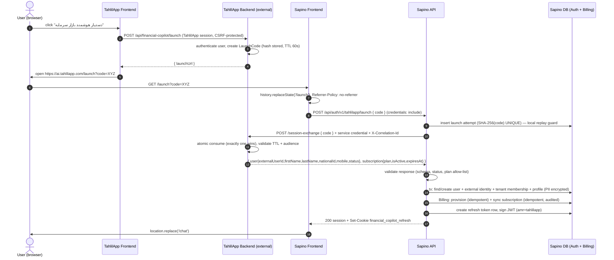

# Feature 139 — TahlilApp Session Exchange and Dual Authentication — Design

Status: **Design only. No production code is changed by this document.**

Naming: *TahlilApp* is the external parent platform. *Sapino* (ساپیو) is the user-facing name of this repository's product (Financial Copilot). In code, `FinancialCopilot.*` is used.

Revision 3 (final profile-PII decisions): `FirstName`, `LastName`, `NationalId` and `Mobile` are persisted for TahlilApp-linked users as **profile data only** (never identity keys), `NationalId`/`Mobile` encrypted with ASP.NET Core Data Protection. The Data Protection key ring is a **required, persistent, backed-up operational dependency** (§17.1). Absent/`null` never deletes (§10.2). There are **no** keyed-hash lookup columns in v1. Own-profile access is self-service; admin access is masked with an audited, permissioned reveal (§10.2). See §9, §10.2, §13.3, §16, §17.1, AC-57…AC-81.

Bounded context: **Sapino Identity & Access** (`AuthDbContext`, `OwnedIdentityService`). Upstream context: **TahlilApp Identity & Subscription** (external, not in this repository). Billing (`FinancialCopilot.Billing`) stays the owner of plans, wallets and entitlements inside Sapino.

## 1. Context

Sapino is a standalone web product (TanStack Start frontend + ASP.NET Core API) with its own owned Identity (`/api/auth/v1`). TahlilApp users already authenticated in TahlilApp (mobile / national-identity flow) must enter Sapino without a second login. Users must also be able to return to Sapino directly with email + password once they opt in.

## 2. Problem

- Sapino has no concept of an external identity. A TahlilApp user would have to self-register with an email/password (`RegisterAsync`), producing an account unrelated to their TahlilApp identity and subscription.
- Subscription state in TahlilApp is the commercial truth for TahlilApp users but is invisible to Sapino Billing.
- Sharing cookies or passing identity in URLs is not acceptable (see §13).

## 3. Goals

1. Seamless launch: TahlilApp → one-time LaunchCode → server-to-server exchange → Sapino session → `/chat`.
2. Deterministic mapping of one TahlilApp user to exactly one Sapino local user via a stable external id.
3. Optional native credentials (verified email + password) on the **same** local user; both paths yield the same actor.
4. TahlilApp-sourced subscription state is refreshed on launch, on direct login, and in the background; stale data never grants indefinite paid access.
5. Reuse existing Sapino mechanisms (Identity, refresh-cookie sessions, API-key client convention, Billing subscription fields, lease-based revalidation workers, rate limiting, correlation IDs).

## 4. Non-Goals

TahlilApp login redesign, OAuth/OIDC, shared cookies/SSO, payments or pricing changes, UI redesign beyond a launch-failed page and a profile credential section, AI behavior, automatic account merging, Telegram identity changes (Feature 087 stays as is).

## 5. Current Architecture Findings (verified in this repository)

| Area | Finding | Source |
| --- | --- | --- |
| User model | `FinancialCopilotUser : IdentityUser<Guid>` + `IsEnabled`. Table `auth_users`. `AddIdentityCore` with `RequireUniqueEmail = true`, lockout 5 attempts / 15 min. **`AddDefaultTokenProviders()` is not registered.** | `AuthPersistenceModels.cs`, `Infrastructure/ServiceCollectionExtensions.cs:241` |
| Tenancy | Single default tenant (`Authentication:OwnedIdentity:DefaultTenantId`); every user gets an `auth_user_tenants` row at registration. | `OwnedIdentityService.RegisterAsync` |
| Session | Stateless JWT access token (claims `sub`, `email`, `financial_copilot:tenant_id`, `financial_copilot:authentication_mode=WebAppUser`, roles, permissions) + opaque refresh token (SHA-256 hashed in `auth_refresh_tokens`, rotation, replay detection). Refresh token lives in HttpOnly, `SameSite=Strict`, `Path=/api/auth/v1`, `Secure` cookie `financial_copilot_refresh`. The frontend keeps the access token in memory/`sessionStorage` and calls `/refresh` on load. | `AuthController.cs`, `OwnedIdentityService.CreateSessionAsync`, `frontend/.../auth.ts` |
| Native accounts exist | `POST /api/auth/v1/register` is open self-registration (email + password). So state **D (native user)** already exists in production data. | `AuthController.Register` |
| JWT email assumption | `CreateAccessToken` and `CreateSessionAsync` use `user.Email!`. A TahlilApp-provisioned user without an email would break token creation. Must be addressed in S-6. | `OwnedIdentityService.cs:222,200` |
| Access-token lifetime | `appsettings.json` sets `AccessTokenMinutes = 10080` (7 days). JWT is stateless and not checked against `IsEnabled` or refresh-token revocation per request. | `appsettings.json` |
| Service auth (inbound) | `X-Api-Key` scheme: SHA-256 comparison with `FixedTimeEquals`, key from env var or hash, `AllowedPathPrefixes`, `AuthenticationMode.ApiClient`. Used by the Telegram gateway. | `ApiKeyAuthenticationHandler.cs`, `ApiKeyAuthenticationOptions.cs` |
| Service auth (outbound) | Telegram gateway / provider clients call out with API keys/tokens held in configuration/env; provider calls use `FinancialProviderResilienceHandler`. | `TelegramGatewayClient.cs`, `ServiceCollectionExtensions.cs:1005` |
| One-time token precedent | `TelegramLinkService` + `auth_telegram_link_tokens`: random token, only hash stored, `ExpiresAtUtc`, `Status`, `ConsumedAtUtc`, revoke-pending, audit row, correlation id. | `TelegramLinkService.cs` |
| Billing | `CustomerAccountRow` has `SubscriptionPlanCode`, `SubscriptionEffectiveFrom/To`, `SubscriptionRevision`. Plans `Free`/`Pro`/`Plus` (`billing_subscription_plans`) with `PlanCapabilities`. `OwnedIdentityBillingProvisioner` provisions a Free prepaid account idempotently. Admin `SetSubscriptionAsync` changes plan with revision check + audit. **No read path was found that honors `SubscriptionEffectiveTo`** (only the admin service writes it). | `BillingPersistenceModels.cs`, `EfCoreAdminManagementService.cs:338` |
| Entitlement model rule | Feature 035: JWT must not carry mutable plan limits, balances or subscription state; controllers must not branch on plan names. | `specs/035-.../user-story.md` |
| Periodic revalidation precedent | `TelegramMembershipRevalidationProcessor` / `auth_telegram_membership_revalidations` (lease owner, next-due, attempts, dead-letter). | `Authentication/Telegram*` |
| Rate limiting | Only the `AuthenticatedActor` fixed-window policy exists; no anonymous/IP policy, no `UseForwardedHeaders`. | `Program.cs`, `RateLimitPolicies.cs` |
| Infra for short-lived state | Postgres (EF, per-context), optional Redis via `IDistributedCache`. | `ServiceCollectionExtensions.cs:346` |
| Email delivery | **None found** (`IEmailSender`/SMTP absent). Email verification and password reset need a new outbound port. | repo grep |
| Frontend | `/auth` login/register, `_app` guard redirects to `/auth` when `isAuthenticated()` fails, post-login target is `/chat`; `redirect` param is validated as same-origin path. No `/launch` or profile credential UI. | `routes/auth.tsx`, `routes/_app.tsx` |
| TahlilApp side | **Not present in this repository.** Everything TahlilApp-side below is an *external integration requirement*, not existing code. | — |

## 6. Proposed Architecture

```text
Browser ──(1) POST launch (TahlilApp session)──▶ TahlilApp Backend   [external]
Browser ◀──(2) launchUrl = https://ai.tahlilapp.com/launch?code=…
Browser ──(3) GET /launch?code=… ──▶ Sapino Frontend /launch page (strips code from URL immediately)
Browser ──(4) POST /api/auth/v1/tahlilapp/launch {code} ──▶ Sapino API
Sapino API ──(5) POST {TahlilApp}/…/session-exchange (service credential, TLS) ──▶ TahlilApp Backend
Sapino API: map/create local user → sync subscription → create session (refresh cookie + JWT)
Browser ◀──(6) 200 session (same shape as /login) ; frontend replaces location with /chat
```

Layering (Clean Architecture rule: policy inward, details outward):

- **Application** (`FinancialCopilot.Application/Authentication/TahlilApp/`): `ITahlilAppLaunchUseCase`, `ITahlilAppIdentityGateway` (port: `ExchangeAsync(code)`, `GetStatusAsync(externalUserId)`), `IExternalIdentityStore`, request/response records, `TahlilAppLaunchFailure` enum. No HTTP, EF or ASP.NET types.
- **Domain** (`FinancialCopilot.Domain/Identity/TahlilApp/`): `ExternalIdentity` (provider, external user id, status), `AccountAuthState` (A/B/C/D computation), `TahlilAppSubscriptionSnapshot` value object (validated plan code, expiry, active flag).
- **Infrastructure** (`Infrastructure/Authentication/TahlilApp/`): `TahlilAppIdentityGateway` (typed `HttpClient`), EF configuration for the new tables in `AuthDbContext`, `ExternalIdentityService` (find-or-create), `TahlilAppEntitlementRevalidationProcessor` (hosted worker).
- **API**: `TahlilAppLaunchController` (anonymous, rate-limited), `CredentialEnrollmentController` (authenticated `WebAppUser`). Controllers are humble: map DTO ↔ use case.
- **Frontend**: route `/launch`, route `/launch-failed`, profile "ورود مستقل با ایمیل" section.

Decision — **where the code lands (alternatives considered)**:

| Option | Pros | Cons | Decision |
| --- | --- | --- | --- |
| A. Frontend `/launch` page → `POST` to API | Works with the existing frontend/API split and cookie `Path=/api/auth/v1` (stale cookie is sent and can be revoked); no GET side effect; no infra assumption; session shape identical to `/login` | JS sees the code briefly (mitigated by `history.replaceState` before any await) | **Chosen** |
| B. API `GET /launch` → `302 /chat` | JS never sees the code; matches the "302" shape | Public `/launch` must be proxied to the API; refresh cookie `Path=/api/auth/v1` would not receive the old cookie unless the route sits under that path; GET with state change | Rejected; revisit if edge routing is available (Open Question Q9) |
| C. TahlilApp auto-submits an HTML `POST` form | Code never in URL/history/logs | Contradicts the requested `?code=` contract | Offered as a future hardening (Q9) |

Same-site requirement: the refresh cookie is `SameSite=Strict`. Frontend (`ai.tahlilapp.com`) and API must be same-site (same registrable domain). This is already true for `/login`; no new constraint.

## 7. End-to-End Sequence



## 8. LaunchCode Lifecycle

The LaunchCode is owned by **TahlilApp** (external). Requirements Sapino imposes on it; Sapino never mints or stores it.

| Aspect | Requirement |
| --- | --- |
| Format | Opaque, URL-safe base64 of 32 random bytes from a CSPRNG (43 chars, 256-bit). No embedded identity, no JWT, no structure. |
| Entropy | ≥ 128 bits required; 256 bits recommended. Not derived from user id, time or counter. |
| Storage | Only a hash (SHA-256) of the code is stored, with `UserId`, `Audience = sapino`, `CreatedAt`, `ExpiresAt`, `ConsumedAt`. Store choice (DB or Redis) is TahlilApp's; the repository's own precedent is a hashed token row (`auth_telegram_link_tokens`). |
| Expiry | 60 seconds default (≤ 120 s hard cap). |
| Consumption | Single atomic operation: SQL `UPDATE … SET ConsumedAt = now WHERE CodeHash = @h AND ConsumedAt IS NULL AND ExpiresAt > now AND Audience = @a` with affected-rows = 1, or Redis `GETDEL`. Read-then-write is not acceptable. Exactly one of N concurrent exchanges succeeds; the rest get the same "invalid" outcome. |
| Replay | A consumed code is never valid again; a second exchange returns the same generic error as an unknown code (no oracle). |
| Binding | **Explicitly no IP / User-Agent binding**: mobile networks, in-app browsers and new tabs change both. The protections are TTL, single use, entropy, and the service credential. |
| Cleanup | TahlilApp purges consumed/expired rows (e.g. hourly, retain 24 h for audit). |
| One per launch | Each click issues a fresh code; earlier unconsumed codes for the same user may be invalidated on issue (recommended). |

Sapino-side defense in depth (new, in Sapino): table `auth_tahlilapp_launch_attempts` stores `SHA-256(code)` with a **unique index**, inserted *before* the exchange call. A duplicate insert (double-submit, concurrent tabs, replay) is rejected locally without calling TahlilApp, so even a misbehaving TahlilApp consumption path cannot yield two Sapino sessions from one code. Rows are purged after 24 h.

## 9. API Contracts

Final field names and paths for the TahlilApp side must be agreed with the TahlilApp team (Q1). Sapino conventions: `ProblemDetails` with `type = https://financialcopilot/errors/{code}` and `correlationId` (see `AuthController`).

### 9.1 TahlilApp (external, proposed)

`POST /api/financial-copilot/launch` — TahlilApp-authenticated user session, CSRF-protected on their side.
Response `200`: `{ "launchUrl": "https://ai.tahlilapp.com/launch?code=<code>" }`. TahlilApp builds the URL from a server-side allow-listed Sapino origin (no caller-supplied host → no open redirect through TahlilApp). `401` when not authenticated.

`POST /api/financial-copilot/session-exchange` — service-to-service only.
Headers: `X-Api-Key: <secret>` (Sapino's credential, §13.1), `X-Correlation-Id`.
Request: `{ "code": "<code>" }`
Response `200`:

```json
{
  "user": {
    "externalUserId": "string, immutable TahlilApp internal user id",
    "firstName": "string, optional",
    "lastName": "string, optional",
    "nationalId": "string, optional (Iranian 10-digit national id)",
    "mobile": "string, optional (e.g. 09121234567 or +989121234567)",
    "status": "Active | Suspended"
  },
  "subscription": {
    "plan": "Free | Plus | Pro",
    "isActive": true,
    "expiresAt": "2026-12-01T00:00:00Z",
    "revision": 17
  }
}
```

Errors: `400 invalid_code` (unknown / expired / already used — TahlilApp should collapse these to one code; Sapino tolerates distinct `expired_code` / `code_already_used` for diagnostics but shows the same user copy), `401/403` (Sapino credential rejected), `429`, `5xx`.

`GET /api/financial-copilot/users/{externalUserId}/status` — service-to-service (direct-login refresh and background revalidation). Response: `user.externalUserId`, `user.status` and the `subscription` object only — **no profile fields, no PII**. `404` when the user no longer exists. A batch variant `POST …/users/status:batch` (≤ 100 ids) is requested for the revalidation worker (Q4).

**Profile fields.** `firstName`, `lastName`, `nationalId`, `mobile` are **trusted, optional profile attributes** returned by the *exchange* response and persisted by Sapino (§10.2). They are attributes of the user, **never** identity keys, and absence of any of them never fails a launch. `displayName` is dropped from the contract (Sapino derives it from first + last name). The **status** endpoint (`GET …/users/{id}/status` and its batch variant) returns *only* `user.status` and `subscription` and **must not** carry `nationalId`/`mobile`: PII travels only on the one-time launch exchange, minimizing exposure on the high-volume background path (AC-75). Sapino binds exactly these fields and ignores unknown ones. `entitlements[]` is not part of v1 (see §11); `revision` is optional and used only to skip redundant syncs.

Field validation on receipt (failure drops the single field, logs a warning with the field *name* only, and never blocks the launch): names — trimmed, ≤ 100 chars, no control characters; `nationalId` — Persian/Arabic digits normalized to ASCII, exactly 10 digits; `mobile` — normalized to E.164 (`+989…`), Iranian mobile pattern.

### 9.2 Sapino (new)

| Endpoint | Auth | Purpose |
| --- | --- | --- |
| `POST /api/auth/v1/tahlilapp/launch` `{ code }` | Anonymous, IP-rate-limited, CORS `Frontend` policy | Exchange + session. Success `200` with the same body as `/login` (`OwnedIdentitySessionResponse`) and sets the refresh cookie. Failure `ProblemDetails` with `type` in {`launch-invalid`, `launch-unavailable`, `launch-account-disabled`} and `correlationId`. Never returns a session on failure. |
| `POST /api/auth/v1/credentials/email` `{ email }` | `WebAppUser` | Start email enrollment/change; sends verification message. Always `202` (no enumeration of existing emails). |
| `POST /api/auth/v1/credentials/email/confirm` `{ email, token }` | `WebAppUser` | Confirms ownership via `UserManager.ChangeEmailAsync`. |
| `POST /api/auth/v1/credentials/password` `{ newPassword }` | `WebAppUser`, requires confirmed email, no current password | `AddPasswordAsync`. |
| `PUT /api/auth/v1/credentials/password` `{ currentPassword, newPassword }` | `WebAppUser` | `ChangePasswordAsync`; revokes other refresh tokens. |
| `DELETE /api/auth/v1/credentials/password` | `WebAppUser`, recent proof (password or ≤ 30 min `amr` session) | `RemovePasswordAsync`; revokes other refresh tokens; TahlilApp launch unaffected. |
| `POST /api/auth/v1/password-reset/request` `{ email }` / `…/confirm` `{ email, token, newPassword }` | Anonymous, rate-limited | Reset for confirmed-email + password-enabled users; revokes all refresh tokens. Always `202` on request. |
| `GET /api/auth/v1/me` (existing) | `WebAppUser` | Extended with `accountAuthState`, `hasTahlilAppIdentity`, `emailConfirmed` (no secrets, no PII). |
| `GET /api/auth/v1/profile` | `WebAppUser`, **self only** (resolved from the `sub` claim; no user id in the path) | Own profile: names in full, `nationalId`/`mobile` **masked**, `profileSyncedAtUtc`. `Cache-Control: no-store`. |
| `POST /api/auth/v1/profile/reveal` `{ field: "nationalId" \| "mobile" }` | `WebAppUser`, **self only**; **no admin permission** | Returns the caller's own full value. `no-store`, per-user rate limit, emits a self-reveal event (field name only). Recommended, non-blocking hardening: require a recent session (`amr` age) when the existing identity architecture supports it. |
| `GET /api/v1/admin/users/{userId}/profile` | Web admin, permission `admin.users.read` (Feature 035) | Another user's profile, `nationalId`/`mobile` **masked**. |
| `POST /api/v1/admin/users/{userId}/profile/reveal` `{ field, reason }` | Web admin, permission **`admin.users.pii.read`**, rate-limited | Full value of another user's field; mandatory `reason`; writes an audit row; value never logged. |

Existing `POST /login` and `POST /register` are retained. Behavior changes required in `login`: see §11 and §12.

## 10. Identity Mapping

**Stable identity key:** `(Provider = "TahlilApp", ExternalUserId = <TahlilApp immutable internal user id>)`. `NationalId`, `Mobile`, email, first and last name are attributes, **never** keys, and are never used to look up, link or merge accounts.

New table `auth_external_identities`:

| Column | Notes |
| --- | --- |
| `Id` (Guid PK), `Provider` (varchar 32), `ExternalUserId` (varchar 128) | **Unique index `(Provider, ExternalUserId)`**. |
| `LocalUserId` (Guid FK `auth_users`), `TenantId` | **Unique index `(Provider, LocalUserId)`**: one TahlilApp identity per local user. |
| `Status` | `Active` / `Suspended` (mirrors TahlilApp `status`) / `Revoked` (admin unlink). |
| `LinkedAtUtc`, `LastLaunchAtUtc` | |
| `LastEntitlementSyncAtUtc`, `NextEntitlementSyncDueAtUtc`, `LastSyncedPlanCode`, `LastKnownSubscriptionExpiresAtUtc`, `LastExternalRevision`, `LeaseOwner`, `LeaseExpiresAtUtc`, `SyncAttemptCount`, `LastSyncFailureCategory` | Sync state owned by Identity; follows the `auth_telegram_membership_revalidations` lease pattern. |
| `Version` (xmin) | Optimistic concurrency, as in `TelegramAccountLinkRow`. |

Provisioning of a first-time TahlilApp user (one transaction on `AuthDbContext`, shared by `UserManager`):

1. `FinancialCopilotUser`: `Id = Guid.NewGuid()`, `UserName = "tahlilapp-" + Guid N` (synthetic, non-guessable, unique), `Email = null`, `EmailConfirmed = false`, no password, `IsEnabled = true`, role `User`.
2. `auth_user_tenants` default tenant row (same as `RegisterAsync`).
3. `auth_external_identities` row.
3a. `auth_user_profiles` row (§10.2) with the validated first/last name, encrypted `NationalId` and `Mobile`, and `ProfileSyncedAtUtc = now`. Invalid or absent fields are left null.
4. Commit. A concurrent first launch loses on the unique index → rollback → re-read and resolve the winner (exactly one local user).
5. After commit: `OwnedIdentityBillingProvisioner.EnsureProvisionedAsync` (idempotent; separate `BillingDbContext`, so not in the same transaction — the existing catch-and-verify pattern handles races), then the entitlement sync (§11).

Returning launch: lookup by `(TahlilApp, ExternalUserId)` → same `LocalUserId`; never creates a user. `UserName`/`Email` are never overwritten from TahlilApp data. Profile fields are refreshed per §10.2.

### 10.2 Profile data (NationalId, Mobile, names)

**Source of truth.** TahlilApp is the source of truth for `FirstName`, `LastName`, `NationalId` and `Mobile`. In v1 there is **no local override** (the Sapino profile page shows these fields read-only, labelled «از تحلیل‌اپ دریافت می‌شود»). A successful TahlilApp launch refreshes them. Direct Sapino email/password login does **not** refresh them, and the background subscription/entitlement sync does **not** refresh PII (the status endpoints carry none). PII freshness is therefore **"as of the last successful TahlilApp launch"**, exposed as `ProfileSyncedAtUtc`.

**Placement decision.** `FinancialCopilotUser` is deliberately thin (`IdentityUser<Guid>` + `IsEnabled`); every other per-user fact lives in a related row keyed by user id (`UserTenantRow`, `TelegramAccountLinkRow`, `CustomerAccountRow`). Following that convention, profile data goes in a new 1:1 related entity `UserProfileRow` (`auth_user_profiles`), **not** on the user entity (loaded by every `UserManager` call) and **not** on `auth_external_identities`. The external identity stays a pure link `(Provider = TahlilApp, ExternalUserId) → LocalUserId`.

`auth_user_profiles`:

| Column | Notes |
| --- | --- |
| `UserId` (Guid PK/FK `auth_users`) | 1:1 with the local user. |
| `FirstName`, `LastName` (varchar 100, nullable) | Plain text. Treated as PII for logging purposes (never logged). |
| `NationalIdEncrypted`, `MobileEncrypted` (text, nullable) | Field-level encryption with ASP.NET Core **Data Protection** (`IDataProtector`, purposes `FinancialCopilot.Profile.NationalId.v1` / `.Mobile.v1`) — no custom cryptography, no additional key management beyond the key ring (§17.1). Stored normalized (national id: 10 ASCII digits; mobile: E.164). |
| `NationalIdLast4`, `MobileLast4` (char(4), nullable, optional) | Display/audit metadata so masked values render without decrypting. Not an index, not a lookup key. |
| `CreatedAtUtc`, `UpdatedAtUtc` | Row lifecycle. |
| `ProfileSyncedAtUtc` | Time of the last successful TahlilApp launch that evaluated the profile. |
| `Version` (xmin) | Optimistic concurrency. |

Explicit v1 constraints: **no index on any PII column**, **no unique constraint**, **no keyed-hash (HMAC) or other deterministic lookup column**, no lookup path by `NationalId` or `Mobile`, no account linking or merge using them. No use case requires such a lookup; if one appears later it needs its own design and key-management decision.

**First login.** The profile row is created in the provisioning transaction with whatever valid fields the exchange returned. A user with no profile fields still gets a valid session.

**Returning launch — synchronization policy** (applied per field, on every successful exchange):

| Incoming value | Sapino behavior |
| --- | --- |
| Valid, changed | Overwrite stored value (re-encrypt, refresh last-4), set `UpdatedAtUtc`, audit row with field **names only**. |
| Valid, identical | No-op (only `ProfileSyncedAtUtc` is touched). |
| Absent field | **Keep stored value.** |
| `null` | **Keep stored value.** |
| Invalid | **Keep stored value**; record a safe warning (field name and reason code only, never the value). |

Principle: **absence ≠ deletion**. For v1, **explicit clearing of `NationalId` or `Mobile` (or names) is out of scope**; Sapino defines no clear/delete semantics. If clearing is needed later, the integration contract must add an explicit operation (e.g. a dedicated field or endpoint); `null` or absence must never be reinterpreted as a clear. If a stored ciphertext cannot be decrypted (§17.1 key-loss scenario), the comparison is skipped and the next valid incoming value overwrites it, so TahlilApp re-populates the data on the next launch.

**Use limits.** Profile PII is account data only: not claims in the JWT, not in AI prompts/conversation memory/context, not exposed to Telegram flows, not in metrics, not in the status/batch contract, not used for email matching, plan mapping or any authentication/linking decision.

**Display rules** — two distinct audiences:

| | A. User viewing their **own** profile | B. Admin/support viewing **another** user |
| --- | --- | --- |
| Names | Full | Full (admin user views) |
| `NationalId`, `Mobile` default | Masked (`••••••1234`, `0912•••5678`) | **Masked** |
| Full value | `POST /api/auth/v1/profile/reveal` for the caller's own record. Authorization is "authenticated `WebAppUser`, target = own `sub`". **`admin.users.pii.read` is neither required nor consulted.** | Only via `POST /api/v1/admin/users/{id}/profile/reveal` with explicit permission **`admin.users.pii.read`**, mandatory reason, rate limit and an audit row |
| Audit | Field-name-only event (no value) | Security audit row: actor, target, field, reason, correlation id (no value) |
| Cross-user access | A user can never request another user's profile (no id parameter on self endpoints) | Controlled by the admin permission model (Feature 035) |

The admin permission model is applied **only** to endpoints that address another user. Diagnostics, exports and error payloads carry masked values or none.

**Retention/removal.** The profile row is deleted (all columns) when the local account is deleted, and also when the TahlilApp external identity is `Revoked` (the TahlilApp-sourced data can no longer be refreshed). Legal retention and backup-retention obligations are tracked in Q13.

### Account-state model (computed, not stored)

| State | Condition | Auth paths |
| --- | --- | --- |
| **A** TahlilApp-linked, no local credentials | external identity ∧ `Email == null` ∧ no password | TahlilApp launch only |
| **B** TahlilApp-linked, verified email, no password | external identity ∧ `EmailConfirmed` ∧ `PasswordHash == null` | TahlilApp launch only (direct login not enabled) |
| **C** TahlilApp-linked, verified email + password | external identity ∧ `EmailConfirmed` ∧ `PasswordHash != null` | Launch **and** direct login |
| **D** Native user (existing `/register` accounts) | no external identity | Direct login only; **not auto-linked** |

Email is only written to `auth_users.Email` after verification (`GenerateChangeEmailTokenAsync(user, newEmail)` / `ChangeEmailAsync`); an unverified claimed address never occupies the unique email slot, so it cannot squat another person's email.

### Collision scenarios (never silent merge)

| Scenario | Behavior |
| --- | --- |
| Repeated launch, same `ExternalUserId` | Same local user. |
| Concurrent first launches (two tabs) | Unique index → one user; both sessions belong to it. |
| Enrollment email already belongs to another Sapino account (e.g. state D) | Verification mail is **not** sent to a different account's detriment; API still returns `202`; UI says "if this address is available, a verification message was sent". No merge. Support-assisted recovery or the future explicit link flow (§18, Q6). |
| TahlilApp user's `NationalId`/`Mobile` equals another Sapino user's (native or TahlilApp-linked) | **Never detected, merged or blocked.** The fields are not indexed, not unique and not consulted by any code path; duplicates are legal data. Reconciliation of real duplicate accounts is the explicit link/support process (Q6). |
| Same `ExternalUserId` returns a *different* `NationalId` than stored | Accepted (TahlilApp is authoritative), field overwritten (valid changed value), warning event `ProfileIdentityFieldChanged` (field name only); no account action. |
| Local user already has a *different* active TahlilApp identity | Not possible (unique `(Provider, LocalUserId)`); launch of a second `ExternalUserId` creates its own user. |
| Same `ExternalUserId` resolving to a disabled local user (`IsEnabled=false`) | Launch fails `launch-account-disabled`; no session. |
| `ExternalUserId` marked `Revoked` locally | Launch fails; requires admin action. |
| Exchange response with missing/empty/over-long `externalUserId` | Rejected as invalid response (§13), no user created. |

## 11. Subscription and Entitlement Sync

TahlilApp is the source of truth for plan and expiry **for users with an Active external identity**. Sapino Billing remains the owner of plans, capabilities, wallets and enforcement. No billing redesign.

**Mapping.** `subscription.plan` → Sapino `SubscriptionPlanCode` via configured allow-list (`Free`/`Plus`/`Pro`, Feature 035 catalog). Unknown plan → `Free` + warning metric (fail to the lowest tier, do not fail the login). `isActive = false` or `expiresAt <= now` → `Free` with `EffectiveTo = null`. The JWT carries no plan or entitlement data.

**Write path.** A new Billing-owned use case `SyncExternalSubscriptionAsync(customerAccountId, planCode, effectiveFrom, effectiveTo, source, externalRevision)`: idempotent (no change ⇒ no `SubscriptionRevision` bump), uses the same revision check and audit semantics as `EfCoreAdminManagementService.SetSubscriptionAsync` (audit action `billing.subscription.synced`, actor = system/`TahlilApp`). It never creates credits per launch; any plan-change credit policy is whatever Billing already defines (Q5).

**Per-scenario behavior**

| Scenario | Behavior |
| --- | --- |
| First-time user | Provision Free account, then immediately apply the plan from the exchange response. |
| Returning user, no change | No-op sync; update `LastEntitlementSyncAtUtc`. |
| Plan changed (upgrade/downgrade) | Applied on next launch, next direct login past TTL, or next background revalidation, whichever first. |
| Active paid subscription | Plan applied with `EffectiveTo = expiresAt`. |
| Expired subscription | Becomes `Free`; user still enters (Free is a valid plan). Not a launch failure. |
| Free user | `Free`; admitted unless product policy says Free TahlilApp users are excluded (Q7). |
| Entitlement changed | Entitlements derive from the plan's `PlanCapabilities` in Billing; per-user entitlement overrides from TahlilApp are out of v1 (Q3). |

**Refresh triggers**

1. **TahlilApp launch:** exchange response is authoritative and fresh; sync always runs.
2. **Direct Sapino login (email+password):** after credential success, if the user has an Active external identity and `LastEntitlementSyncAtUtc` is older than `StatusTtlMinutes` (default **15**), call `GET …/users/{id}/status` with a tight budget (3 s). Login is **never blocked** by TahlilApp unavailability.
3. **Background revalidation:** `TahlilAppEntitlementRevalidationProcessor` (lease-based, same shape as `TelegramMembershipRevalidationProcessor`) selects identities with `NextEntitlementSyncDueAtUtc <= now`, batches status lookups, applies results. Due time = `min(lastSync + StatusTtl, knownExpiresAt)`; paid users only (Free users sync lazily on login/launch). This is what makes plan changes "eventually reflected" even if the user never returns.
4. Optional later accelerant: TahlilApp webhook on subscription change (not required; Q4).

**TahlilApp unavailable / stale policy.** Outbound budget: connect+total timeout 3 s for status, 5 s for exchange. On failure keep the last-known plan only while `now < min(LastKnownSubscriptionExpiresAtUtc, LastEntitlementSyncAtUtc + StaleGraceHours)` (default **6 h**); after that the worker/login path downgrades to `Free` and records `LastSyncFailureCategory`. Paid access can therefore never outlive the earlier of the real expiry and the grace window, regardless of how long TahlilApp is down. A user who becomes Free in TahlilApp is downgraded at the next successful sync (≤ TTL for active users, ≤ background cadence otherwise). `Suspended` status from TahlilApp: launch denied; direct login denied while the cached status is within TTL; background sync marks the identity `Suspended`.

**Enforcement gap to close (finding):** no read path honors `SubscriptionEffectiveTo` today. The worker-driven downgrade above is sufficient for eventual correctness, but S-8 must also add a Billing read-side guard (effective plan = `Free` when `EffectiveTo <= now`) so a stopped worker cannot extend paid access.

## 12. Session Creation

- Reuse `OwnedIdentityService.CreateSessionAsync` (refresh row + cookie + JWT). Add an `ICreateSessionForLinkedUser`-style method `CreateSessionForUserAsync(user, tenantId, authenticationMethod)` rather than a second session framework; `LoginAsync`, `RefreshAsync` and the launch path share it.
- JWT gains one claim `amr` (`tahlilapp` | `pwd`) for audit and re-authentication gating; `sub`, tenant, mode, roles, permissions are unchanged, so **launch and password login produce an equivalent actor**.
- `CreateAccessToken`/`CreateSessionAsync`/`OwnedIdentityProfile` must tolerate `Email == null` (state A). `/me` already returns `""` for a missing email.
- Session fixation: every launch issues a **new** random refresh token. If the request carries an existing refresh cookie (cookie `Path` `/api/auth/v1` covers the launch endpoint), that token is revoked ("replaced by TahlilApp launch"). The code is never stored as session material.
- If an existing Sapino session belongs to a **different** local user, the frontend `/launch` page shows a one-click confirmation ("ورود با حساب تحلیل‌اپ جدید؟") only when a session is detected; silent replacement would enable login-CSRF with an attacker-issued code (§13).
- After success the SPA calls `window.location.replace('/chat')`; the URL was already scrubbed to `/launch` before the request, so the code is not in history. The redirect target is a constant, never a parameter.

## 13. Security Model

### 13.1 Service-to-service authentication

**Proposed:** per-client API key in header `X-Api-Key` over TLS, matching the repository's existing service credential convention (`ApiKeyAuthenticationHandler`: hashed/fixed-time compare, key from environment variable, narrow `AllowedPathPrefixes`, one key per client, rotation = add second key then retire). Sapino stores its outbound key only in an environment variable / secret store (`Authentication:TahlilApp:ApiKeyEnvironmentVariable`), never in the repository and never in the frontend. TahlilApp should additionally restrict the key to the exchange and status paths and to Sapino's egress IPs. **Optional hardening** if TahlilApp supports it: HMAC-SHA256 over `timestamp + method + path + body-hash` with a ±60 s window (bounded clock skew). mTLS and client-credentials JWT are not used anywhere in the repository today and would introduce a new mechanism; they are not proposed. (Q2)

### 13.2 Threat table

| Threat | Mitigation |
| --- | --- |
| LaunchCode theft (history, logs, shoulder-surf) | 60 s TTL, single use, 256-bit; scrubbed from URL before the first await; `Referrer-Policy: no-referrer` and `Cache-Control: no-store` on `/launch`; edge/proxy access logs may contain the query string, which is harmless once consumed or expired (log retention must not be shared with third parties). |
| Replay | TahlilApp atomic consume + Sapino unique `CodeHash` guard. |
| Expired / reused code | Generic failure, no session (§14). |
| Brute-force guessing | 256-bit space; Sapino per-IP limiter on the launch endpoint (e.g. 10/min) plus TahlilApp limiter on `session-exchange`; sustained invalid-code rate raises an alert. |
| Tampering / forged identity | Identity comes **only** from the server-to-server response; query-string ids, `Referer`, `Origin`, headers and body fields from the browser are ignored (the request body is `{ code }` only). |
| Malicious/forged exchange response | Response validated: HTTPS to a configured host only (no redirects followed), `Content-Type`, size cap (≤ 8 KB), required fields, `externalUserId` length/charset, plan allow-list, `expiresAt` plausibility. Invalid ⇒ failure, nothing persisted. |
| Session fixation | New refresh token per launch, old cookie revoked, no pre-auth session identifier accepted. |
| Open redirect | No `redirect`/`returnUrl` parameter on the launch path; target `/chat` is a constant; TahlilApp builds `launchUrl` from a configured Sapino origin. Existing `/auth?redirect=` validation unchanged. |
| CSRF / login CSRF | Launch endpoint is credentialed only by the secret code; CORS limited to the `Frontend` origins. Login-CSRF (attacker feeds victim *their own* fresh code) is bounded by TTL + single use + the "switch account" confirmation when a session exists; residual risk accepted for a read-oriented product (Q9 option C removes it). Cookie remains `SameSite=Strict`. |
| Exchange endpoint abuse (Sapino API) | Anonymous endpoint with IP fixed-window limiter, request-size cap, no outbound call when the local attempt row is a duplicate, bounded concurrency to TahlilApp (bulkhead) so a flood cannot exhaust API threads. Requires `UseForwardedHeaders` so the limiter sees client IPs behind the proxy (finding: not configured today). |
| Exchange endpoint abuse (TahlilApp) | Authenticated service identity, rate limit, IP allow-list (external requirement). |
| TahlilApp unavailable | §14; circuit breaker on the typed client; direct login keeps working. |
| Sapino unavailable | User sees the browser error; TahlilApp should not consume the code until Sapino calls exchange (consumption happens on exchange only), so a retry within TTL is possible but TahlilApp may also simply reissue. |
| Sensitive logging | See §15. The code, tokens, passwords, API key, `NationalId`, `Mobile`, first/last name and full email are never logged. |
| PII at rest (database/backup leak) | `NationalId`/`Mobile` encrypted at field level with Data Protection; the key ring is stored outside the database and backed up separately from DB dumps (§17.1); masked by default; admin reveal is permissioned and audited (§10.2, §13.3). |
| PII over the wire | Only the TahlilApp exchange response carries PII (TLS, configured host, no redirects, size cap); status/batch endpoints carry none. |
| PII-based account takeover/merge | `NationalId`/`Mobile` never unlock, link or merge anything; no index, no unique constraint, no lookup path, no "find my account by national id or mobile". |
| Access/proxy logs | Query strings may be captured at the edge; documented residual risk; mitigated by TTL/one-time use. Application request logging must not add the query string (Serilog `RequestPath` excludes it; verify in S-10). |
| Browser history | Code scrubbed by `replaceState` before navigation continues. |
| Credential enrollment abuse | Verified email before password; tokens from Identity's data-protection token providers (no custom crypto); rate-limited request endpoints; generic `202`; lockout (existing) on login; reset revokes sessions. Identity token providers use the same persistent Data Protection key ring (§17.1), so email-confirmation and reset tokens survive restarts and are valid across instances. |
| Stale access token after logout | Access JWT is stateless with a 7-day lifetime in current config; logout revokes the refresh token but an already-issued access token stays valid until `exp`. Existing debt; recommended follow-up is shortening `AccessTokenMinutes` or adding a per-request revocation/`IsEnabled` check (out of scope, tracked as Q8). |
| Key-ring loss or theft | Loss: encrypted PII unreadable until re-populated by TahlilApp launches (data-recovery incident, §17.1). Theft of the ring plus a DB dump exposes PII: ring is on a separate durable volume, runtime-identity-only permissions, never in the repo/image, backed up separately from DB dumps. |
| Shared cookies | None. Sapino sets only its own `financial_copilot_refresh`; no TahlilApp cookie is read or set. |
| Frontend secrets | None. The browser holds only the one-time code and Sapino's own session. |

### 13.3 Privacy considerations for stored profile data

1. **Classification:** `NationalId` = high sensitivity; `Mobile` = high; names = medium. A Persian-language notice on the profile page states what is stored and that it comes from TahlilApp. Lawful basis, consent wording and retention periods are a legal decision (Q13), not a technical one.
2. **Minimization where still possible:** PII is received only on the launch exchange; it is not duplicated into JWTs, logs, metrics, AI context, caches, `auth_tahlilapp_launch_attempts`, or the status/batch contract.
3. **Logging policy (single rule):** `NationalId`, `Mobile` and **names** are never written to application logs, audit rows (values), metrics or traces. Exchange DTOs and `UserProfileRow` override `ToString()` and use Serilog destructuring policies that redact these members; HTTP bodies from TahlilApp are never logged (including error bodies); EF sensitive-data logging stays disabled. Events carry field *names* and reason codes only. Verified by a log-sink test (AC-72).
4. **Access audit:** profile overwrites are audited with field names only; admin reveals are audited with actor, target, field, reason; self-reveals emit a field-name-only event.
5. **Key handling:** the only key material is the Data Protection key ring (§17.1). No application-defined HMAC/lookup keys exist for profile data.
6. **Deletion:** profile rows are deleted with the account or when the TahlilApp identity is revoked (AC-77).

## 14. Error Handling

Persian copy (single, non-revealing message for code problems): **«ورود به دستیار هوشمند بازار سرمایه انجام نشد. لطفاً از تحلیل‌اپ دوباره وارد شوید.»** The page `/launch-failed?reason=<enum>` takes a closed enum only (never reflected text), shows the correlation id (copyable), a primary button **بازگشت به تحلیل‌اپ** (configured URL), and a secondary link **ورود با ایمیل و رمز عبور** to `/auth` (shown always, since the server cannot know before login whether native credentials exist). `/launch-failed` never auto-redirects anywhere, so no loops; `/launch` never redirects to `/auth`.

| Case | API outcome | UI |
| --- | --- | --- |
| Invalid / expired / already-used code | `launch-invalid` (401) | Standard message; "back to TahlilApp". |
| TahlilApp unavailable / timeout / 5xx / breaker open | `launch-unavailable` (503), no retry of `exchange` (non-idempotent) | "سرویس تحلیل‌اپ در دسترس نیست؛ چند دقیقه دیگر دوباره تلاش کنید." + back link. |
| Sapino credential rejected by TahlilApp (401/403) | `launch-unavailable` + **error-level alert** (misconfiguration) | Same as unavailable. |
| Account disabled (Sapino `IsEnabled=false`, identity `Revoked`/`Suspended`) | `launch-account-disabled` (403) | "حساب شما غیرفعال است." + support contact. |
| Subscription expired / Free | **Not an error**: user enters as Free | — |
| Missing entitlement for a feature | Handled later by existing Billing/capability checks at use time | existing UX |
| Invalid exchange response | `launch-unavailable` + warning | Same as unavailable. |
| Duplicate local attempt (concurrent same code) | `launch-invalid` | Standard message. |
| Rate-limited | `429` | "تلاش‌های زیاد؛ کمی بعد دوباره امتحان کنید." |

A failed exchange never creates a user, an external identity, a refresh token or a cookie (AC-20). Retry policy: **exchange — none**; **status lookup — 1 retry with jitter inside the 3 s budget**; breaker shared across both.

## 15. Observability

Structured logs (Serilog), all carrying `CorrelationId` (existing `CorrelationIdMiddleware`, forwarded to TahlilApp as `X-Correlation-Id`) and a `CodeFingerprint` = first 8 hex chars of SHA-256(code) — never the code.

| Event | Level | Extra fields (no PII; names are PII too) |
| --- | --- | --- |
| `TahlilAppLaunchRequested` | Info | fingerprint, client IP hash |
| `TahlilAppExchangeAttempted` / `Succeeded` / `Failed` | Info/Warn | outcome category, latency ms, HTTP status |
| `TahlilAppLocalUserCreated` / `ExistingUserResolved` | Info | local user id, external identity id (not `ExternalUserId` in clear at Info) |
| `TahlilAppProfileProvisioned` / `ProfileRefreshed` | Info | local user id, **field names** changed (never values), source revision |
| `TahlilAppProfileFieldRejected` | Warn | field name, reason code (never the value) |
| `ProfileIdentityFieldChanged` | Warn | local user id, field name (never values) |
| `ProfilePiiSelfRevealed` | Info | local user id, field name |
| `ProfilePiiAdminRevealed` | Info (security audit) | actor, target user id, field name, reason |
| `ProfileDecryptionFailed` | Error | local user id, field name; alert (key-ring problem, §17.1) |
| `TahlilAppSessionCreated` | Info | local user id, `amr` |
| `TahlilAppEntitlementSynced` / `SyncFailed` | Info/Warn | plan from→to, source (launch/login/worker), staleness seconds |
| `TahlilAppEntitlementDowngradedStale` | Warn | reason (expired/grace) |
| Credential events (`EmailVerificationRequested`, `EmailVerified`, `PasswordSet`, `PasswordResetRequested`, `CredentialsRemoved`) | Info | local user id |

Metrics: exchange count/latency histogram by outcome, invalid-code rate, breaker state, sync lag (oldest `NextEntitlementSyncDueAtUtc`), stale-downgrade count, launch-attempt table size. Audit: security-relevant events (link created, suspended, credential changes) written to `auth_security_admin_audits`-style audit rows (same pattern as `auth_telegram_link_audits`). Health: `/health` reports whether `Authentication:TahlilApp` is configured (without calling TahlilApp on every probe).

## 16. Data Model Changes

All in `AuthDbContext` (EF migration under `Authentication/Persistence/Migrations`), snake_case table names per the existing convention:

1. `auth_external_identities` (§10).
2. `auth_tahlilapp_launch_attempts`: `Id`, `CodeHash` (char(64), **unique**), `CorrelationId`, `Outcome`, `CreatedAtUtc`, `CompletedAtUtc`; index on `CreatedAtUtc` for purge.
2a. `auth_user_profiles` (§10.2): 1:1 with `auth_users`; `NationalIdEncrypted`/`MobileEncrypted` (Data Protection), optional last-4 columns, `CreatedAtUtc`/`UpdatedAtUtc`/`ProfileSyncedAtUtc`. **No index and no unique constraint on any PII column; no HMAC/lookup columns.** New permission `admin.users.pii.read` added to `FinancialCopilotPermissions` (seeded like other permissions; not part of any default role; not required for self-service).
3. `auth_users`: **no schema change** (`Email` is already nullable in Identity; `UserName` synthetic).
4. Billing: **no new columns** for v1; `SyncExternalSubscriptionAsync` writes existing `CustomerAccountRow` fields. (A `SubscriptionSource` marker is optional and deferred, Q5.)
5. Enable Identity token providers (`AddDefaultTokenProviders()`), which uses the existing `auth_user_tokens` table — no migration.
6. Data Protection key ring: **not a database table** in v1 (file-system key ring on a durable volume, §17.1) — no migration.

## 17. Configuration

```jsonc
"Authentication": {
  "TahlilApp": {
    "Enabled": false,
    "BaseUrl": "https://…",                    // https only, validated on start
    "ExchangePath": "/api/financial-copilot/session-exchange",
    "StatusPathTemplate": "/api/financial-copilot/users/{externalUserId}/status",
    "ApiKeyEnvironmentVariable": "TAHLILAPP_EXCHANGE_API_KEY",  // secret never in appsettings
    "ExchangeTimeoutSeconds": 5,
    "StatusTimeoutSeconds": 3,
    "StatusTtlMinutes": 15,
    "StaleGraceHours": 6,
    "ReturnToTahlilAppUrl": "https://…",
    "Profile": {
      "RefreshOnLaunch": true                    // TahlilApp authoritative; no local overrides in v1
    },
    "PlanMap": { "Free": "Free", "Plus": "Plus", "Pro": "Pro" },
    "LaunchRateLimit": { "PermitLimit": 10, "WindowSeconds": 60 },
    "Revalidation": { "BatchSize": 100, "LeaseSeconds": 90, "PollSeconds": 30 }
  },
  "DataProtection": {
    "ApplicationName": "FinancialCopilot",         // fixed; never derived from content root
    "KeyRingPath": "",                             // supplied by environment per deployment (durable volume); no default path in code
    "KeyLifetimeDays": 90                          // rotation only adds keys; old keys are never deleted
  }
}
```

`ValidateOnStart` rules: HTTPS URL, positive bounded numbers, non-empty plan map targets that exist in Billing, API key present when `Enabled`, and — when `Enabled` — `DataProtection:KeyRingPath` configured, existing and writable by the runtime identity (startup fails otherwise rather than silently falling back to an ephemeral ring). `Cors:AllowedOrigins` already governs the frontend origin.

### 17.1 Data Protection key ring — final operational decision

`NationalId` and `Mobile` are encrypted with ASP.NET Core Data Protection, so the key ring is a **required persistent dependency** of this feature, not an option. The repository currently has no `AddDataProtection` configuration (the default ring lives in the container file system and is lost on redeploy), so S-5 introduces it.

1. **Persistence:** keys MUST be persisted outside ephemeral container storage and MUST survive application restart and redeployment. Deployment is Docker Compose with named volumes (`postgres-data`, `redis-data`, …) and environment-driven bind mounts (e.g. `FUND_PORTFOLIO_HOST_PATH`); the key ring follows that convention: a dedicated named volume or bind mount whose container path is supplied by configuration (`DataProtection:KeyRingPath`), with no path hard-coded in application code. An equivalent durable store is acceptable only if it is **not** the same database that holds the ciphertext unless the keys are additionally wrapped by a key held outside that database.
2. **Stable application identity:** `SetApplicationName("FinancialCopilot")` is fixed in configuration so keys remain usable across redeploys, image changes and replicas. Every service that decrypts profile PII (the API in v1; the worker does not touch PII) mounts the same ring; multiple API replicas share it.
3. **Rotation:** automatic rotation (default 90 days) only *adds* keys. Old keys are retained indefinitely — deleting or revoking keys is prohibited because it makes existing ciphertext unreadable.
4. **Backup:** the key ring MUST be backed up (at least daily and after every rotation) **separately from database dumps**, with its own access control, so a leaked DB backup never contains its own keys. Backup and restore are scripted/versioned with the other ops scripts (Pragmatic Programmer: automate), not manual.
5. **Restore:** the documented restore procedure restores the key ring *first*, then the database, then runs the profile decryption verification (below). A restored environment with the restored ring MUST decrypt previously stored values (AC-79).
6. **Access control:** the ring is readable/writable only by the application runtime identity (container user) and by the backup operator role; it is not baked into images, not committed to the repository, not logged, and not mounted into unrelated containers. Optionally wrap keys at rest with a certificate supplied by the secret store (`ProtectKeysWithCertificate`) as hardening.
7. **Verification:** startup and `/health` run a protect/unprotect self-check; a sampled decrypt of an existing profile row is reported (degraded, not fatal) so key problems are visible before users are affected. `ProfileDecryptionFailed` raises an alert.
8. **Failure scenario — key-ring loss (documented data-recovery incident):** existing `NationalIdEncrypted`/`MobileEncrypted` values become permanently unreadable (names, last-4 and all authentication/subscription data are unaffected). Behavior: the user can still launch and log in; unreadable fields are presented as "unavailable"; because TahlilApp is authoritative, each user's next successful launch overwrites the unreadable value and heals it. Users who never relaunch stay empty until they do. Pending email-confirmation/reset tokens become invalid (short-lived, re-requestable). The runbook (ops owner, severity, communication, re-population via relaunch) is part of S-5 deliverables. Mitigation is prevention: persistence, backup, restore drills.
9. **Rollout gate:** `Authentication:TahlilApp:Enabled` must not be switched on in an environment until persistence, backup, and a restore drill have been verified there (§18).

## 18. Rollout / Backward Compatibility

- Feature flag `Authentication:TahlilApp:Enabled` (default `false`): endpoints return `404` when off; existing login/register/refresh are untouched.
- Existing native accounts (state D) keep working; nothing is auto-linked. An explicit **link flow** (authenticated native session + fresh TahlilApp launch with link intent, both proofs required) is designed as a follow-up (S-13, Q6) and is **not** part of the first release; until then a native user launching from TahlilApp gets a *separate* TahlilApp-linked account, which support can reconcile.
- Migration is additive (three tables: `auth_external_identities`, `auth_tahlilapp_launch_attempts`, `auth_user_profiles`); no backfill.
- Prerequisite per environment: persistent, backed-up Data Protection key ring with a successful restore drill (§17.1). Flag stays off until verified.
- Staged rollout: staging TahlilApp ↔ staging Sapino → allow-listed TahlilApp users → general. Rollback = flag off (sessions already issued remain normal Sapino sessions).
- `/register` remains open; consider (separate decision, Q10) whether open self-registration should stay for TahlilApp-originated product launch.

## 19. Acceptance Criteria

Launch and exchange
- **AC-01** An authenticated TahlilApp user can request a Financial Copilot launch. *(external)*
- **AC-02** An unauthenticated TahlilApp user cannot obtain a LaunchCode. *(external)*
- **AC-03** LaunchCode is cryptographically random / non-guessable (≥ 128-bit CSPRNG, opaque). *(external)*
- **AC-04** LaunchCode has a short expiration (≤ 120 s, default 60 s). *(external)*
- **AC-05** LaunchCode can be successfully consumed only once.
- **AC-06** Concurrent exchange requests for the same code result in exactly one success.
- **AC-07** Financial Copilot validates the code only through a server-to-server request.
- **AC-08** The exchange endpoint requires an authenticated Financial Copilot service identity. *(external, Sapino sends it)*
- **AC-09** Browser-provided user identity (query, header, body, Referer, Origin) is never trusted.
- **AC-24** The Sapino launch request body accepts only `code`; unknown fields are ignored and never influence identity.
- **AC-25** An invalid, oversized, non-HTTPS or schema-violating exchange response creates no user, identity or session.
- **AC-26** The exchange call has an explicit timeout and is never automatically retried.

Provisioning and linking
- **AC-10** A first-time TahlilApp user is provisioned as exactly one local Financial Copilot user.
- **AC-11** A returning TahlilApp user resolves to the same Financial Copilot user.
- **AC-27** The TahlilApp external identity is linked using the stable TahlilApp `ExternalUserId`.
- **AC-28** Repeated TahlilApp launches never create another local user (including concurrent first launches).
- **AC-29** The stable cross-system identity is `(Provider = TahlilApp, ExternalUserId)`; `NationalId`, `Mobile`, email and names are never used as the account-linking key.
- **AC-30** A TahlilApp user without an email can receive a valid session (JWT/profile tolerate null email).
- **AC-31** A launch for a disabled, suspended or revoked identity fails and creates no session.

Subscription and entitlement
- **AC-12** Plan and expiry are refreshed on every successful launch.
- **AC-32** Direct login refreshes subscription state from TahlilApp when the last sync is older than `StatusTtlMinutes`.
- **AC-33** Direct login is not blocked when TahlilApp is unavailable.
- **AC-34** A TahlilApp plan change is eventually reflected in Sapino without requiring the user to return (background revalidation).
- **AC-35** An expired or lapsed paid subscription cannot remain active beyond `min(expiry, lastSync + StaleGraceHours)`.
- **AC-36** A user who becomes Free in TahlilApp is downgraded to Free in Sapino.
- **AC-37** An unknown TahlilApp plan code maps to Free and never grants a higher plan.
- **AC-38** Syncing is idempotent: repeated identical syncs do not bump `SubscriptionRevision`, add credits, or duplicate audit/ledger entries.

Session and redirect
- **AC-13** Financial Copilot creates its own authenticated session (refresh cookie + JWT).
- **AC-14** The user is redirected to `/chat`.
- **AC-15** The LaunchCode is removed from the browser URL before the exchange request is sent.
- **AC-16** Expired codes fail safely.
- **AC-17** Reused codes fail safely.
- **AC-18** Invalid codes fail safely.
- **AC-20** A failed exchange does not create an authenticated Copilot session.
- **AC-39** Each launch issues a new refresh token and revokes any refresh token presented with the request.
- **AC-40** A launch never redirects to `/auth`; failures land on `/launch-failed`, which does not auto-redirect (no loops).
- **AC-41** The launch path has no caller-controlled redirect target.

Logging and secrets
- **AC-19** LaunchCode is not stored or logged in plaintext (logs use fingerprint/hash/correlation id; only the hash is stored locally).
- **AC-42** The service API key is read from environment/secret store only, absent from the repository and frontend bundle.
- **AC-23** No frontend secret is introduced.
- **AC-22** No shared authentication cookie is introduced between TahlilApp and Financial Copilot.
- **AC-43** Launch endpoint is rate-limited per client IP and returns `429` beyond the limit.

Native credentials
- **AC-44** A TahlilApp-linked user can add an email address from the Sapino profile.
- **AC-45** Email ownership must be verified before native login is enabled; an unverified email is not stored in the unique email slot.
- **AC-46** A password can be set only after successful email verification.
- **AC-47** Setting native credentials does not create a second local user.
- **AC-48** A user with verified email + password can log in directly.
- **AC-49** Direct login does not require visiting TahlilApp.
- **AC-50** Direct login and TahlilApp launch resolve the same local user id, tenant and permissions.
- **AC-51** An email that already belongs to another Sapino account never merges accounts and never reveals that it exists (uniform `202`).
- **AC-52** Password reset works only for verified-email + password users and revokes all their refresh tokens.
- **AC-53** Removing the local password does not affect TahlilApp launch.
- **AC-54** Native login honors existing lockout and the new anonymous rate limit.

Profile data
- **AC-57** `NationalId` returned by the exchange is persisted encrypted (Data Protection) after successful TahlilApp provisioning; no plaintext column exists.
- **AC-58** `Mobile` returned by the exchange is persisted encrypted and normalized after successful TahlilApp provisioning; no plaintext column exists.
- **AC-59** `FirstName` and `LastName` returned by the exchange are persisted after successful provisioning; absent or invalid optional fields never fail the launch.
- **AC-60** A returning TahlilApp launch overwrites a stored profile field with a valid, changed incoming value.
- **AC-61** A returning launch with an identical value performs no value write.
- **AC-62** An absent profile field in the exchange response keeps the stored value.
- **AC-63** A `null` profile field in the exchange response keeps the stored value.
- **AC-64** An invalid incoming profile value keeps the stored value and records a warning containing the field name and reason code but not the value.
- **AC-65** v1 has no operation that clears or deletes a profile field from TahlilApp input; absence and `null` are never interpreted as deletion.
- **AC-66** No lookup path, index, unique constraint or keyed-hash (HMAC) column exists on `NationalId` or `Mobile`, and none is used for identity, linking or merging.
- **AC-67** Two users holding the same `NationalId` or `Mobile` are never merged and neither launch is blocked or flagged.
- **AC-76** Direct email/password login and the background entitlement sync do not refresh or fetch profile PII; freshness is "as of last successful TahlilApp launch" (`ProfileSyncedAtUtc`).
- **AC-77** The profile row is deleted when the local account is deleted or when the TahlilApp identity is revoked.

Profile display and authorization
- **AC-68** A signed-in user can retrieve their own profile: names in full, `NationalId`/`Mobile` masked by default.
- **AC-69** A signed-in user can reveal their own full `NationalId`/`Mobile` without holding `admin.users.pii.read`; the endpoint offers no way to address another user.
- **AC-70** Admin/support profile views return `NationalId`/`Mobile` masked by default.
- **AC-71** Revealing another user's full `NationalId`/`Mobile` requires `admin.users.pii.read`, a reason, and writes an audit row without the value.

Privacy boundaries
- **AC-72** Full `NationalId`, `Mobile` and names are never written to application logs, audit values or metrics on any launch/profile path (success, failure, field rejection, reveal), verified by a log-sink test.
- **AC-73** `NationalId`, `Mobile` and names are never present in JWT/access-token claims.
- **AC-74** `NationalId` and `Mobile` never enter AI prompts, conversation memory or model-provider context.
- **AC-75** The status and batch entitlement endpoints contain no PII.

Data Protection key ring
- **AC-78** Previously stored `NationalId`/`Mobile` remain decryptable after application restart and redeployment (key ring persisted outside ephemeral container storage, fixed application name).
- **AC-79** A restored environment using the restored key ring can decrypt previously stored `NationalId`/`Mobile` (verified by a restore drill/test).
- **AC-80** With the feature enabled, startup fails when the key-ring location is unconfigured or not writable; the ring is readable only by the runtime identity and is absent from the repository and images.
- **AC-81** Key-ring loss is documented as a data-recovery failure scenario with a runbook; when ciphertext cannot be decrypted, launch and login still succeed, the field is shown as unavailable, and the next valid TahlilApp launch re-populates it.

Logout
- **AC-21** Financial Copilot logout invalidates the Copilot refresh session without logging out of TahlilApp.
- **AC-55** After logout a TahlilApp user can launch again and obtain a fresh session; a C-state user can also log in directly.

Testing/architecture
- **AC-56** Application use cases are unit-testable with fake gateway/stores (no HTTP/EF); an architecture test asserts Application/Domain do not reference Infrastructure or ASP.NET.

Total: **81 ACs** (AC-01 … AC-81; AC-01…AC-04 and the TahlilApp half of AC-05/06/08 are external requirements verified by a contract test double plus TahlilApp's own tests).

## 20. Open Questions / External Dependencies

| # | Question | Needed from |
| --- | --- | --- |
| Q1 | Final TahlilApp contract: paths, DTO names, exact `firstName`/`lastName`/`nationalId`/`mobile` names, formats and optionality in the exchange response, confirmation that the status endpoints carry no PII, collapsed error codes, availability of `status` and batch status endpoints. | TahlilApp team |
| Q2 | Service credential: is API key acceptable, is HMAC signing available, egress-IP allow-list, key rotation process. | TahlilApp team / ops |
| Q3 | Are per-user entitlements beyond plan code needed, or is plan → Billing capabilities sufficient? | Product |
| Q4 | Subscription change webhook from TahlilApp (accelerant) and batch status for the worker. | TahlilApp team |
| Q5 | Billing: behavior on plan change for included credits; does `SubscriptionEffectiveTo` need a read-side guard (finding) and a `SubscriptionSource` marker? | Billing owner |
| Q6 | Explicit account-linking policy for existing native users (state D) and the email-collision recovery path; who handles support cases. | Product / Security |
| Q7 | Are TahlilApp Free users admitted to Sapino? Are suspended TahlilApp users blocked from direct login too (proposed: yes within TTL)? | Product |
| Q8 | Access-token lifetime (7 days) vs. "logout/disable takes effect"; shorten or add revocation check? | Security |
| Q9 | Edge routing/proxy ownership for `ai.tahlilapp.com/launch`; acceptance of option B or C; same-site relationship between frontend and API domains. | Ops |
| Q10 | Should open `/register` stay enabled? | Product |
| Q11 | Email delivery provider/port for verification and reset mails (none exists); Persian templates; sender domain/SPF/DKIM. | Product / Ops |
| Q12 | Production proxy topology to enable `UseForwardedHeaders` for accurate IP rate limiting. | Ops |
| Q13 | Legal/privacy (compliance, not technical design): lawful basis and privacy notice for storing national id/mobile/names, retention periods, erasure-request obligations, backup retention, and which roles may hold `admin.users.pii.read`. | Legal / Security / Product |

Resolved and removed from this list (now design decisions): Data Protection key ring is required, persistent and backed up (§17.1); absent/`null` never deletes and explicit clearing is out of v1 (§10.2); no HMAC lookup columns in v1 (§10.2). Q2's "HMAC signing" refers only to optional service-to-service request signing with TahlilApp (§13.1), unrelated to profile data.

## 21. Implementation Slices

| Slice | Scope | Depends on |
| --- | --- | --- |
| **S-1** Foundation & contracts | Confirm Q1/Q2; Application/Domain types and ports; config options with `ValidateOnStart`; contract-test double of TahlilApp; architecture test. | — |
| **S-2** TahlilApp: LaunchCode issuance *(external work, tracked here)* | Issue endpoint, hashed storage, TTL, `launchUrl` from allow-list. | S-1 contract |
| **S-3** TahlilApp: secure exchange + status endpoints *(external)* | Atomic consume, service auth, rate limit, status/batch status. | S-1 contract |
| **S-4** Sapino: gateway client + launch endpoint | Typed `HttpClient` (timeouts, breaker, validation, no redirects), local attempt table, anonymous rate limiter, `UseForwardedHeaders`, feature flag. | S-1 |
| **S-5** Data Protection key-ring operations | `AddDataProtection` with fixed application name and persistent key ring (`DataProtection:KeyRingPath`), compose volume/bind-mount definition for the API service, permissions, scripted backup + restore, startup validation, protect/unprotect self-check in `/health`, key-loss runbook, restore drill. | S-1 |
| **S-6** Local user linking/provisioning + encrypted profile | `auth_external_identities` and `auth_user_profiles` migrations, transactional find-or-create, field validation/normalization, encrypted persistence (`NationalId`, `Mobile`) + names + last-4, returning-launch refresh policy (overwrite / no-op / keep on absent, null, invalid), profile deletion lifecycle, null-email tolerance in session/JWT, disabled/suspended handling. | S-4, S-5 |
| **S-7** Session creation + frontend | `CreateSessionForUserAsync` with `amr`, stale-cookie revocation, `/launch` and `/launch-failed` routes, switch-account confirmation. | S-6 |
| **S-8** Subscription sync | Billing `SyncExternalSubscriptionAsync` + read-side `EffectiveTo` guard, mapping, TTL refresh on direct login, stale-grace logic, revalidation worker (no PII). | S-6, Q5 |
| **S-9** Profile views, masking and authorization | Self endpoints (`GET /profile`, `POST /profile/reveal`, self-only, no admin permission), admin masked views, `admin.users.pii.read` + audited reveal, `no-store` headers, profile page (read-only, TahlilApp-sourced notice). | S-6 |
| **S-10** Observability & hardening | Events/metrics/audit, PII redaction policies (names, `NationalId`, `Mobile`), `ProfileDecryptionFailed` alert, log-redaction verification (no query string/code/PII in logs), alerts for credential rejection and invalid-code spikes. | S-4…S-9 |
| **S-11** Native credential enrollment | `AddDefaultTokenProviders` (on the persistent key ring), email port + adapter, endpoints for email verify / set / change / remove password / reset, profile credential UI, anonymous rate limits. | S-6, S-5, Q11 |
| **S-12** Direct-login parity | Login path resolves external identity, TTL status refresh, uniform actor/permissions, `/me` extension. | S-8, S-11 |
| **S-13** Explicit account linking (optional, post-release) | Link-intent launch for state-D users with dual proof; admin unlink (revokes identity and deletes profile). | Q6 |
| **S-14** Integration & security tests | End-to-end with fake TahlilApp, concurrency (same code ×N, first-launch ×N), replay/expiry, null-email session, stale-grace downgrade, collision scenarios (shared NationalId/Mobile never merged), profile refresh matrix (changed/identical/absent/null/invalid), own-vs-admin authorization matrix, PII log-sink test, JWT/AI-context/status-contract PII absence, key-ring restart + restore decrypt tests, rate-limit tests. | all |

Total: **14 slices** (S-2/S-3 are TahlilApp-side).
